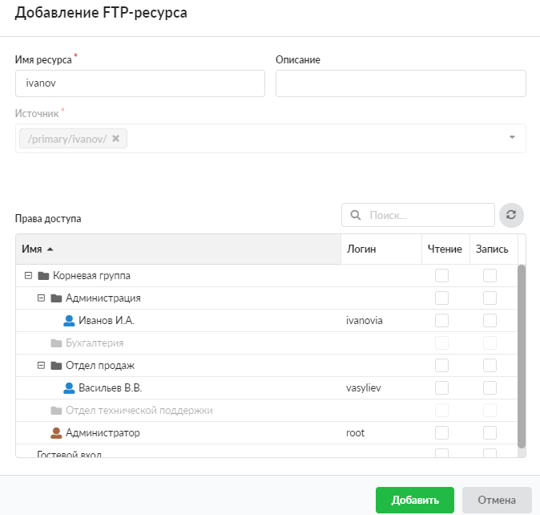

# FTP-ресурс

Для того чтобы добавить FTP-ресурс, выполните следующие действия:

1. Перейдите в меню **Файловый сервер > Хранилище файлов**.

2. Выделите нужную папку в правой части модуля и нажмите на кнопку **«Открыть доступ»**.

3. В раскрывающемся списке выберите **«FTP-ресурс»**.

4. Введите **название** ресурса и, если требуется, **описание**.

5. **Источник** ресурса будет указан автоматически.

6. Назначьте права доступа к ресурсу. Для этого установите флаги напротив пользователей в столбцах **«Чтение»** и **«Запись»**.

7. Установка флагов **«Гостевой вход»** разрешает просмотр и запись любым источником.

8. Нажмите **«Добавить»**.

---

**Источник:** [Документация ИКС — FTP-ресурс](https://doc.a-real.ru/index.php?article=257)
