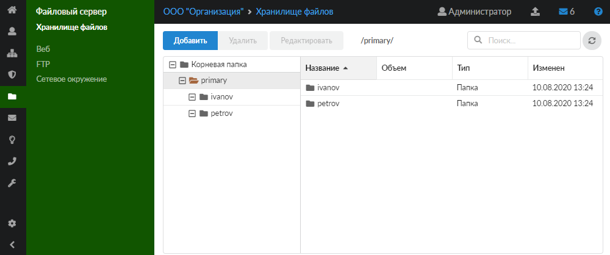
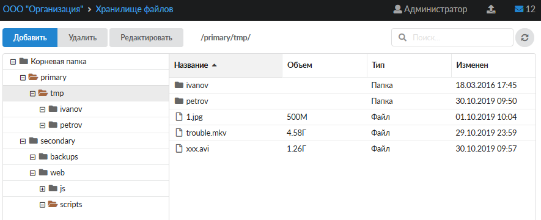
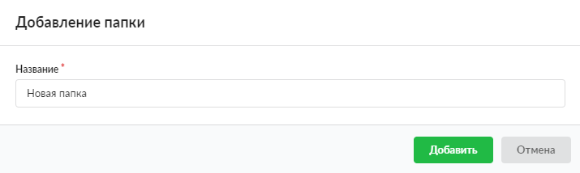
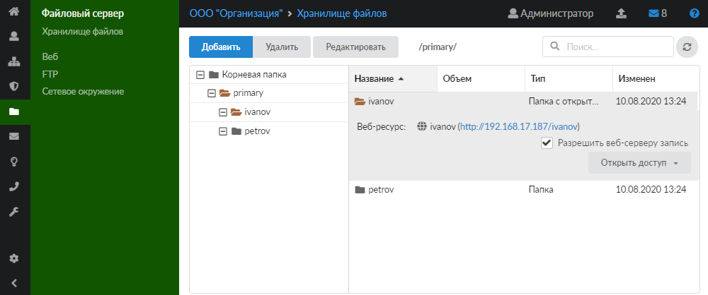
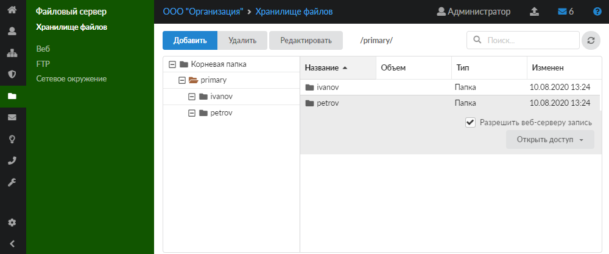

Хранилище файлов представляет собой список всех пользовательских ресурсов, расположенных на ИКС. Для открытия модуля перейдите в меню **Файловый сервер > Хранилище файлов**.

---

Хранилище файлов представляет собой список всех пользовательских ресурсов, расположенных на ИКС. Для открытия модуля перейдите в меню **Файловый сервер > Хранилище файлов**.

Модуль «Хранилище файлов» состоит из двух частей:

- слева расположено общее дерево папок;
- справа отображается список файлов и папок выделенной папки дерева. Также здесь содержится информация об объеме папки или файла, типе и дате последнего изменения.

В модуле можно [создавать](#add) новые папки и управлять ими (переименовывать, удалять) при помощи соответствующих кнопок, а также [открывать доступ](#open) к ресурсам.

> ⚠ Внимание! Папка primary и папки, соответствующие разделам жестких дисков ИКС, являются корневыми и не подлежат редактированию.

## Добавить папку

Чтобы добавить новую папку в хранилище файлов, выполните следующие действия:

1. Выделите в дереве папку, в которую требуется добавить новый элемент, и нажмите на кнопку **«Добавить»**.
2. Введите название папки.

   

3. Нажмите **«Добавить»**.

## Открыть доступ

Хранилище файлов является универсальным центром контроля пользовательских ресурсов, поэтому непосредственно из данного модуля можно предоставлять доступ к определенным ресурсам:

- [Веб-ресурс](vebresurs-v-hranilische-faylov-2.md)
- [Виртуальный хост](virtualnyy-host-v-hranilische-faylov-2.md)
- [FTP-ресурс](ftpresurs.md)
- [Общий ресурс](obschiy-resurs-2.md)

Если к папке открыт доступ, то при выделении папки появится информация о ресурсе со ссылкой на него.

В некоторых случаях веб-серверу требуются дополнительные права для работы с файлами. Для таких ситуаций используются расширенные настройки ресурса. Чтобы разрешить веб-серверу запись в папку, выделите ресурс в правой части модуля и установите флаг **«Разрешить веб-серверу запись»**.

