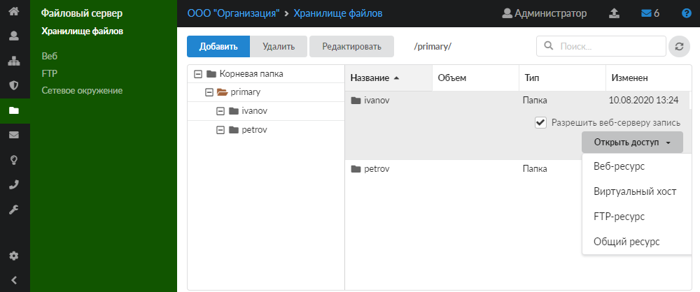

Инструкция по добавлению виртуального хоста в хранилище файлов на межсетевом экране ИКС.

---

Для того чтобы добавить виртуальный хост в хранилище файлов, выполните следующие действия:

1. Перейдите в меню **Файловый сервер > Хранилище файлов**.
2. Выделите нужную папку в правой части модуля и нажмите на кнопку **«Открыть доступ»**.

3. В раскрывающемся списке выберите **«Виртуальный хост»**.
4. Заполните поля открывшегося окна по аналогии с [добавлением виртуального хоста](../veb/virtualnyy-host-3.md) в модуле **«Веб»**. Источник ресурса будет указан автоматически.
5. Нажмите **«Добавить»**.
