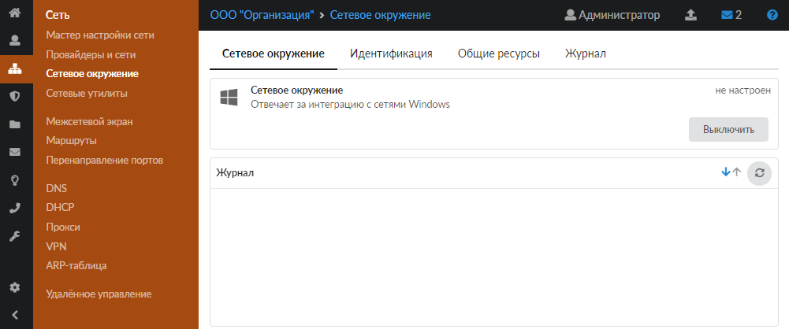
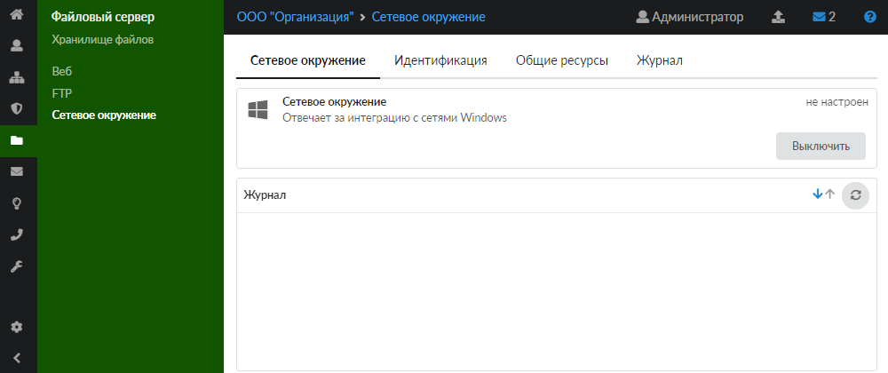
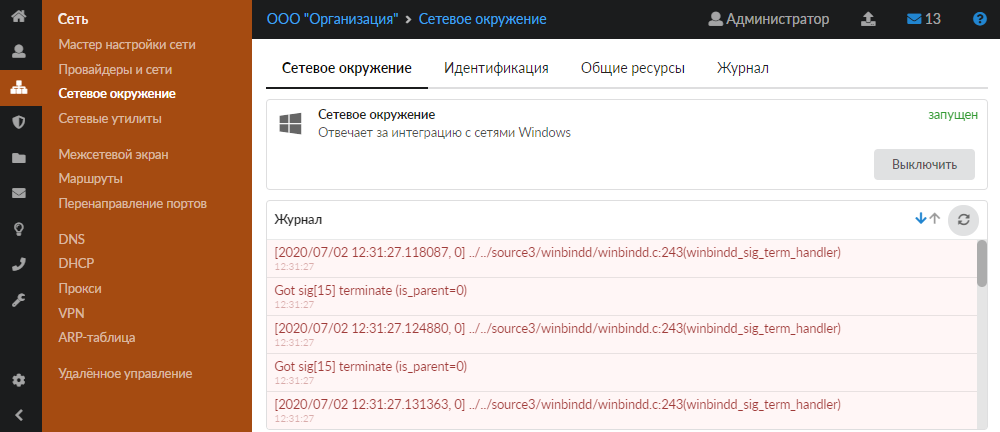
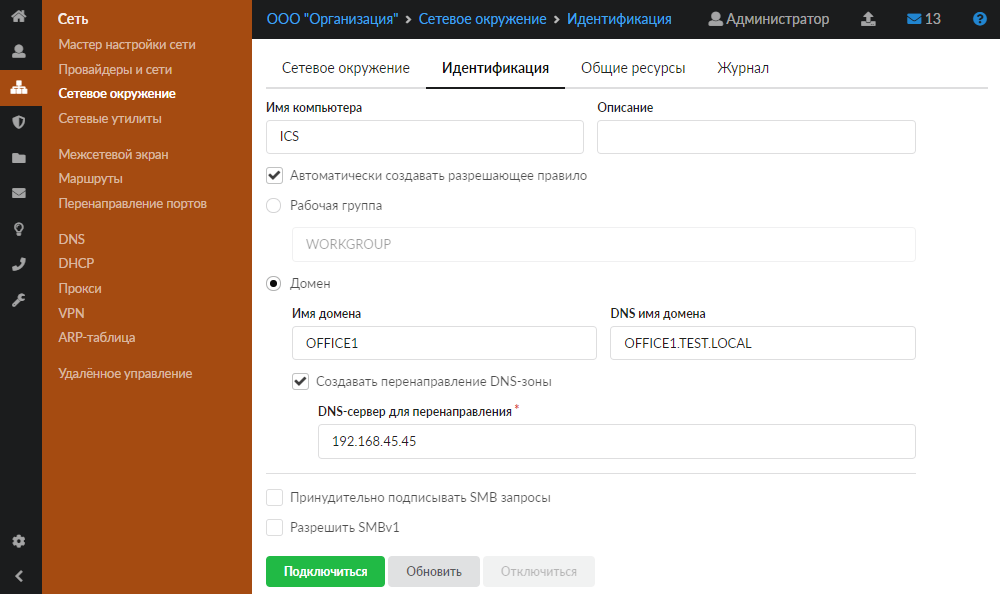
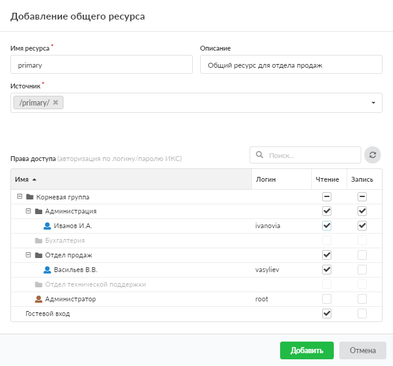
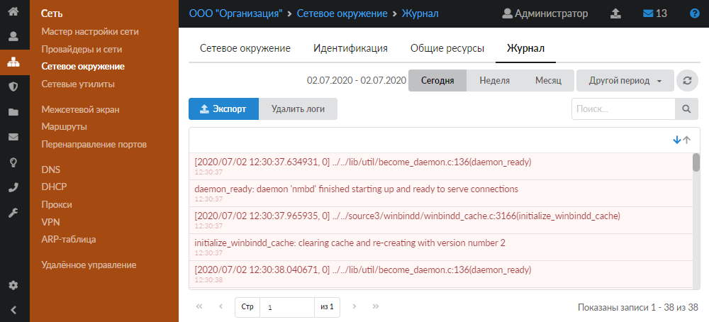

Модуль «Сетевое окружение» в ИКС предназначен для настройки и управления удаленным доступом по протоколу SMB.

---

Для обмена данными в локальной сети используется протокол [SMB](../o-dokumentacii/slovar-terminov-3.md). В ИКС за реализацию этого протокола отвечает служба «Сетевое окружение».

Модуль **«Сетевое окружение»** предназначен для настройки и управления удаленным доступом. В модуль можно перейти двумя способами:

- в меню **Сеть > Сетевое окружение**:

- в меню **Файловый сервер > Сетевое окружение**:

В модуле расположены следующие вкладки:

- [Сетевое окружение](#tab1)
- [Идентификация](#tab2)
- [Общие ресурсы](#tab3)
- [Журнал](#tab4)

## Сетевое окружение

На данной вкладке отображаются:

- статус службы (**запущен**, **остановлен**, **выключен**, **не настроен**);
- кнопка **«Включить»** (**«Выключить»**) — позволяет запустить или остановить службу;
- журнал последних событий.

## Идентификация

Данная вкладка предназначена для определения режима работы ИКС в локальной сети предприятия.

1. Введите **имя компьютера** и **описание**. Поле **«Имя компьютера»** отвечает за назначение сетевого [NetBIOS-имени](../o-dokumentacii/slovar-terminov-3.md) для сервера.

2. Если требуется, установите флаг **«Автоматически создавать разрешающее правило»**. Тогда в межсетевом экране будет создано разрешающее правило для доступа к общим ресурсам через внутренние интерфейсы.

3. При помощи переключателя выберите роль ИКС. Он может:

- находиться в **рабочей группе** — в сети предприятия не используется [контроллер домена](../o-dokumentacii/slovar-terminov-3.md) ([AD](../o-dokumentacii/slovar-terminov-3.md)), компьютеры находятся в одной рабочей группе, [WINS](../o-dokumentacii/slovar-terminov-3.md)-сервер отсутствует. По умолчанию ИКС находится в рабочей группе WORKGROUP, при необходимости ее можно переименовать.

- быть присоединенным к **домену** — в сети предприятия используется контроллер домена (AD). ИКС может быть присоединен к домену, что позволит [импортировать](../polzovateli-i-statistika/polzovateli/import-polzovateley-2.md) доменных пользователей, [синхронизировать](../polzovateli-i-statistika/sinhronizaciya-2.md) их, а также использовать [доменную авторизацию](../polzovateli-i-statistika/nastroyki-avtorizacii-2.md) на сетевых ресурсах ИКС.

  Для ввода ИКС в домен укажите **имя домена** и **[DNS](../o-dokumentacii/slovar-terminov-3.md)-имя домена**. Установите флаг **«Создавать перенаправление DNS-зоны»** и укажите [DNS-сервер](../o-dokumentacii/slovar-terminov-3.md) для перенаправления. Это может потребоваться, так как зачастую DNS-зона, в которой находится домен, не может быть разрешена внешними DNS-серверами.

4. При необходимости установите флаг **«Принудительно подписывать SMB запросы»**, который отвечает за подписывание с помощью [SMB](../o-dokumentacii/slovar-terminov-3.md). Подписывание SMB, или подписи безопасности — это механизм обеспечения безопасности протокола SMB. Может не поддерживаться старыми операционными системами (Win98, WinXP).

5. Если требуется, установите флаг **«Разрешить SMBv1»**, который включает поддержку устаревших протоколов для взаимодействия с WindowsXP, [PHP](../o-dokumentacii/slovar-terminov-3.md)-скриптов и т. д.

6. Нажмите кнопку **«Подключиться»** — ИКС применит выбранную роль в сетевом окружении. Если выбрана роль «Домен», сервер запросит логин и пароль пользователя с правами администратора для присоединения к домену.

> ⚠ Внимание! Необходимо, чтобы ИКС использовал DNS контроллера домена как единственный DNS-сервер. В противном случае в зонах DNS-сервера должно быть добавлено перенаправление DNS-зоны домена на адрес контроллера домена.

После попытки подключения к домену под полем с именем домена появится сообщение о результате подключения.

При отключении от домена ИКС запросит ввести логин и пароль. Это необходимо для корректного завершения сеанса связи на стороне домена.

## Общие ресурсы

Данная вкладка предназначена для управления общими ресурсами, размещенными на ИКС.

Для добавления общего ресурса выполните следующие действия:

1. Нажмите **«Добавить»**.

2. В открывшемся окне введите **имя ресурса** и **описание** (предназначено для краткого описания ресурса, которое будет отображаться в списке общих ресурсов, а также в хранилище файлов рядом с соответствующей папкой).

3. Укажите **источник**. Это директория из структуры хранилища файлов ИКС, в которой будет располагаться содержимое общей сетевой папки. При необходимости в каталоге можно создать новую папку.

4. В дереве **«Права доступа»** определите список пользователей, имеющих доступ к чтению и записи на данном ресурсе. При этом, если установить флаги в строке **«Гостевой вход»**, то любой подключившийся к серверу сможет просматривать и изменять файлы общей сетевой папки.

5. Нажмите **«Добавить»**.

> ⚠ Внимание! Если ИКС присоединен к домену, он будет авторизовывать только доменных пользователей.

> ⚠ Внимание! Сетевое окружение работает только с логинами, написанными без использования заглавных букв (в случае если ИКС не присоединен к домену).

> ⚠ Внимание! Особенность работы сетевого окружения не позволяет использовать логин root.

Общие ресурсы можно **редактировать** и **удалять** при помощи соответствующих кнопок.

## Журнал

На данной вкладке отображается сводка всех системных сообщений службы с указанием даты и времени.

[Журнал](https://doc.a-real.ru/index.php?article=196#summary) является стандартным элементом веб-интерфейса ИКС.
