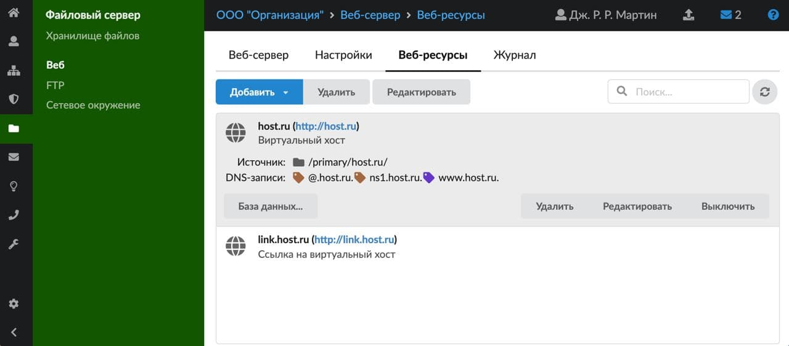
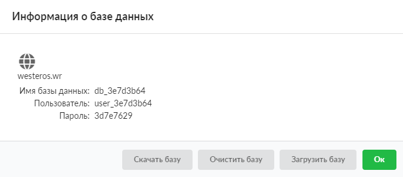
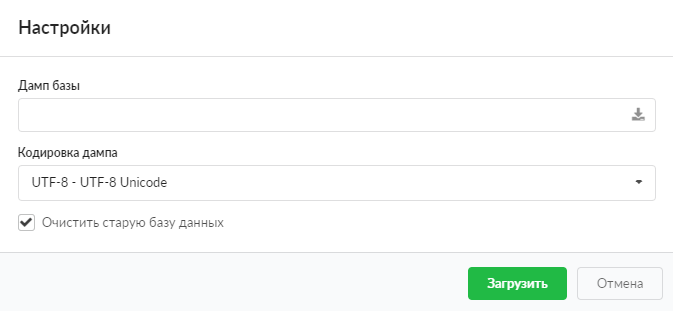

Каждый раз, когда создается новый веб-ресурс или виртуальный хост, в сервере баз данных MySQL за ним закрепляется база данных. С этой базой при помощи PHP-запросов может взаимодействовать сайт, расположенный на ресурсе.

Чтобы просмотреть параметры базы данных ресурса, выделите его в общем списке в меню **Файловый сервер > Веб > Веб-ресурсы** и нажмите кнопку **«База данных…»**.

Откроется диалоговое окно с параметрами подключения к базе данных:

- имя базы;
- пользователь (логин) для подключения;
- пароль для подключения.

Данные параметры необходимо использовать для подключения к базе из PHP-скриптов.

Действия с базой данных осуществляются при помощи следующих функциональных кнопок:

- **«Скачать базу»** — экспорт дампа базы данных ресурса;
- **«Очистить базу»** — очистка базы данных ресурса;
- **«Загрузить базу»** — загрузка дампа рабочей базы данных. При нажатии откроется новое диалоговое окно, в котором будет предложено выбрать файл дампа для загрузки, кодировку дампа, а также возможность установить флаг **«Очистить старую базу данных»** (определяет сохранность предыдущих данных в базе после загрузки).

Загрузка базы данных в ИКС происходит асинхронно, что позволяет продолжить работу с ИКС, не дожидаясь окончания загрузки. Процес загрузки будет показан в правом верхнем углу. Во время загрузки кнопки **«Редактировать»**, **«Выключить»**, **«Удалить»**, а также **«База данных»** станут недоступными.

Чтобы отменить загрузку базы, нажмите кнопку **«Загрузка файлов»** на верхней панели главного меню.

> ⚠ Внимание! Для обращения к базе MySQL введите следующий адрес: `mysql.ics.my`.
