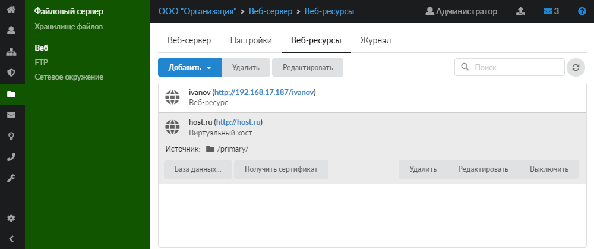
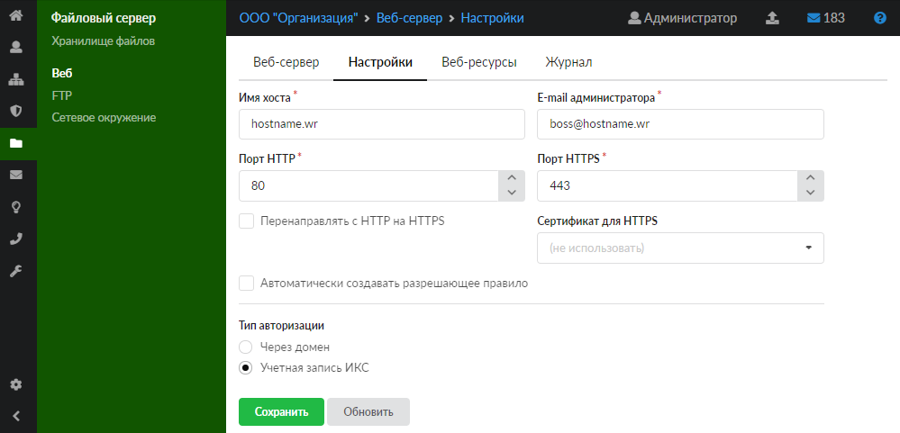
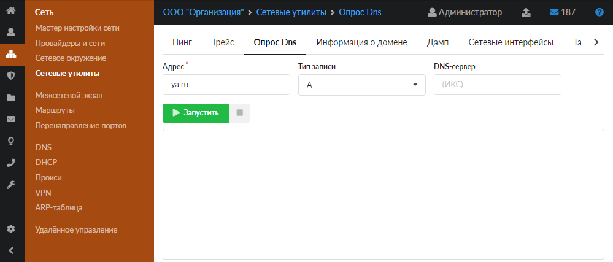
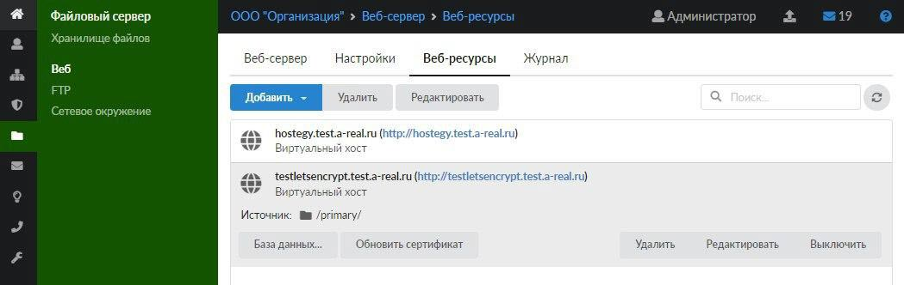
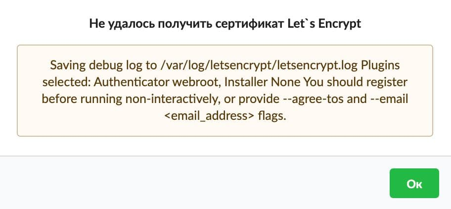

Let's Encrypt — это центр сертификации, в котором можно получить бесплатный SSL-сертификат для сайта. Такие сертификаты подойдут небольшим сайтам, где пользователи оставляют личные данные: адреса электронной почты, пароли, телефонные номера (например, личные сайты, блоги, небольшие форумы).

Сертификат Let's Encrypt обладает рядом преимуществ:

- доступность;
- надежное шифрование;
- автоматическое управление.

Среди недостатков сертификата Let's Encrypt можно выделить следующие:

- короткий срок действия (90 дней);
- сложная установка;
- низкая совместимость;
- отсутствие гарантии;
- ограниченная функциональность;
- отсутствие поддержки клиентов.

В ИКС подключить использование сертификата Let's Encrypt можно на этапе создания виртуального хоста либо виртуального хоста с перенаправлением. При нажатии на такой хост в списке будет отображаться кнопка «Получить сертификат».

Для получения сертификата Let's Encrypt необходимо выполнить ряд условий:

1. В меню **Файловый сервер > Веб > Настройки** в поле **«E-mail администратора»** введите действующий почтовый адрес. Данный электронный ящик будет указан в запросе для Let's Encrypt, и на него в дальнейшем будут приходить технические сообщения от Let's Encrypt.

   

2. Домен, который используется для виртуального хоста или виртуального хоста с перенаправлением, должен иметь [А-запись](../../set/dns/zapisi-dnszony-4.md) с внешним [IP-адресом](../../o-dokumentacii/slovar-terminov-3.md).

   > ⚠️ **Внимание!** Необходимо, чтобы имя, для которого получается сертификат, определялось его действительным внешним IP-адресом.

   Чтобы проверить это, перейдите в меню **Сеть > Провайдеры и сети > Сетевые утилиты > Опрос DNS**. В поле **«Адрес»** введите имя домена. В поле **«Тип записи»** выберите A-запись.

   

3. Проверьте, что в [межсетевом экране](../../set/mezhsetevoy-ekran/mezhsetevoy-ekran-obzor-3.md) разрешены порты веб-сервера (80 и 443) для доступа извне, а также отсутствуют перенаправления данных портов.

Автоматически сертификат Let's Encrypt **обновляется** раз в 3 месяца. Также его можно обновить принудительно. После успешного получения сертификата при нажатии на виртуальный хост появится кнопка «Обновить сертификат». Сертификат Let's Encrypt можно обновить и в [модуле](../../zaschita/sertifikaty/sertifikaty-obzor-4.md) **«Сертификаты»**. Если срок сертификата еще не истек, на экране появится соответствующее уведомление с просьбой подтвердить операцию.

Сертификат Let's Encrypt отобразится и в общем списке [сертификатов](../../zaschita/sertifikaty/sertifikaty-obzor-4.md). С ним можно работать так же, как и с другими сертификатами.

При несоблюдении условий после нажатия на кнопку «Получить сертификат» на экране появится сообщение о том, что получить сертификат не удалось.

> ⚠️ **Внимание!** При использовании Let's Encrypt существует ряд [ограничений](https://letsencrypt.org/ru/docs/rate-limits/).

Ознакомиться с подробной документацией по работе с сертификатом Let's Encrypt можно [здесь](https://letsencrypt.org/ru/docs/).
