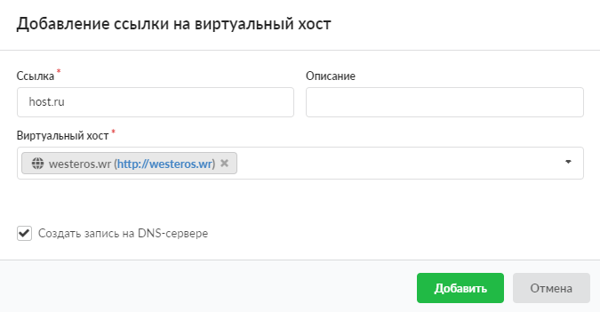

Ссылка на виртуальный хост создает псевдоним для виртуального хоста. Например, если на ИКС создан виртуальный хост и необходимо, чтобы он отвечал на запросы по другому доменному имени, можно воспользоваться ссылкой.

---

Ссылка на виртуальный хост создает псевдоним для виртуального хоста. Например, если на ИКС создан виртуальный хост и необходимо, чтобы он отвечал на запросы по другому доменному имени, можно воспользоваться ссылкой.

Для того чтобы добавить ссылку виртуальный хост, выполните следующие действия:

1. Перейдите в меню **Файловый сервер &gt; Веб &gt; Веб-ресурсы**.

2. Нажмите на кнопку **«Добавить»** и выберите **«Ссылка на виртуальный хост»**.

3. Введите **ссылку** на виртуальный хост (имя псевдонима).

4. Если требуется, введите **описание**. Это краткое описание ресурса, которое будет отображаться в хранилище файлов, а также в списке [веб-ресурсов](veb-obzor-2.md) рядом с соответствующей папкой.

5. В поле **«Виртуальный хост»** выберите из списка созданных виртуальных хостов тот, к которому будет относиться данная ссылка.

6. При необходимости установите флаг **«Создать запись на DNS-сервере»** — будет создана зона для данного хоста, а также записи на DNS-сервере ИКС.

7. Нажмите **«Добавить»**.
