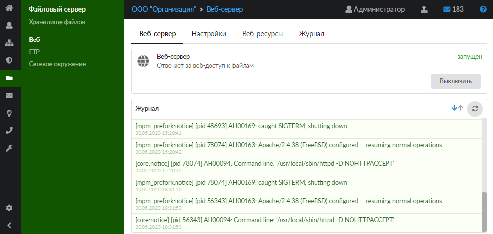
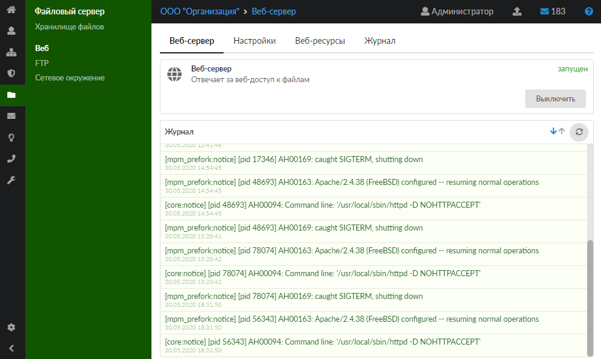
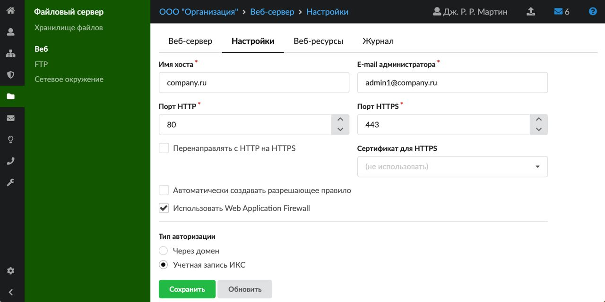
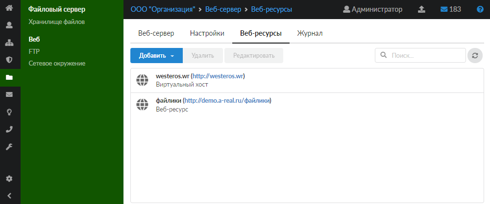
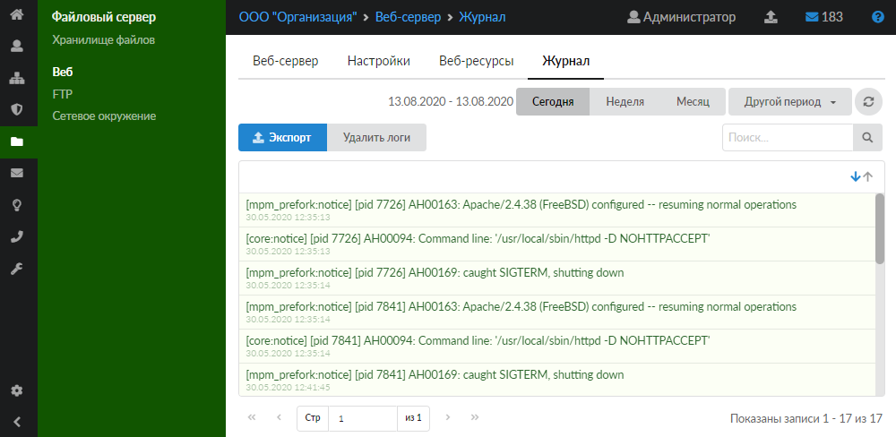

Модуль «Веб» предназначен для настройки веб-сервера и управления им. Для открытия модуля перейдите в меню **Файловый сервер > Веб**.

---

Модуль «Веб» предназначен для настройки веб-сервера и управления им. Для открытия модуля перейдите в меню **Файловый сервер > Веб**.

В модуле расположены следующие вкладки:

- [Веб-сервер](#tab1)
- [Настройки](#tab2)
- [Веб-ресурсы](#tab3)
- [Журнал](#tab4)

## Веб-сервер

На данной вкладке отображаются сведения о состоянии веб-сервера:

- статус службы (**запущен**, **остановлен**, **выключен**, **не настроен**);
- кнопка **«Включить»** (**«Выключить»**) — позволяет запустить или остановить службу;
- журнал последних событий.

## Настройки

Данная вкладка предназначена для установки параметров работы веб-сервера ИКС.

Поле **«Имя хоста»** определяет внешнее доменное имя хоста, которое необходимо для корректной работы веб-ресурса по доменному имени.

В поле **«E-mail администратора»** можно указать e-mail ответственного за веб-сервер системного администратора на тот случай, если в работе сервера возникнут перебои. Также данное поле используется для получения [Let's Encrypt-сертификата](https://doc.a-real.ru/index.php?article=264).

Поле **«Порт HTTP»** предназначено для указания порта, по которому веб-сервер принимает [HTTP](../../o-dokumentacii/slovar-terminov-3.md)-запросы. По умолчанию это порт 80.

Поле **«Порт HTTPS»** предназначено для указания порта, по которому веб-сервер принимает [HTTPS](../../o-dokumentacii/slovar-terminov-3.md)-запросы. По умолчанию это порт 443.

В поле **«Сертификат для HTTPS»** можно назначить службе заранее созданный [сертификат](../../zaschita/sertifikaty/sertifikaty-obzor-4.md) для работы сервера по защищенному протоколу HTTPS с использованием [SSL](../../o-dokumentacii/slovar-terminov-3.md).

При установке флага **«Перенаправлять с HTTP на HTTPS»** веб-сервер всегда будет работать по защищенному соединению.

Флаг **«Автоматически создавать разрешающее правило»** создает [разрешающее правило](../../set/mezhsetevoy-ekran/razreshayuschee-pravilo-mezhsetevogo-ekrana-2.md) межсетевого экрана на HTTP/HTTPS-порты веб-сервера из внешних сетей.

Флаг **«Использовать Web Application Firewall»** подключает модуль [Web Application Firewall](https://doc.a-real.ru/index.php?article=72).

Блок **«Тип авторизации»** позволяет определить, каким образом пользователи будут авторизоваться на ресурсе при входе, если веб-ресурс или виртуальный хост не предназначены для гостевого входа. Выберите один из двух типов авторизации:

- **через домен** — позволяет авторизоваться на ресурсах веб-сервера пользователям, импортированным в ИКС из домена. Авторизация возможна, если в [настройках](../../polzovateli-i-statistika/nastroyki-avtorizacii-2.md) [LDAP](../../polzovateli-i-statistika/nastroyki-avtorizacii-2.md) [-авторизации](../../polzovateli-i-statistika/nastroyki-avtorizacii-2.md) указаны корректные данные для подключения к LDAP-серверу. Для авторизации через LDAPS необходимо импортировать в ИКС корневой сертификат центра сертификации, выдавшего сертификат для LDAP-сервера. После импорта сертификата установите в нем флаг **«Добавить в доверенные сертификаты»**, а затем укажите данный сертификат в настройках LDAP-авторизации;
- **учетная запись ИКС** — на ресурсах веб-сервера можно авторизоваться с помощью логина и пароля пользователя ИКС, если данный пользователь не импортирован из домена.

Чтобы установленные параметры вступили в силу, нажмите **«Сохранить»**.

## Веб-ресурсы

Данная вкладка предназначена для управления собственными интернет-сайтами, размещенными на ИКС.

В ИКС можно создавать следующие типы веб-ресурсов:

- [Веб-ресурс](vebresurs-2.md)
- [Виртуальный хост](virtualnyy-host-3.md)
- [Виртуальный хост с перенаправлением](virtualnyy-host-s-perenapravleniem-3.md)
- [Ссылка на виртуальный хост](https://doc.a-real.ru/index.php?article=263)
- [Let's Encrypt](https://doc.a-real.ru/index.php?article=264)

При создании нового веб-ресурса или виртуального хоста в сервере баз данных MySQL за ним закрепляется [база данных](https://doc.a-real.ru/index.php?article=265).

На данной вкладке доступны операции **включения/выключения** веб-ресурса, его **редактирования** и **удаления**, а также просмотра [базы данных](https://doc.a-real.ru/index.php?article=265). Для этого просто нажмите на нужный веб-ресурс в списке и выберите действие.

## Журнал

На данной вкладке отображается сводка всех системных сообщений модуля с указанием даты и времени.

[Журнал](https://doc.a-real.ru/index.php?article=196#summary) является стандартным элементом веб-интерфейса ИКС.
