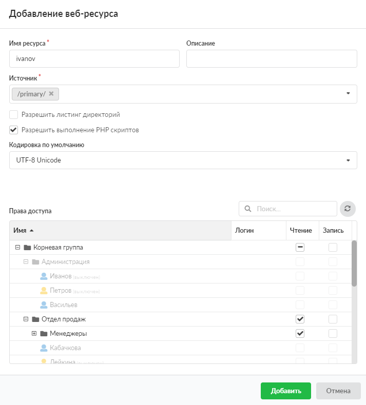

Веб-ресурс отвечает на HTTP-запросы по IP-адресам интерфейсов ИКС.

---

Веб-ресурс отвечает на HTTP-запросы по IP-адресам интерфейсов ИКС.

Для того чтобы добавить веб-ресурс, выполните следующие действия:

1. Перейдите в меню **Файловый сервер > Веб > Веб-ресурсы**.
2. Нажмите на кнопку **«Добавить»** и выберите **«Веб-ресурс»**.
3. Введите **название** ресурса — любое доменное имя.
4. Если требуется, введите **описание**. Это краткое описание ресурса, которое будет отображаться в списке веб-ресурсов, а также в хранилище файлов рядом с соответствующей папкой.
5. Выберите **источник** ресурса. Это директория из структуры хранилища файлов ИКС, в которой будет располагаться содержимое сайта. При необходимости можно создать новую папку в каталоге.

6. Флаг **«Разрешить листинг директории»** позволяет серверу отобразить список всех файлов и папок ресурса, в случае если в корневой папке не обнаружены индексные файлы `index.html` или `index.php`.
7. Флаг **«Разрешить выполнение PHP скриптов»** разрешает серверу выполнять на HTML-страницах PHP-скрипты.
8. Если требуется, измените **кодировку по умолчанию**. Она определяет значение кодировки отображаемых HTML-страниц ресурса по умолчанию.
9. Назначьте **права доступа** к ресурсу. Для этого установите флаги напротив пользователей в столбцах **«Чтение»** и **«Запись»**.
10. Установка флагов **«Гостевой вход»** разрешает просмотр и запись любым источником.

11. Нажмите **«Добавить»**.

Веб-ресурс также можно добавить в модуле **«Хранилище файлов»**.
