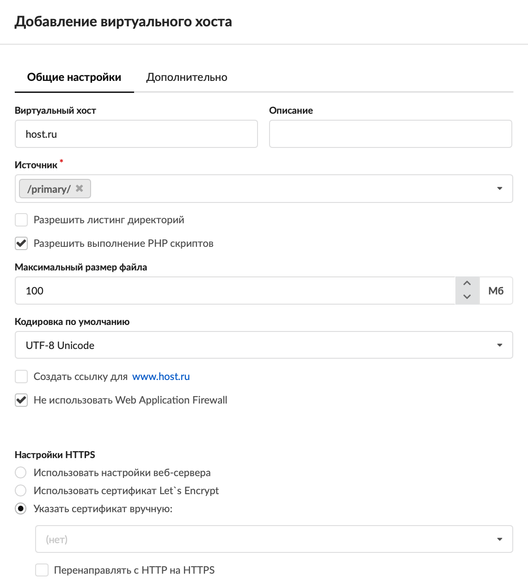
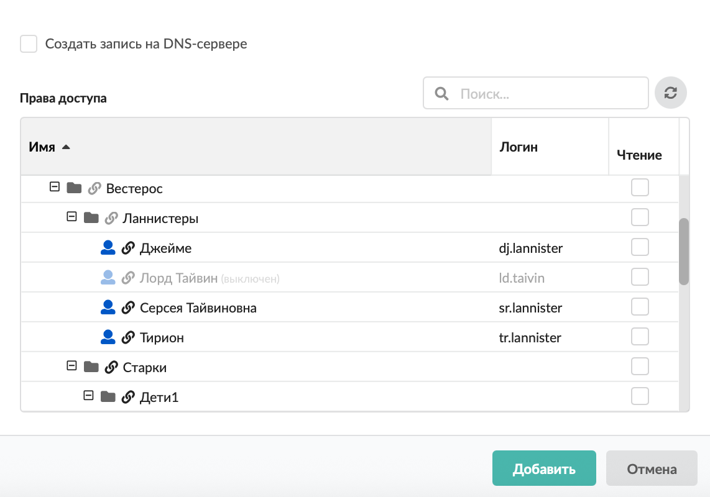
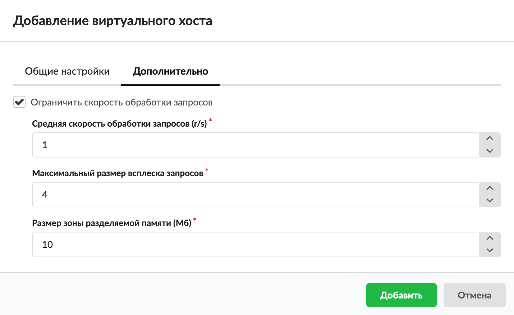

# Виртуальный хост

Виртуальный хост — это основной ресурс при создании сайта. Он позволяет создавать неограниченное количество веб-ресурсов, отвечающих каждый за свой веб-сайт по имени сайта.

---

Для того чтобы добавить виртуальный хост, выполните следующие действия:

1. Перейдите в меню **Файловый сервер &gt; Веб &gt; Веб-ресурсы**.

2. Нажмите на кнопку **«Добавить»** и выберите **«Виртуальный хост»**.

3. На вкладке «Общие настройки» введите **название** виртуального хоста. Оно аналогично имени веб-ресурса, но должно содержать доменное имя сайта, на которое виртуальный хост будет отвечать по [HTTP](https://doc.a-real.ru/index.php?article=24#http)-запросу.

4. Если требуется, введите **описание**. Это краткое описание ресурса, которое будет отображаться в списке [веб-ресурсов](https://doc.a-real.ru/index.php?article=81#tab3), а также в [хранилище файлов](https://doc.a-real.ru/index.php?article=80) рядом с соответствующей папкой.

5. Выберите **источник** ресурса. Это директория из структуры хранилища файлов ИКС, в которой будет располагаться содержимое сайта. При необходимости можно создать новую папку в каталоге.

> ⚠ Для корректной работы виртуального хоста в большинстве случаев требуется настройка [DNS-зон](https://doc.a-real.ru/index.php?article=24#dns-zone) доменного имени.

6. Флаг **«Разрешить листинг директории»** позволяет серверу отобразить список всех файлов и папок ресурса, в случае если в корневой папке не обнаружены индексные файлы `index.html` или `index.php`.

7. Флаг **«Разрешить выполнение PHP скриптов»** разрешает серверу выполнять на HTML-страницах [PHP](https://doc.a-real.ru/index.php?article=24#php)-скрипты.

8. Укажите **максимальный размер файла**. По умолчанию установлено значение «100».

9. Если требуется, измените **кодировку по умолчанию**. Она определяет значение кодировки отображаемых HTML-страниц ресурса по умолчанию.

10. Флаг **«Создать ссылку для www.\<имя_домена\>»** предназначен для настройки [DNS](https://doc.a-real.ru/index.php?article=24#dns)-записей для приёма HTTP-запросов как на имя сайта, указанное в названии, так и на него же с добавлением домена www.

11. Флаг **«Не использовать Web Application Firewall»** отключает модуль [Web Application Firewall](https://doc.a-real.ru/index.php?article=72).

12. В блоке **«Настройки HTTPS»** выберите настройки обработки [HTTPS](https://doc.a-real.ru/index.php?article=24#https)-запросов. Установите переключатель:

    - использовать настройки веб-сервера — будут использованы настройки [веб-сервера](https://doc.a-real.ru/index.php?article=81#tab2);
    - использовать сертификат LetsEncrypt — будут использованы настройки веб-сервера, но с сертификатом LetsEncrypt;
    - указать сертификат вручную — будут использованы настройки веб-сервера с указанным сертификатом. Здесь можно задать **сертификат** и **перенаправление с HTTP на HTTPS** (флаг перекрывает действие аналогичного флага в настройках веб-сервера).

    > ⚠ Внимание! Если сертификат не указан, то виртуальный хост работать не будет.

13. При необходимости установите флаг **«Создать запись на DNS-сервере»** — будет создана зона для данного хоста, а также записи на DNS-сервере ИКС.

14. Назначьте **права доступа** к ресурсу. Для этого установите флаги напротив пользователей в столбце **«Чтение»**.

15. Установка флага **«Гостевой вход»** разрешает просмотр любым источником.

16. На вкладке «Дополнительно», если требуется, установите флаг **«Ограничить скорость обработки запросов»** и укажите значения следующих параметров:

    - средняя скорость обработки запросов (r/s) — количество обрабатываемых запросов в секунду;
    - максимальный размер всплеска запросов — количество избыточных запросов, которые задерживаются таким образом, чтобы запросы обрабатывались с указанной выше скоростью. Если число избыточных запросов превысит установленное, запрос завершится с ошибкой;
    - размер зоны разделяемой памяти (Мб) — размер зоны, в которой хранится состояние для различных значений ключа (например, текущее число избыточных запросов).

17. Нажмите **«Добавить»**.

Виртуальный хост также можно [добавить](https://doc.a-real.ru/index.php?article=256) в модуле **«Хранилище файлов»**.

---

**Источник:** [Документация ИКС — Виртуальный хост](https://doc.a-real.ru/index.php?article=261)
