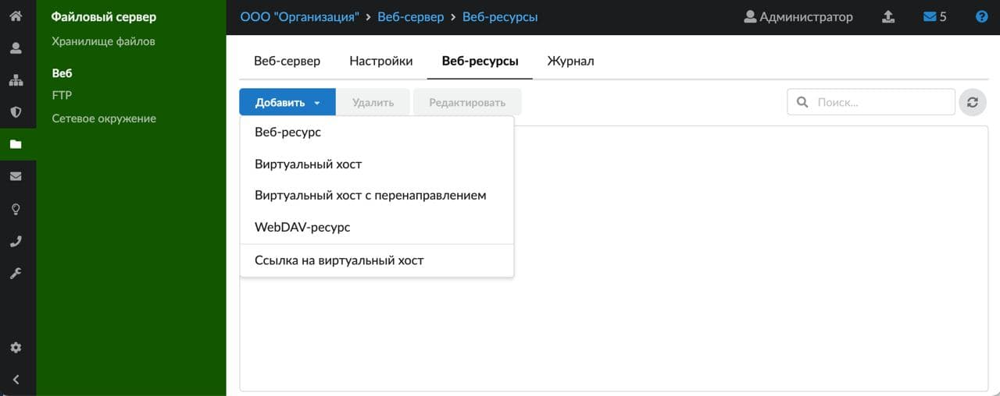
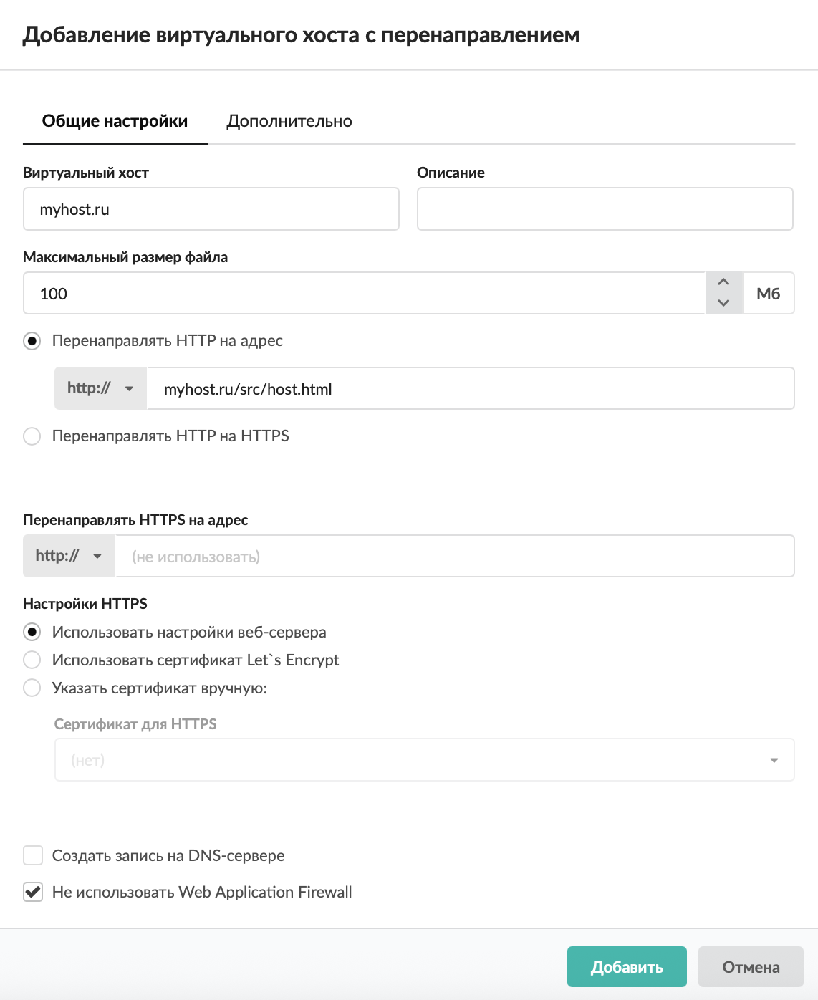
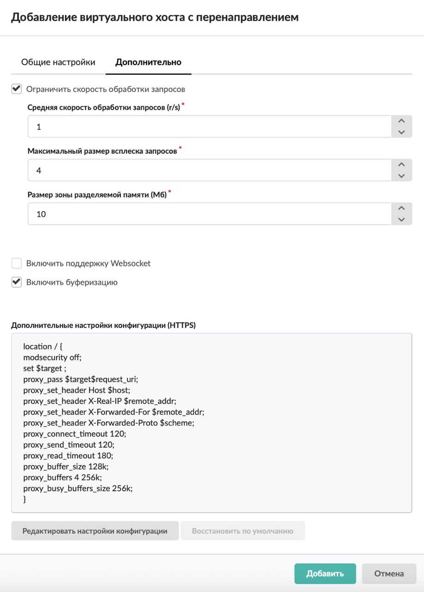

Виртуальный хост с перенаправлением выполняет функции обратного прокси (reverse proxy) и позволяет ИКС перенаправлять запросы на указанное имя сайта.

---

Виртуальный хост с перенаправлением выполняет функции обратного прокси (reverse proxy) и позволяет ИКС перенаправлять запросы на указанное имя сайта, например в случае, когда сам сервер с сайтом находится в локальной сети предприятия (по аналогии с [перенаправлением портов](/index.php?article=59)).

Для того чтобы добавить виртуальный хост с перенаправлением, выполните следующие действия:

1. Перейдите в меню **Файловый сервер > Веб > Веб-ресурсы**.

2. Нажмите на кнопку **«Добавить»** и выберите **«Виртуальный хост с перенаправлением»**.

3. На вкладке «Общие настройки» введите **название** виртуального хоста. Оно аналогично имени веб-ресурса, но должно содержать доменное имя сайта, на которое виртуальный хост будет отвечать по [HTTP](/index.php?article=24#http)-запросу.

4. Если требуется, введите **описание**. Это краткое описание ресурса, которое будет отображаться в хранилище файлов, а также в списке [веб-ресурсов](/index.php?article=81#tab3) рядом с соответствующей папкой.

5. Укажите **максимальный размер файла**. По умолчанию установлено значение «100».

6. При помощи переключателя выберите, куда **перенаправлять HTTP-запросы** и по какому протоколу будут передаваться дальше данные запросы: HTTP (укажите адрес) либо [HTTPS](/index.php?article=24#https) (веб-сервер при получении HTTP-запроса будет отвечать, что HTTP не доступно и необходимо обращаться на HTTPS).

7. Поле **«Перенаправлять HTTPS на адрес»** предназначено для ввода адреса, на который будут перенаправляться HTTPS-запросы. При этом можно выбрать, по какому протоколу будут передаваться дальше данные запросы: HTTP или HTTPS. В качестве адресов для перенаправления можно указывать:

- [IP-адрес](/index.php?article=24#ip-address);
- домен, в том числе русскоязычный;
- \<домен:порт>;
- \<путь_до_файла>.

8. В блоке **«Настройки HTTPS»** выберите настройки обработки [HTTPS](/index.php?article=24#https)-запросов. Установите переключатель:

- использовать настройки веб-сервера — будут использованы настройки [веб-сервера](/index.php?article=81#tab2);
- использовать сертификат LetsEncrypt — будут использованы настройки веб-сервера, но с сертификатом LetsEncrypt;
- указать сертификат вручную — будут использованы настройки веб-сервера с указанным сертификатом. Здесь можно задать **сертификат** и **перенаправление с HTTP на HTTPS** (флаг перекрывает действие аналогичного флага в настройках веб-сервера).

> ⚠ Внимание! Если сертификат не указан, то виртуальный хост работать не будет.

9. При необходимости установите флаг **«Создать запись на DNS-сервере»** — будет создана зона для данного хоста, а также записи на DNS-сервере ИКС.

10. Флаг **«Не использовать Web Application Firewall»** отключает модуль [Web Application Firewall](/index.php?article=72).

11. На вкладке «Дополнительно», если требуется, установите флаг **«Ограничить скорость обработки запросов»** и укажите значения следующих параметров:

- средняя скорость обработки запросов (r/s) — количество обрабатываемых запросов в секунду;
- максимальный размер всплеска запросов — количество избыточных запросов, которые задерживаются таким образом, чтобы запросы обрабатывались с указанной выше скоростью. Если число избыточных запросов превысит установленное, запрос завершится с ошибкой;
- размер зоны разделяемой памяти (Мб) — размер зоны, в которой хранится состояние для различных значений ключа (например, текущее число избыточных запросов).

12. При необходимости включите **поддержку протокола WebSocket** при помощи одноименного флага.

13. **Включить буферизацию** можно установкой соответствующего флага.

14. Если требуется изменить настройки конфигурации для перенаправления HTTPS на адрес, нажмите **«Редактировать настройки конфигурации»**. Для возвращения исходных настроек нажмите **«Восстановить по умолчанию»**. Измененное поле имеет приоритет над остальными настройками (адрес для перенаправления, чекбоксы WAF и Websocket), то есть после редактирования и сохранения изменения этих настроек они не будут попадать в конфигурационный файл. При помощи данной настройки можно разрешать либо блокировать доступ с определенных IP-адресов.

15. Нажмите **«Добавить»**.
