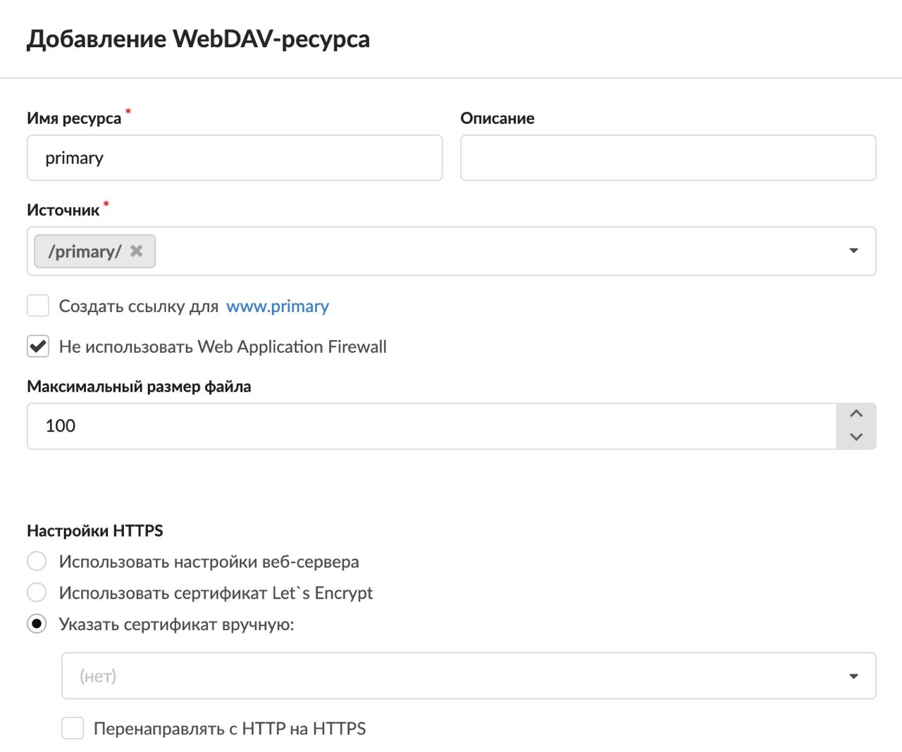
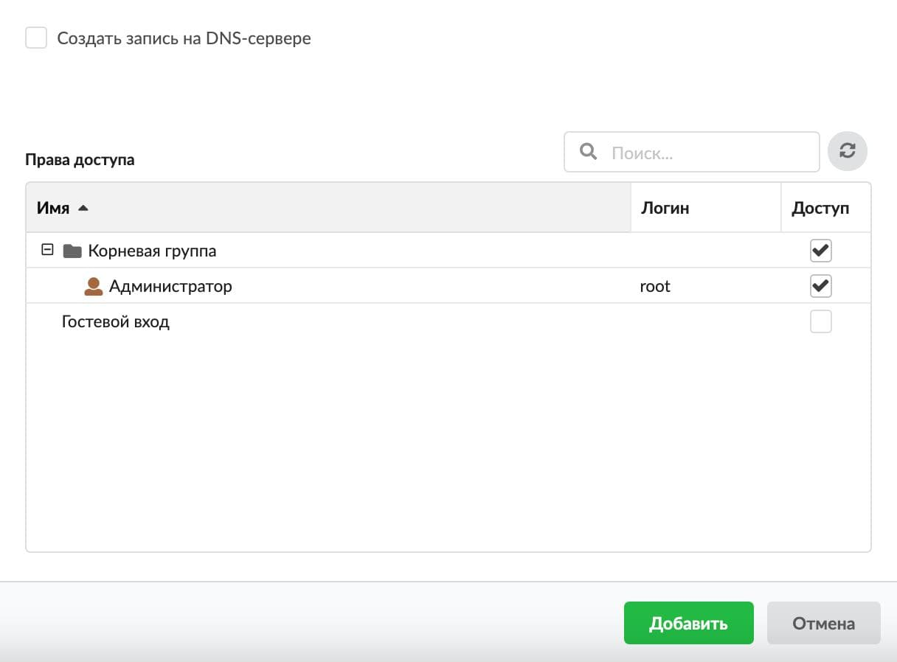

# WebDAV-ресурс

WebDAV-ресурс позволяет получить доступ по протоколу WebDAV к директории, которая указана в настройках.

---

Для того чтобы добавить WebDAV-ресурс, выполните следующие действия:

1. Перейдите в меню **Файловый сервер > Веб > Веб-ресурсы**.

2. Нажмите на кнопку **«Добавить»** и выберите **«WebDAV-ресурс»**.

3. Введите **название** WebDAV-ресурса. Названием может быть любое доменное имя.

4. Если требуется, введите **описание**. Это краткое описание ресурса, которое будет отображаться в списке [веб-ресурсов](https://doc.a-real.ru/index.php?article=81#tab3), а также в [хранилище файлов](https://doc.a-real.ru/index.php?article=80) рядом с соответствующей папкой.

5. Выберите **источник** ресурса. Это директория из структуры хранилища файлов ИКС, в которой будет располагаться содержимое ресурса. При необходимости можно создать новую папку в каталоге.

6. Флаг **«Создать ссылку для www.&lt;имя_домена&gt;»** предназначен для настройки [DNS](https://doc.a-real.ru/index.php?article=24#dns)-записей для приёма HTTP-запросов как на имя сайта, указанное в названии, так и на него же с добавлением домена www.

7. Флаг **«Не использовать Web Application Firewall»** отключает модуль [Web Application Firewall](https://doc.a-real.ru/index.php?article=72).

8. Если требуется, измените **максимальный размер файла**. Это максимально допустимый размер загружаемых файлов (в мегабайтах). По умолчанию установлено значение 100 Мб.

9. В блоке **«Настройки HTTPS»** выберите настройки обработки [HTTPS](https://doc.a-real.ru/index.php?article=24#https)-запросов. Установите переключатель:

   - использовать настройки веб-сервера — будут использованы настройки [веб-сервера](https://doc.a-real.ru/index.php?article=81#tab2);
   - использовать сертификат Let's Encrypt — будут использованы настройки веб-сервера, но с сертификатом Let's Encrypt;
   - указать сертификат вручную — будут использованы настройки веб-сервера с указанным сертификатом. Здесь можно задать **сертификат** и **перенаправление с HTTP на HTTPS** (флаг перекрывает действие аналогичного флага в настройках веб-сервера).

   > ⚠ Внимание! В случае если сертификат не используется, для подключения WebDAV-ресурса на ОС Windows для успешного подключения необходимо изменить реестр. В ветке `HKEY_LOCAL_MACHINE\SYSTEM\CurrentControlSet\Services\WebClient\Parameters\BasicAuthLevel` замените значение на «2».

10. При необходимости установите флаг **«Создать запись на DNS-сервере»** — будет создана зона для данного WebDAV-ресурса, а также записи на DNS-сервере ИКС.

11. Назначьте **права доступа** к ресурсу. Для этого установите флаги напротив пользователей в столбце **«Доступ»**.

12. Установка флага **«Гостевой вход»** разрешает просмотр любым источником.

13. Нажмите **«Добавить»**.

---

**Источник:** [Документация ИКС — WebDAV-ресурс](https://doc.a-real.ru/index.php?article=379)
