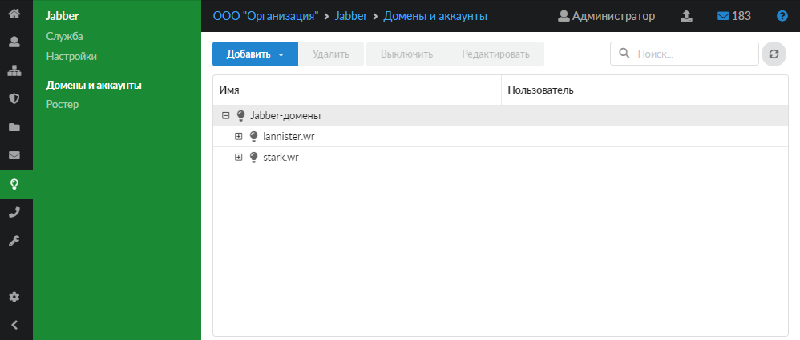
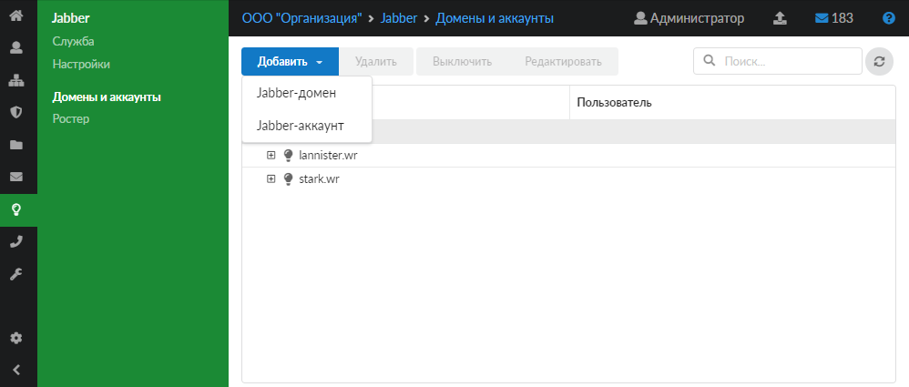
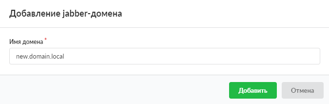
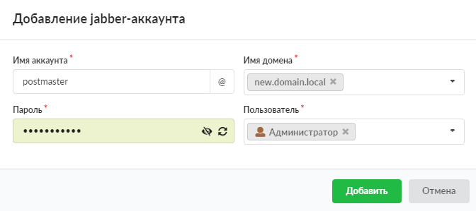

Модуль «Домены и аккаунты» предназначен для присвоения Jabber-доменов и аккаунтов пользователям ИКС, а также для работы с ними.

---

Модуль **«Домены и аккаунты»** предназначен для присвоения Jabber-доменов и аккаунтов пользователям ИКС, а также для работы с ними.

Для открытия модуля перейдите в меню **Jabber &gt; Домены и аккаунты**.

На странице модуля отображаются Jabber-домены и Jabber-аккаунты. Для аккаунтов также показываются пользователи.

В модуле можно добавлять, редактировать, удалять, выключать [домены](#domain) и [аккаунты](#account) при помощи соответствующих кнопок, а также осуществлять поиск.

> ⚠ Внимание! При создании Jabber-доменов и аккаунтов соответствующие домены и аккаунты появляются в [почтовом сервере](../pochta/domeny-i-yaschiki-2.md). Изменение Jabber-доменов и аккаунтов влечет также изменение почтовых доменов и ящиков. При удалении Jabber-доменов и аккаунтов также удалятся соответствующие почтовые домены и ящики, и наоборот.
>
> При удалении Jabber-домена все аккаунты, находящиеся в данном домене, будут удалены.

## Добавить Jabber-домен

Чтобы добавить Jabber-домен, выполните следующие действия:

1. Нажмите кнопку **«Добавить»** и выберите **«Jabber-домен»**.

   

2. В появившемся окне введите **имя** **Jabber-домена**. Это может быть любое несуществующее имя, если общение по протоколу Jabber будет происходить внутри корпоративной сети. В противном случае необходимо настроить пересылку Jabber-сообщений на реально существующем домене, зарегистрированном за организацией.

   

3. Нажмите **«Добавить»** — новый Jabber-домен появится в списке.

## Добавить Jabber-аккаунт

Чтобы добавить Jabber-аккаунт, выполните следующие действия:

1. Нажмите кнопку **«Добавить»** и выберите **«Jabber-аккаунт»**.

   

2. В появившемся окне введите **имя Jabber-аккаунта**.

   

3. Задайте **пароль**. Он может быть сгенерирован автоматически по кнопке .

4. Выберите **пользователя**, за которым будет закреплен данный аккаунт.

5. Укажите **имя Jabber-домена**. Его можно выбрать из существующих либо задать новое.

6. Нажмите **«Добавить»** — новый Jabber-аккаунт появится в списке.

Если количество включенных Jabber-аккаунтов достигнет лимита лицензии ИКС Lite, то в нижнем левом углу появится соответствующее сообщение: «Достигнут лимит включенных Jabber-аккаунтов, разрешенных лицензией: 9».
