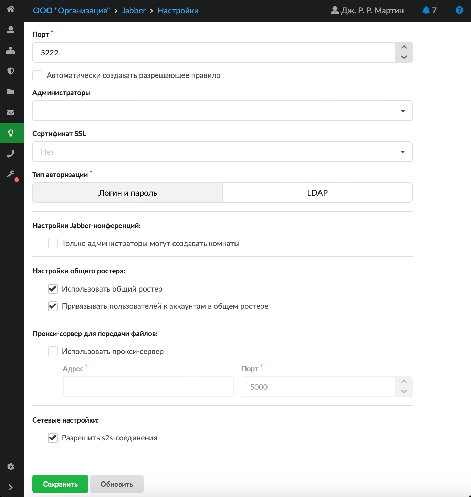

Модуль «Настройки» предназначен для установки параметров работы Jabber-сервера.

Для открытия модуля перейдите в меню **Jabber > Настройки**.

## Общие настройки

Поле **«Порт»** является обязательным, позволяет задать или изменить порт, на котором работает Jabber-сервер.

При установке флага **«Автоматически создавать разрешающее правило»** в межсетевом экране ИКС будет добавлено [разрешающее правило](../set/mezhsetevoy-ekran/razreshayuschee-pravilo-mezhsetevogo-ekrana-2.md) для доступа к указанному порту на всех сетевых интерфейсах.

Если поле **«Администраторы»** пустое, то комнаты сможет создавать любой пользователь. Таким образом, администратором комнаты станет тот пользователь, который ее создаст. Если в поле указать аккаунты (только заведенные на ИКС Jabber-аккаунты), они всегда будут администраторами в любой создаваемой комнате.

Поле **«Сертификат SSL»** необходимо для создания защищенного соединения «клиент-сервер». По умолчанию данные передаются в открытом виде. Чтобы избежать этого, выберите в поле заранее сгенерированный [SSL](../o-dokumentacii/slovar-terminov-3.md)-сертификат для Jabber-сервера.

На выбор доступны два **типа авторизации** — по логину и паролю и LDAP. Авторизация через LDAP доступна только с использованием Plain или LDAPS.

## Jabber-конференции

Конференция — это место общения нескольких пользователей Jabber. Имеет имя, уникальное в пределах одного сервера.

**Войти** в конференцию можно при помощи соответствующего пункта меню в программе-клиенте (например, Join Group в Tkabber или Join Groupchat в Psi). Введите имя комнаты и сервер, на которой она находится (например, conference.up4k.loc).

Чтобы **создать** новую комнату, просто войдите в несуществующую комнату на нужном сервере конференций. Для просмотра списка существующих комнат воспользуйтесь Service Discovery применительно к серверу конференций.

**Особенности функционирования** при создании комнаты (например в Jabber-клиенте Pidgin):

- `persistent room should remain even when it is empty` — с данной настройкой комната всегда будет храниться на сервере (даже пустой) и к ней можно подключаться. Удобно для комнат, которые не должны «случайно» удалиться по ошибке;
- `include room information in public lists` — данная настройка отвечает за то, будет ли комната выдаваться при поиске из меню **«Присоединиться к чату…»** по кнопке **«Список комнат»**. Если флаг не установлен, то комната искаться не будет, а подключиться к ней пользователь сможет, только если знает ее название.

## Общий ростер

При установке флага **«Использовать общий ростер»** включается общий [ростер](roster-2.md).

Флаг **«Привязывать пользователей к аккаунтам в общем ростере»** отвечает за отображение новых добавленных аккаунтов в общем ростере и, соответственно, у других абонентов в списке контактов.

## Прокси-сервер для передачи файлов

Jabber-сервер ИКС поддерживает передачу файлов через прокси-сервер (Out-of-band). Для этого установите флаг **«Использовать прокси-сервер»**, в поле **«Адрес»** введите внешний IP-адрес ИКС, на котором работает Jabber-сервер. Укажите порт, который доступен обоим клиентам, желающим передать файл.

## Сетевые настройки

Флаг **«Разрешить S2S-соединения»** включает поддержку соединений типа «сервер-сервер».

Чтобы изменения вступили в силу, нажмите **«Сохранить»**.
