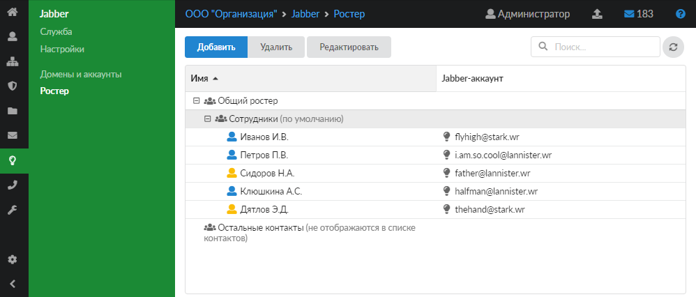
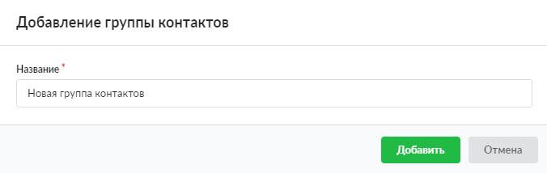

---

Общий ростер — это способ настройки XMPP-сервера.

В модуле **«Ростер»** можно управлять списком контактов всех созданных на ИКС Jabber-доменов в том виде, в котором они будут отображаться в контакт-листе пользователя, подключившегося к ИКС по своему Jabber-аккаунту.

В модуле можно добавлять, редактировать и удалять группы при помощи соответствующих кнопок, а также осуществлять поиск.

## Добавить группу контактов

Аккаунты можно группировать в группы контактов. Для создания новой группы выполните следующие действия:

1. Нажмите кнопку **«Добавить»**.
2. Введите **название** группы контактов.

3. Нажмите **«Добавить»** — в списке появится новая группа. В ИКС реализована функция drag-and-drop, поэтому контакты можно легко переместить в созданную группу, зажав левую кнопку мыши.

> ⚠ Внимание! При удалении группы контактов аккаунты, входящие в данную группу, автоматически перемещаются в группу «Остальные контакты» и не отображаются в списке контактов.
