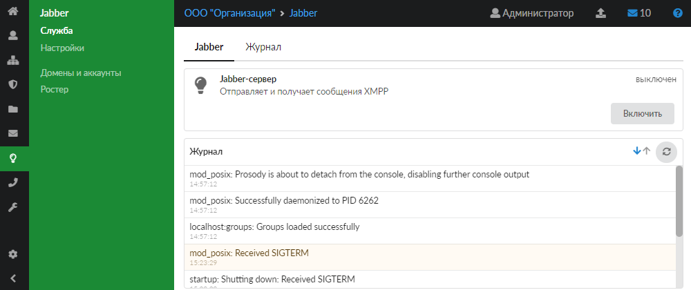
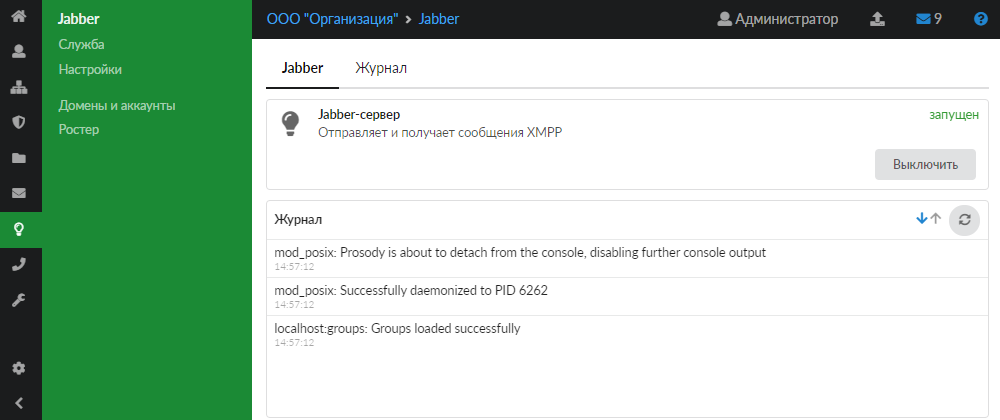
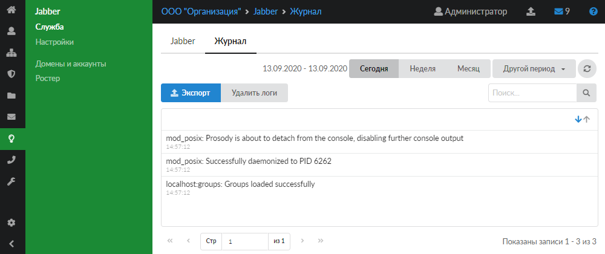

В ИКС поддерживается служба Jabber для обмена сообщениями и файлами по сети в режиме реального времени.

---

Для открытия модуля перейдите в меню **Jabber > Служба** .

В модуле расположены следующие вкладки:

- Jabber
- Журнал

## Jabber

На данной вкладке отображаются сведения о службе Jabber:

- статус службы ( запущен , остановлен , выключен , не настроен );
- кнопка **«Включить»** (**«Выключить»**) — позволяет запустить или остановить службу;
- журнал последних событий.

## Журнал

На данной вкладке отображается сводка всех системных сообщений модуля с указанием даты и времени.

Журнал является стандартным элементом веб-интерфейса ИКС.
