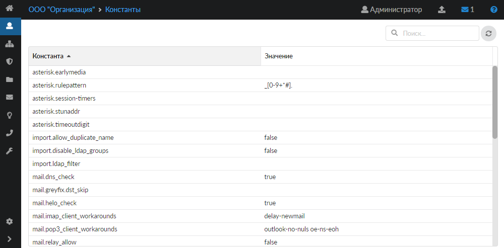

В Шлюзе безопасности ИКС реализован модуль, который отсутствует в списке всех служб. Этот модуль определяет некоторые глобальные константы поведения ИКС. В большинстве случаев изменять их не требуется, однако в некоторых случаях их изменение оправдано.

Для того чтобы перейти в модуль настройки констант, выполните следующие действия:

1. Удалите в адресной строке браузера весь путь после символов `#/`.
2. Впишите в URL слово `const`:

   `https://192.168.17.187:81/#/const`

3. Нажмите **<Enter>** — откроется окно со списком доступных для редактирования глобальных констант.

В ИКС предусмотрены следующие константы:

- **net.nat_networks** — определяет локальные сети, которые будут транслироваться во внешнюю сеть сервисом NAT. По умолчанию он работает только для локальных сетей, определяемых RFC — 192.168.0.0/16, 172.16.0.0/12 и 10.0.0.0/8. В случае, если в вашей локальной сети присутствуют нестандартные IP-адреса, можно добавить их в список натируемых хостов и подсетей.
- **net.inet.tcp.rfc1323** — масштабирование окна TCP, включено по умолчанию. В пакетах TCP передаются временные метки, что в некоторых случаях считается небезопасным. Отключение прекратит передачу временных меток, но может привести к потере производительности.
- **net.link.ether.inet.max_age** — время жизни записей в ARP кеше, рекомендуемое значение 1200 сек.
- **max_execution_time** — максимальное время выполнения PHP-скриптов. По умолчанию составляет 30 секунд. Если ИКС работает слишком медленно и некоторые скрипты не успевают выполниться за данное время (например, импорт большого числа доменных пользователей), можно увеличить этот параметр.

  > ⚠️ Важно! Не следует присваивать параметру слишком большие значения, это может привести к зависанию системы!

- **update_server** — сервер обновлений ИКС. Этот параметр может быть изменен для установки специальных обновлений с тестового сервера.

  > ⚠️ Важно! Не изменяйте данный параметр самостоятельно без консультации с сотрудником технической поддержки!

- **mail.smtp_auth_enable** — позволяет включить авторизацию на SMTP. Может иметь значение true либо false. При значении false авторизоваться смогут только хосты из белого списка.
- **mail.helo_check** — позволяет включить проверку HELO для входящих почтовых сообщений. Может иметь значение true либо false.
- **mail.dns_check** — позволяет включить проверку PTR-записей для входящих почтовых сообщений. Может иметь значение true либо false.
- **mail.greyfix.dst_skip** — адреса, для которых отключена проверка серыми списками.
- **mail.relay_allow** — отвечает за добавление сетей из белого списка в список mynetworks, тем самым автоматически разрешая ретрансляцию/отправку/релей писем из этих сетей.
- **web.sessionTimeout** — время отключения сессии пользователя в веб-авторизации в случае неактивности в секундах.
- **asterisk.session-timers** — таймеры сессии для провайдеров (accept, originate или refuse). Значение следует уточнить у провайдера.
- **asterisk.earlymedia** — формат: значение 1;значение 2. Записываются в переменные progressinband;prematuremedia. Progressinband = yes (для тех, у кого нет сообщений от провайдера), never (для тех, у кого два гудка); prematuremedia = yes/no (обычно no).
- **asterisk.timeoutdigit** — время ожидания нажатия следующей клавиши при наборе номера. По умолчанию 3 секунды.
- **squid.intercept_host_verify** — включает проверку соответствия IP-адреса для перехваченных запросов. Может иметь значение true (по умолчанию) либо false.
- **import.ldap_filter** — позволяет вручную ввести строку фильтра для импорта из LDAP.
- **import.disable_ldap_groups** — отключает импорт групп безопасности (синхронизированных наборов правил). Может иметь значение true либо false.
- **import.allow_duplicate_name** — разрешает импорт пользователей с одинаковыми именами. Может иметь значение true либо false.
- **squid.connect_retries** — количество попыток восстановления TCP-сессии после истечения таймаута соединения.
- **squid.icap_io_timeout** — таймаут для ожидания ответа от ICAP-сервера.
- **snort.et_rules_url**, **snort.pt_rules_url** — позволяет задать URL загрузки правил для детектора атак Suricata.
- **clamav.update_server** — позволяет задать URL загрузки правил для ClamAV.
- **pinger.pongs** — количество полученных ответов на пинг хоста, при котором можно считать, что он пингуется. По умолчанию равно 5. Граничные значения: 1—60 (включительно).
- **pinger.timeout** — время, в течение которого, если не получен ответ на пинг, можно считать, что пинга нет (в секундах). По умолчанию равно 5. Граничные значения: 1—60 (включительно).
- **pinger.some** — определяет зависимость статуса провайдера от статусов указанных серверов в настройках мониторинга. Если значение false, то провайдер считается недоступным, если недоступен хотя бы один из серверов (поведение по умолчанию). Если значение true, то провайдер считается недоступным, если недоступны ВСЕ серверы из списка; если хотя бы один сервер из списка доступен, то провайдер также доступен.
- **firewall.tcp_timeout** — время жизни установленного TCP-соединения в секундах. По умолчанию равно 86400 (24 часа).
- **support.hosts** — серверы регистрации и технической поддержки ИКС.

  > ⚠️ Важно! Не изменяйте данный параметр самостоятельно без консультации с сотрудником технической поддержки.

- **xauth_update_server** — сервер для обновлений клиентов Xauth.
- **pinger.kill_states** — при значении true происходит разрыв соединения на резервном провайдере, если восстановлена работа основного провайдера. При отваливании первого провайдера основного (или резервного), по умолчанию (или не по умолчанию) и переключении трафика на второй провайдер происходит разрыв соединения на первом провайдере. Проверять можно запуском пинга на пользовательской машине до внешнего адреса. Может иметь значение true либо false.
- **kern.hz** — частота таймера ядра, пульс ядра, отмечающий регулярные интервалы, с которыми ядро выполняет важные задачи хронометража. Увеличение параметра увеличит точность, например ограничения скорости, но может привести к большей нагрузке на процессор. После изменения требуется перезагрузка системы.
- **samba.allow.md5** — константа для поддержки устаревших windows server. Может иметь значение true либо false.
- **if_re_load** — значение true (по умолчанию) подключает использование драйвера сетевых адаптеров Realtek 5G (RTL8126), 2.5G (RTL8125/RTL8125B) и т.д. Значение false подключает стандартный драйвер из ядра. После переключения необходима перезагрузка системы.

## Правила набора (Dialplan)

Начиная с версии 7.0.0 добавлена возможность корректировать (обрабатывать) все called number в SIP Trunk провайдера. Так как некоторые SIP-провайдеры отходят от стандартной записи (например, один провайдер присылал номер, начинающийся с решетки #), такой номер не мог быть обработан правилами, установленными на ИКС. Поэтому для решения данной ситуации в ИКС добавлена возможность использовать символ решетки в начале номера.

Константа `asterisk.rulepattern` позволяет задать список возможных символов, с которых начинается номер. По умолчанию установлено значение `_[0-9+*#]`.

## Настройка кеша ZFS

Начиная с версии ИКС 6.1.0 изменено искусственное ограничение размера кеша ZFS (Zettabyte File System). Теперь FreeBSD резервирует половину оперативной памяти для ядра и прикладных программ. Вторая половина оперативной памяти используется для кеша ZFS (ARC — Adaptive Replacement Cache).

ARC имеет очень низкий приоритет для запросов к памяти. Если приложение запрашивает оперативную память, а система не имеет достаточно свободной памяти, ядро системы уменьшает ARC, предоставляя приложению запрошенную им память. Процесс возвращения оперативной памяти кеша в систему не является мгновенным: он может занять несколько секунд, поэтому система начнет подтормаживать.

Чтобы изменить параметры ARC, перейдите в `<IP-адрес ИКС>:<порт web-интерфейса>/#/const`. На данной вкладке доступны следующие параметры настройки ARC:

- vfs.zfs.arc_max
- vfs.zfs.arc_min
- vfs.zfs.prefetch_disable

Параметр **vfs.zfs.arc_max** позволяет установить максимальный размер ARC, указывается в мегабайтах. Пустое поле означает, что ИКС использует размер по умолчанию (`<объем ОЗУ>/2`). Ограничение соответствует объему оперативной памяти (RAM).

Для изменения размера ARC следует исходить из следующих рекомендаций:

- На каждый терабайт ПЗУ необходимо использовать 1 Гб ARC.
- Максимальный размер ARC не должен превышать `<объем ОЗУ> – 1Гб`.

Параметр **vfs.zfs.arc_min** отвечает за минимальный размер ARC, указывается в мегабайтах. Значение всегда должно быть меньше `vfs.zfs.arc_max`.

В ZFS реализован механизм предварительной загрузки файлов zfetch. Данный механизм анализирует шаблоны чтения файлов и пытается предсказать результаты следующего чтения для сокращения времени отклика приложений. В некоторых случаях zfetch может интенсивно нагружать процессор и иметь предел масштабируемости. Для того чтобы отключить zfetch, укажите значение параметра `vfs.zfs.prefetch_disable` равным 1.

> ⚠️ Внимание! Чтобы произведенные настройки вступили в силу, перезагрузите ИКС.

## Изменение групп AD

Константа `import.ldap_admin_groups` позволяет менять группы AD, которые будут администрировать ИКС. Если удалить все группы, из констант подтянутся группы по умолчанию Administrators, Domain Admins, Администраторы, Администраторы домена. Группы необходимо указывать через запятую.
