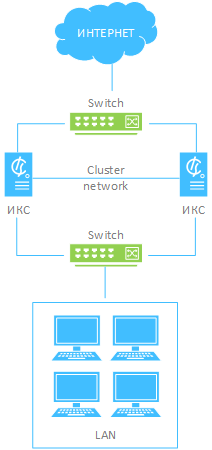
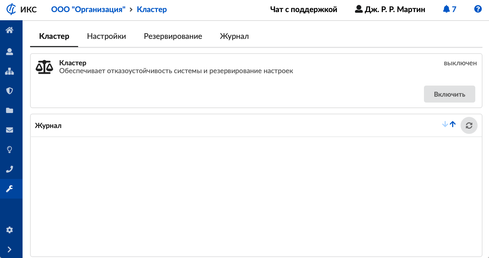
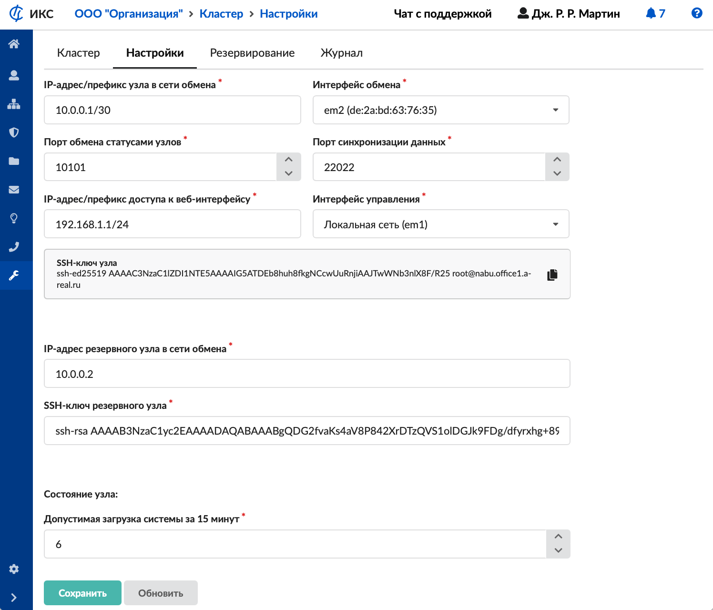
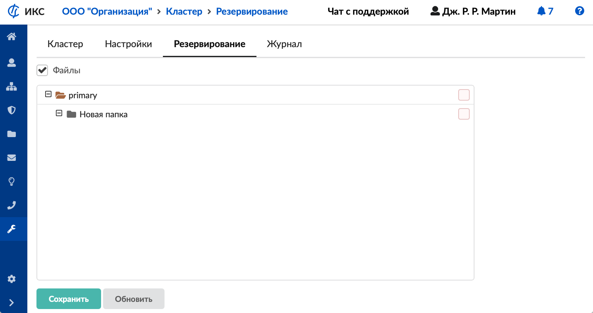
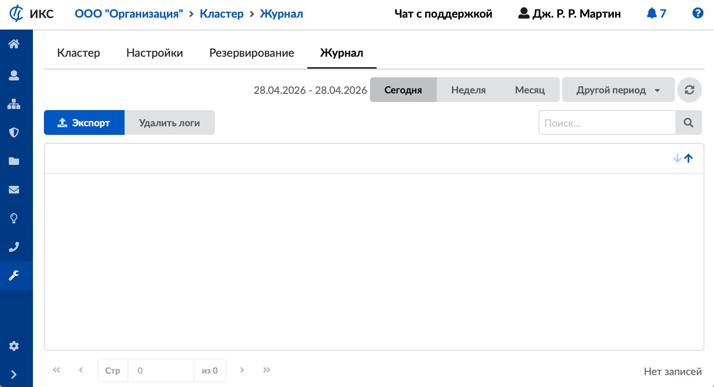

Сервис «Кластер» обеспечивает отказоустойчивость работы шлюза ИКС и работает в режиме Active-Standby. Состоит из двух узлов (основной и резервный).

---

Сервис **«Кластер»** обеспечивает отказоустойчивость работы шлюза ИКС и работает в режиме Active-Standby.

Кластер ИКС состоит из двух **узлов** (шлюзов ИКС):

- основной узел (master);
- резервный узел (slave).

Активным является узел, обрабатывающий трафик в данный момент времени. Резервный узел непрерывно мониторит состояние. При отсутствии связи с активным узлом резервный переводит текущие задачи обработки трафика на себя и сам становится основным. Обработкой трафика может заниматься только один из узлов.

У каждого узла настраивается один интерфейс обмена (состояние, синхронизация настроек ИКС, мониторинг) и один интерфейс управления для доступа админа (web-gui и SSH) из локальной сети организации.

Интерфейс провайдера изначально настраивается на **основном узле** (master). Далее при переключении эти настройки применяются на **резервном узле** (slave).

На резервном узле (slave) делаются только настройки для работы кластера. Настройка провайдеров, сетей и сервисов происходит на основном узле (master).

Сетевой обмен (состояние узлов, синхронизация данных) между узлами осуществляется по отдельному физическому каналу, под который на каждом из узлов резервируется по одной физической сетевой карте.

Переключение резервного узла (slave) в состояние основного происходит в случае:

- отказа (полного зависания или перезагрузки) основного узла (master);
- при потере связи между узлами на интерфейсе обмена;
- срабатывание системы самодиагностики (сеть, диски, загрузка системы) на основном узле.

[Порядок обновления](obnovlenie-klastera-2.md) узлов кластера имеет свои особенности.

Для создания кластера необходимо выполнение следующих требований:

- в кластере может быть только два узла (два шлюза ИКС);
- узлы должны иметь одинаковую версию ИКС;
- сетевые интерфейсы (обмена, управления/локалка и провайдера) шлюза/узла ИКС подключены к соответствующему коммутатору или сегменту сети;
- количество используемых физических сетевых карт на обоих серверах должно совпадать (минимальное количество — 3 шт. на каждый узел).

Особенности работы кластера:

- Данные отчетности, логов, мониторинга, содержимое почтовых ящиков, записи звонков и резервные копии не синхронизируются между узлами. У каждого узла хранятся свои данные.
- Если у провайдера имеется привязка по MAC-адресу, то при переключении узлов будет отсутствовать доступ в Интернет.
- При развороте на основном узле резервной копии с незапущенным кластером служба Кластер будет выключена на обоих узлах. Выключение службы кластер на резервном узле не влияет на работу службы на основном узле.

Для открытия модуля **«Кластер»** перейдите в меню **Обслуживание > Кластер**.

В модуле расположены следующие вкладки:

- [Кластер](#tab1)
- [Настройки](#tab2)
- [Резервирование](#tab3)
- [Журнал](#tab4)

## Кластер

На данной вкладке отображаются следующие сведения о службе кластер:

- статус службы (**запущен**, **остановлен**, **выключен**, **не настроен**);
- кнопка **«Включить»** («Выключить») — позволяет запустить или остановить службу;
- журнал последних событий.

> ⚠ **Внимание!** Корректный порядок для выключения кластера: сначала следует выключить службу «Кластер» у SLAVE, а затем выключить службу «Кластер» у MASTER. Если на MASTER лицензия на большее количество пользователей, чем на SLAVE, то при переключении на SLAVE лишние пользователи на MASTER будут выключены.

## Настройки

Данная вкладка предназначена для настройки службы Кластер.

1. Укажите **IP-адрес/префикс узла в сети обмена** и выберите **интерфейс** **обмена**.
2. Укажите **порт обмена статусами узлов** или оставьте по умолчанию.
3. Укажите **порт синхронизации данных** или оставьте по умолчанию.
4. Укажите **IP-адрес/префикс доступа к веб-интерфейсу** и выберите **интерфейс управления**.
5. Укажите **IP-адрес резервного узла в сети обмена**.
6. Введите **SSH-ключ резервного узла**.
7. Укажите **допустимую загрузку системы за 15 минут** или оставьте по умолчанию.
8. Нажмите **«Сохранить»**.

## Резервирование

С **версии ИКС 13.1** Кластер позволяет настраивать резервирование папок из хранилища файлов файлового сервера ИКС.

> ⚠ **Внимание!** Можно резервировать только папки из основного (системного/primary) раздела.

> ⚠ **Внимание!** Можно резервировать FTP- и Samba-ресурсы.

**Пример:**

1. Настроить и включить кластер, дождаться статусов Основной-Резервный.
2. Завести пользователя `Test` с логином `test` и паролем `test`.
3. На Основном в [меню](../../faylovyy-server/hranilische-faylov/vebresurs-v-hranilische-faylov-2.md) **Файловый сервер > Хранилище файлов** создать папку `/primary/sales`.
4. На Основном в меню **Файловый сервер > Хранилище файлов** выбрать папку `sales` и **Открыть доступ > FTP-ресурс**.
5. На Основном в [меню](https://doc.a-real.ru/index.php?article=257) **Добавление FTP-ресурса** поставить галки разрешений для пользователя `Test`, нажать **«Добавить»**.
6. Загрузить на FTP-ресурс в папку `sales` файлы.
7. На Основном в меню **Кластер > Резервирование** поставить галку «Файлы» и выбрать папку `sales`. Сохранить.
8. На Резервном проверить наличие пользователя `Test`.
9. На Резервном проверить в меню **Кластер > Резервирование** наличие настроек.
10. На Резервном проверить в меню **Файловый сервер > Хранилище файлов** наличие папки `sales` и файлов в ней.
11. На Основном смоделировать аварию — выключить по питанию.
12. Дождаться переключения Резервного на Основной.
13. Проверить доступность и наличие файлов в меню **FTP-ресурс** в папке `sales`.

**Ограничения:**

- Если папка с именем `sales` удаляется из хранилища файлов, а потом снова создается, то ее необходимо снова отметить в меню **Кластер > Резервирование** для синхронизации (если это требуется).
- При переименовании папок на основном узле Кластера на Резервном узле папки не переименовываются, а создается новая папка с новым именем.
- В меню **Кластер > Резервирование** если отметить галкой единственную папку (`dir1`) в `primary`, галка также ставится и на `primary`, резервируя все хранилище. При этом, если добавить в меню **Файловый сервер > Хранилище файлов** новую папку (`dir2`), она автоматически попадает в Резервирование.

## Журнал

На данной вкладке отображается сводка всех системных сообщений службы кластер.

[Журнал](https://doc.a-real.ru/index.php?article=196#summary) является стандартным элементом веб-интерфейса ИКС.
