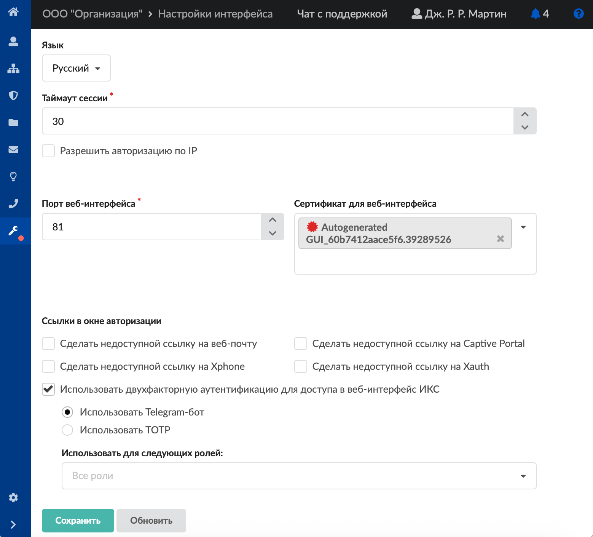
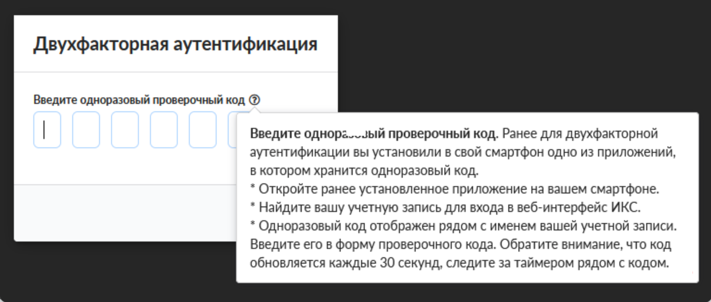

Модуль «Настройки интерфейса» предоставляет возможность установить некоторые параметры веб-интерфейса. Для открытия модуля перейдите в меню **Обслуживание &gt; Настройки интерфейса**.

## Общие настройки

В поле **«Язык»** можно выбрать язык отображения веб-интерфейса: русский либо английский.

Поле **«Вид пользователей»** позволяет задать вид отображения пользователей в соответствующем [модуле](/index.php?article=124): дерево либо список.

В поле **«Таймаут сессии»** задается время таймаута. Таймаут сессии определяет время бездействия пользователя ИКС в веб-интерфейсе, по окончании которого пользователь будет отключен (разлогинен) от веб-интерфейса.

> ⚠ Внимание! Если веб-интерфейс открыт на странице с динамическим содержимым, то таймаут сессии не наступит.

Флаг **«Разрешать авторизацию по IP»** позволяет всем пользователям, заведенным на ИКС с указанным [IP-адресом](/index.php?article=24#ip-address), проходить авторизацию и аутентификацию без введения логина и пароля.

### Порты и сертификаты

Поле **«Порт веб-интерфейса»** позволяет задать порт, на котором работает веб-интерфейс ИКС. По умолчанию это порт 81.

Поле **«Сертификат для веб-интерфейса»**. Так как веб-интерфейс ИКС работает только по протоколу [HTTPS](/index.php?article=24#https), то для доступа к веб-интерфейсу необходимо иметь [сертификат](/index.php?article=78). По умолчанию ИКС создает самоподписанный сертификат «Autogenerated GUI…». Поскольку сертификат является самоподписанным, все интернет-браузеры будут считать его недостоверным. Чтобы зайти в веб-интерфейс ИКС, добавьте данный сертификат в интернет-браузер.

> ⚠ Внимание! Устанавливаемый сертификат для веб-интерфейса должен иметь тип - конечный.

### Ссылки в окне авторизации

Флаг **«Сделать недоступной ссылку на веб-почту»** позволяет скрывать ссылку на [веб-почту](/index.php?article=86) в окне авторизации ИКС.

Флаг **«Сделать недоступной ссылку на Xphone»** позволяет скрывать ссылку на [Xphone](/index.php?article=101) в окне авторизации ИКС.

Флаг **«Сделать недоступной ссылку на Captive Portal»** позволяет скрывать ссылку на программу авторизации [Captive Portal](/index.php?article=52) в окне авторизации ИКС.

Флаг **«Сделать недоступной ссылку на Xauth»** позволяет скрывать ссылку на программу авторизации [Xauth](/index.php?article=51) в окне авторизации ИКС.

## Двухфакторная аутентификация

Для настройки двухфакторной аутентификации установите флаг **«Использовать двухфакторную аутентификацию для доступа в веб-интерфейс ИКС»**. При установке флага появляется возможность выбора способа для второго фактора аутентификации: TOTP либо Telegram-бот. Также можно задать, для каких именно ролей активируется данный фактор.

### Использовать Telegram-бот

При выборе **«Использовать Telegram-бот»** в [Пользователях](/index.php?article=124) станет доступной кнопка **«Двухфакторная аутентификация»** для выбранных ролей. При выборе пользователя соответствующей роли для него можно либо обновить ссылку, либо скопировать ссылку. Скопированную ссылку необходимо передать пользователю, чтобы он перешел по ней и зарегестрировался в Telegram-боте, [настроенном на ИКС](/index.php?article=115#tab5). Если пользователь не перейдет по ссылке, то не сможет в дальнейшем авторизоваться в GUI ИКС. После перехода по ссылке и авторизации в боте, при входе в веб-интерфейс ИКС, пользователю будет приходить сообщение в Telegram о попытке входа в веб-интерфейс и подтверждение/отказ данного действия. Без подтверждения в авторизации будет отказано. Если нажать **«Обновить ссылку»** на пользователе, то Telegram-бот не будет отправлять уведомление данному пользователю до тех пор, пока пользователь не авторизуется в боте по новой ссылке. Стоит отметить, что данная ссылка общая для: GUI, [OpenVPN](/index.php?article=198), [VPN](/index.php?article=197), [SSTP](/index.php?article=311).

#### Особенность функционирования

Если API Телеграмма не доступен ИКС, то фактор авторизации через Телеграмм будет пропущен.

Если включен данный функционал и собран кластер, то двухфакторная авторизация на узле Master будет поддерживаться, а на узле Slave — нет, так как API Телеграмма не доступен на втором узле.

### Использовать TOTP

TOTP — это алгоритм, способный выдавать и сверять временные коды на разных устройствах, которые меняются каждые 30 секунд. Для использования TOTP необходимо установить приложение и единожды синхронизировать его с ИКС. Например, при помощи приложения для смартфона от Яндекса «Я Ключ».

При выборе **«Использовать TOTP»** в [Пользователях](/index.php?article=124) станет доступной кнопка **«Двухфакторная аутентификация»** для выбранных ролей. При выборе пользователя соответствующей роли для него можно либо показать QR-код TOTP-токена, либо обновить TOTP-токен. При нажатии на **«Показать QR-код TOTP-токена»** будет открыто новое диалоговое окно, в котором отобразится QR-код токена, а также секретный ключ. Для того чтобы использовать в виде второго фактора TOTP, пользователю необходимо в специализированном приложении (например, **«Я Ключ»**) отсканировать данный QR-код или ввести секретный ключ при ручном добавлении. При нажатии на **«Обновить TOTP-токен»** секретный ключ для выбранного пользователя будет сгенерирован снова. Стоит отметить, что данный токен общий для: GUI, [OpenVPN](/index.php?article=198). В рамках использования кластера TOTP-коды будут одинаковыми для узлов Master и Slave.

В окно ввода TOTP-кода разрешено вводить только цифры.

Если включен [fail2ban](/index.php?article=77) на защиту GUI, то неправильное введение второго фактора будет считаться за неудачную попытку авторизации.

Если установлен флаг **«Разрешить авторизацию по IP»** выше, то он имеет наибольший приоритет. То есть произойдет игнорирование любых иных факторов авторизации.

Чтобы внесенные изменения вступили в силу, нажмите кнопку **«Сохранить»**.
