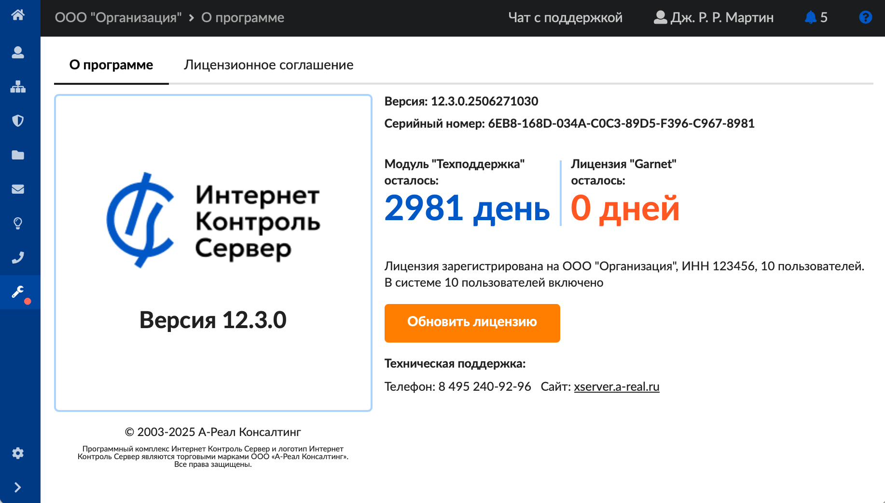
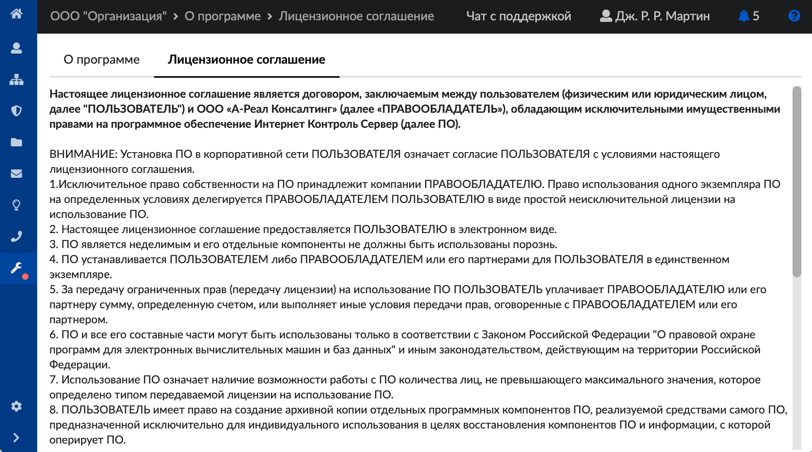

В модуле «О программе» отображается основная информация об установленной версии ИКС. Для открытия данного модуля перейдите в меню **Обслуживание > О программе**.

---

В модуле расположены следующие вкладки:

- [О программе](#tab1)
- [Лицензионное соглашение](#tab2)

## О программе

На данной вкладке отображаются следующие сведения:

- текущая версия ИКС;
- серийный номер;
- сроки действия лицензий на некоторые модули защиты (веб-фильтр Garnet, службы Касперского);
- срок действия модуля «Техподдержка» либо тестового периода;
- количество подключенных к системе пользователей;
- кнопка **«Запрос лицензии»** — позволяет [активировать сервер](poluchenie-licenzii-2.md);
- телефон технической поддержки;
- ссылка на главную страницу [официального сайта](https://xserver.a-real.ru/).

## Лицензионное соглашение

На вкладке можно прочесть лицензионное соглашение, заключенное с ООО «А-Реал Консалтинг», правообладателем программы ИКС.

