# Получение лицензии

Процесс получения лицензии зависит от версии ИКС.

---

Процесс получения лицензии зависит от версии ИКС:

- [Версия 10.2 и выше](#new)
- [Версия 10.1.1 и ниже](#old)

## Версия 10.2 и выше

Начиная с версии 10.2 для получения лицензии необходимо выполнить следующие действия:

Нажмите на кнопку **«Запрос лицензии»** и в открывшемся окне выберите **тип лицензии**:

- [Trial](#trial)
- [Коммерческая](#commercial)
- [Бесплатная ИКС Lite](#free-lite)

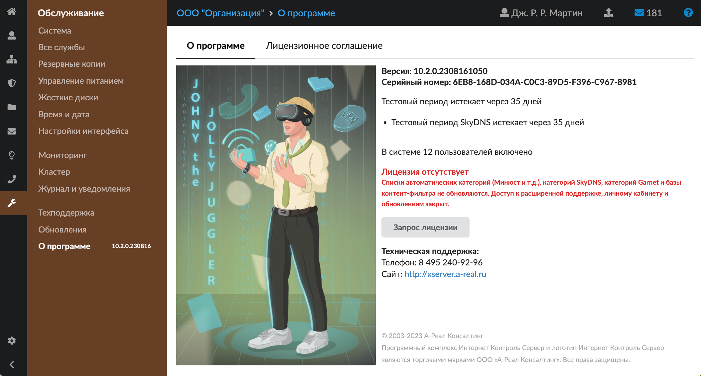

### Trial

1. Укажите **имя**.
2. Введите **название организации** и **ИНН**.
3. Укажите **e-mail** и **номер телефона**.

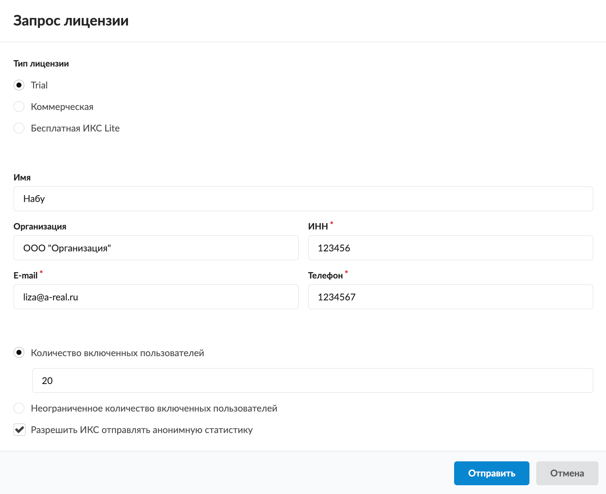

4. Введите **количество включенных пользователей** либо выберите пункт «Неограниченное количество включенных пользователей».
5. При желании установите флаг **«Разрешить ИКС отправлять анонимную статистику»**.
6. Нажмите кнопку **«Отправить»**. На экране появится сообщение об успешном получении и установке версии Trial на 35 дней.

В дальнейшем вы сможете получить новую лицензию по мере необходимости. Для этого нажмите кнопку **«Запрос новой лицензии»** в модуле **«О программе»**.

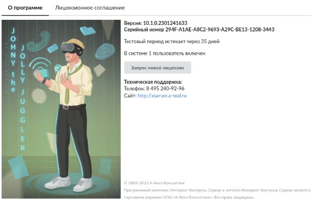

### Коммерческая

1. Укажите **имя**.
2. Введите **название организации** и **ИНН**.
3. Укажите **e-mail** и **номер телефона**.

> ⚠️ Важно! При выборе коммерческой версии следует особенно внимательно вводить данные, так как они будут использованы при оформлении лицензии.

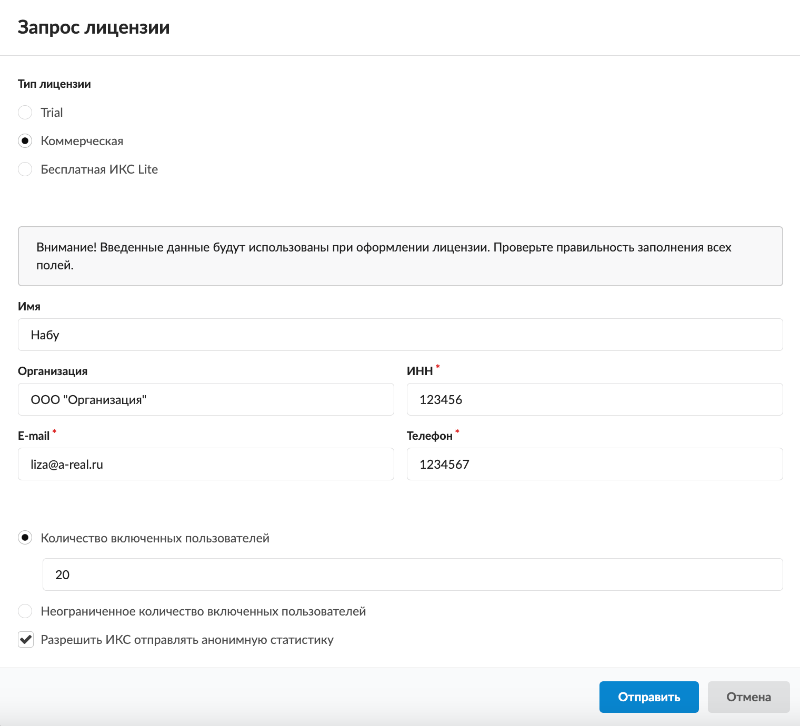

4. Введите **количество включенных пользователей** либо выберите пункт «Неограниченное количество включенных пользователей».
5. При желании установите флаг **«Разрешить ИКС отправлять анонимную статистику»**.
6. Нажмите кнопку **«Отправить»**. На экране появится сообщение об успешной отправке запроса. Лицензия будет создана и отправлена на указанную почту в течение двух рабочих дней.

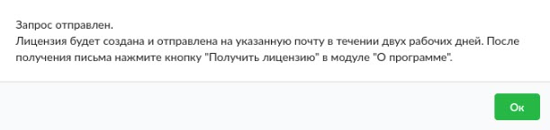

7. После получения письма нажмите кнопку **«Получить лицензию»** в модуле **«О программе»**.

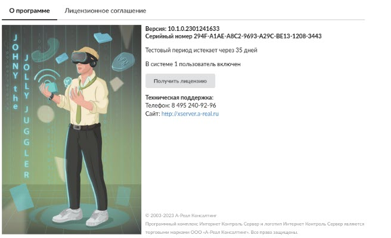

В дальнейшем вы сможете обновлять лицензию по мере необходимости. Для этого нажмите кнопку **«Обновить лицензию»** в модуле **«О программе»**.

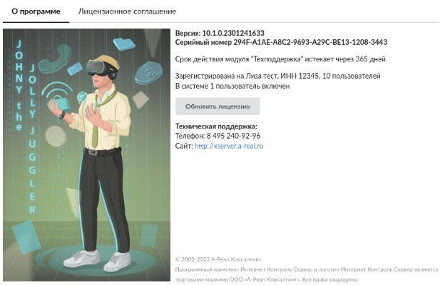

### Бесплатная ИКС Lite

1. Укажите **имя**.
2. Введите **название организации** и **ИНН**.
3. Укажите **e-mail** и **номер телефона**.

> ⚠️ Важно! При выборе бесплатной версии ИКС Lite следует особенно внимательно вводить данные, так как они будут использованы при оформлении лицензии.

> ⚠️ При выборе бесплатной версии ИКС Lite выбор количества пользователей будет недоступен. Данная версия рассчитана не более чем на 9 пользователей. Отправка анонимной статистики также будет обязательной.

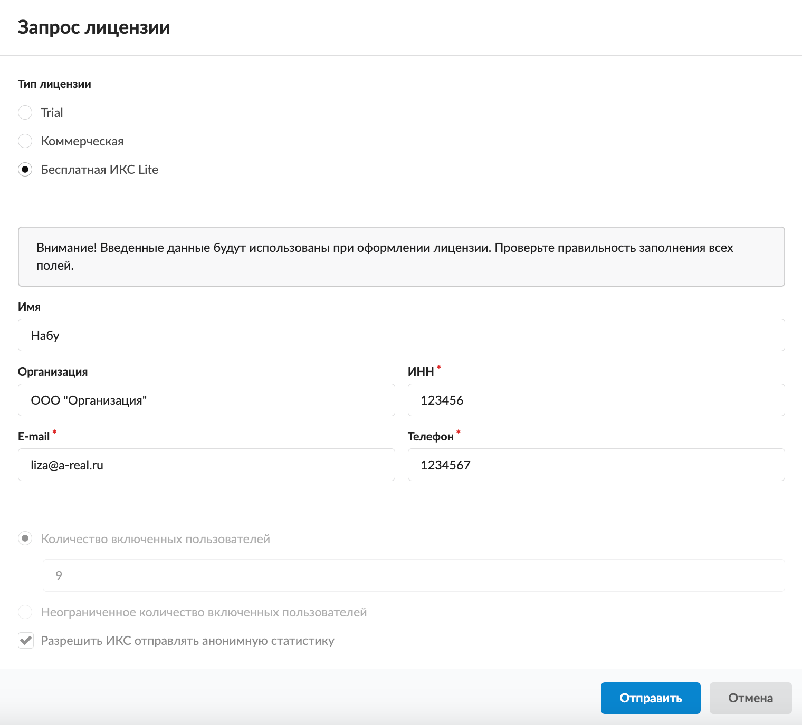

4. Нажмите кнопку **«Отправить»**. На экране появится информационное сообщение.

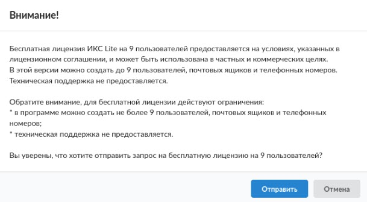

5. Нажмите кнопку **«Отправить»**. На экране появится сообщение об успешной отправке запроса. Лицензия будет создана и отправлена на указанную почту в течение двух рабочих дней.

6. После получения письма нажмите кнопку **«Получить лицензию»** в модуле **«О программе»**.

В дальнейшем вы сможете обновлять лицензию по мере необходимости. Для этого нажмите кнопку **«Обновить лицензию»** в модуле **«О программе»»

## Версия 10.1.1 и ниже

Активацию сервера можно осуществить после приобретения лицензии на программу либо в том случае, если вы планируете использовать ИКС Lite.

> ⚠️ Внимание! При каждой переустановке программы серийный номер и хеш генерируются заново. Поэтому вам нужно будет делать повторный запрос активации после каждой переустановки программы.

Для активации сервера перейдите в меню **Обслуживание &gt; О программе**. Нажмите кнопку **«Регистрация»**. Дальнейшие действия по активации сервера зависят от того, есть ли сеть Интернет.

### При наличии интернет-подключения

Если есть сеть Интернет, возможны следующие варианты регистрации:

- [Активация ИКС Lite](#lite)
- [Активация ИКС](#activ)
- [Регистрация демо-версии](#demo)

#### Активация ИКС Lite

Для активации заполните соответствующие поля.

Если число включенных пользователей, почтовых ящиков и телефонных номеров указано 9 или меньше, вы можете активировать версию ИКС Lite. Для этого нажмите на одноименную кнопку.

#### Активация ИКС

При активации ИКС вы получите полнофункциональную версию, ограниченную только количеством купленных включенных пользователей.

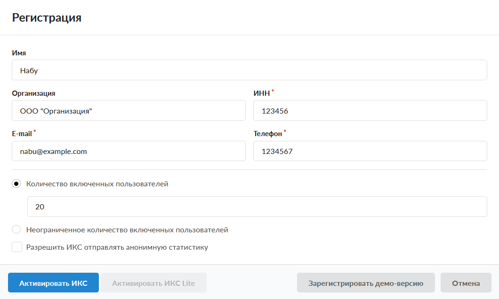

После приобретения лицензии на программу вы также можете активировать систему в [автоматическом режиме](https://doc.a-real.ru/index.php?article=155#var1).

#### Регистрация демо-версии

Демо-версия ИКС представляет собой полнофункциональную бесплатную версию ИКС на неограниченное количество пользователей. Данная версия ограничена по времени использования (35 дней).

Зарегистрируйте демо-версию программы для того, чтобы получать обновления ИКС, иметь доступ к спискам Минюста, Роскомнадзора, РБОС, веб-фильтра Garnet и их обновлениям.

Для регистрации демо-версии программы выполните следующие действия:

1. [Зайдите в веб-интерфейс ИКС](https://doc.a-real.ru/index.php?article=8).
2. Перейдите в меню **Обслуживание** &gt; **О Программе**.
3. Нажмите кнопку **«Регистрация»**.

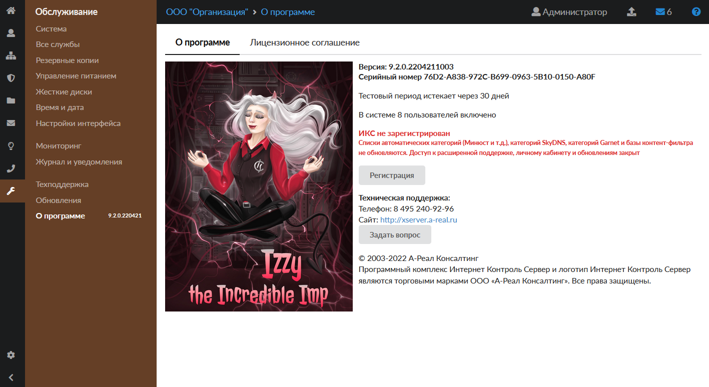

4. Заполните поля открывшегося окна и нажмите кнопку **«Зарегистрировать демо-версию»**.

5. Обновите страницу комбинацией клавиш **CTRL+F5**.
6. Убедитесь, что на странице больше не отображается красная надпись: *ИКС не зарегистрирован*.

Оцените интерфейс программы до установки при помощи **Демо Онлайн**. Доступны все вкладки, настройки не сохраняются. Доступ к сервису Демо Онлайн предоставляется по запросу. Чтобы получить логин и пароль, заполните форму на [сайте](https://xserver.a-real.ru/ics-standard/).

### При отсутствии интернет-подключения

При отсутствии сети Интернет автоматическую активацию выполнить невозможно. В таком случае используйте [ручную активацию](https://doc.a-real.ru/index.php?article=155#var2).

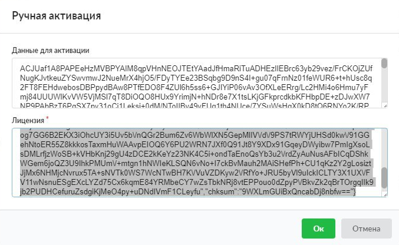

> ⚠️ При покупке дополнительных лицензий дождитесь, когда ваш персональный менеджер сообщит о внесении нужного количества пользователей в реестр, и нажмите кнопку **«Переактивация»** — и лицензия будет обновлена.

### Больше информации:

- [Что такое ИКС Lite?](https://doc.a-real.ru/index.php?article=179)
- [Чем отличается версия Стандарт от ФСТЭК?](https://doc.a-real.ru/index.php?article=178)
- [Можно ли увеличить пользователей в ИКС Lite?](https://doc.a-real.ru/index.php?article=180)
- [Как продлить модуль «Техподдержка»?](https://doc.a-real.ru/index.php?article=154)

---

**Источник:** [Документация ИКС — Получение лицензии](https://doc.a-real.ru/index.php?article=324)
