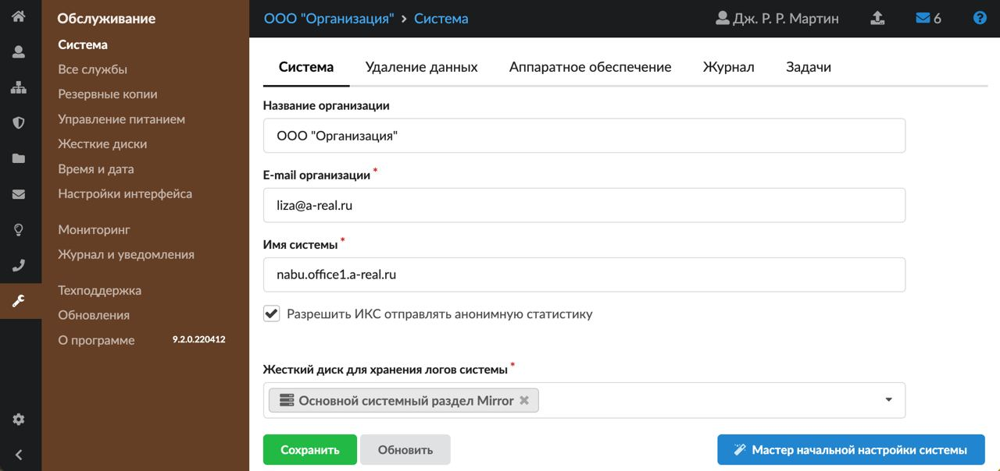
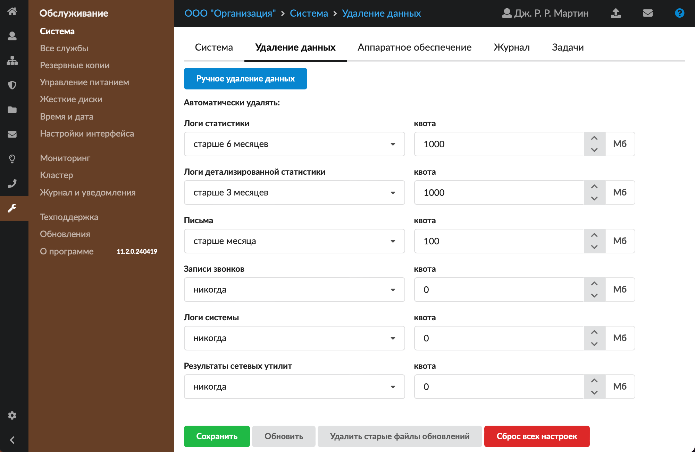
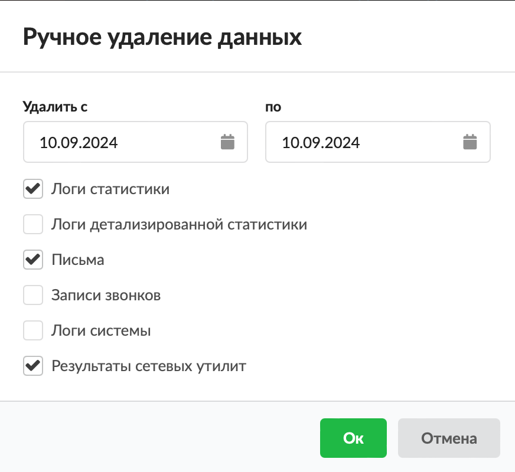
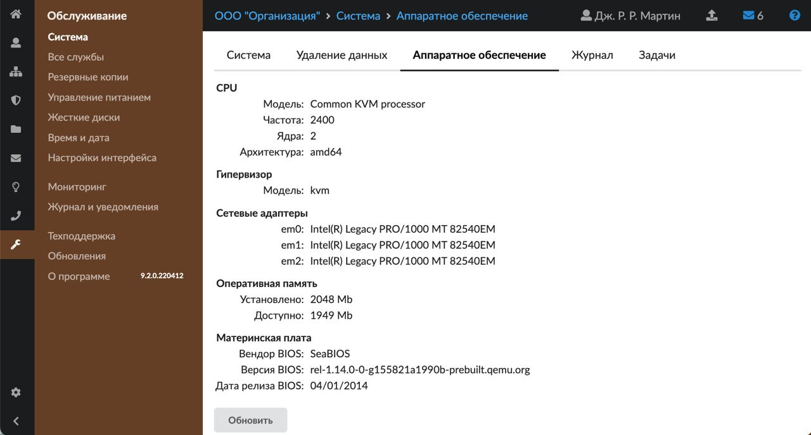
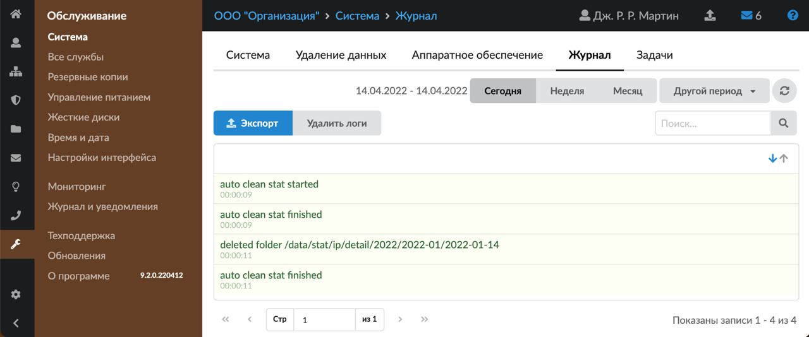
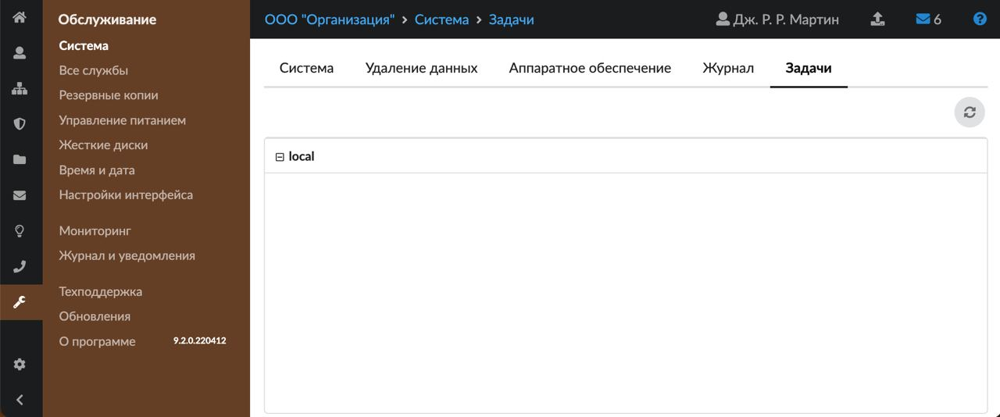

Модуль «Система» предназначен для ввода данных организации, удаления данных и просмотра текущих задач в ИКС.

---

Модуль **«Система»** предназначен для ввода следующих данных: название организации, которое будет отображаться в веб-интерфейсе, имейл-адрес, доменное имя системы. Также здесь можно произвести удаление данных и просмотреть текущие задачи в ИКС (создание резервной копии, импорт пользователей и т. д.).

Для открытия модуля перейдите в меню **Обслуживание > Система**.

В модуле расположены следующие вкладки:

- [Система](#tab1)
- [Удаление данных](#tab2)
- [Аппаратное обеспечение](#tab2.2)
- [Журнал](#tab3)
- [Задачи](#tab4)

## Система

На данной вкладке расположены поля для ввода данных:

- **«Название организации»** — будет отображаться в веб-интерфейсе ИКС;
- **«E-mail организации»** — имейл-адрес организации;
- **«Имя системы»** — hostname (имя хоста);
- **«Жесткий диск для хранения логов системы»** — позволяет переместить логи системы и записать их на отдельный жесткий диск.

### Выбор имени системы

Имя системы определяет имя хоста (hostname), а также используется в SMTP баннере почтовой системы ИКС.

В общем случае имя системы не должно содержать одноуровневый домен (в имени должна присутствовать хотя бы одна точка, при этом имя не должно заканчиваться точкой), то есть имя может быть в виде `aaa.bbb` или `aaa.bbb.ccc` и т. д.

Если имя системы не будет использоваться для доступа к ИКС из внешней сети, то с точки зрения потенциальных сетевых конфликтов, наиболее безопасным было бы использование принадлежащего вам домена с субдоменом, не существующим во внешнем пространстве имен DNS, вида: `local.my_company.ru`.

Использование в имени системы любых имен верхнего уровня (TLD), не зарегистрированных в настоящее время, чревато конфликтами в будущем.

`.local.` — не рекомендуется, так как используется различным ПО, в том числе Apple zeroconf (mDNS/Bonjour), Microsoft WSBS и т.д.

Из популярного списка таких имен (`.intranet.`; `.internal.`; `.private.`; `.local.`; `.corp.`; `.home.`; `.lan.`) и цифровых (от .0 до .9) можно считать условно безопасными следующие:

- цифровые: от .0 до .9;
- `.home.` — домен специального назначения, исключен из глобальной системы DNS (см. RFC 8375);
- `.internal.` — в настоящее время занят Google и Amazon для внутренней интрасети.

> ⚠ Внимание! При изменении имени системы необходимо создать соответствующую запись в [DNS-сервере](../set/dns/dns-obzor-2.md), иначе сервер телефонии, почты и Jabber-сервер не будут функционировать.

Флаг **«Разрешить ИКС отправлять анонимную статистику»** доступен, если приобретена лицензия не ИКС лайт. Если флаг установлен, с ИКС будет собираться анонимная статистика (какие службы и модули запущены). Для ИКС лайт данная настройка включена всегда.

Для запуска [мастера начальной настройки системы](../vebinterfeys-iks/master-nachalnoy-nastroyki-sistemy-2.md) нажмите одноименную кнопку.

## Удаление данных

Данная вкладка предназначена для удаления различных логов (данных, содержащихся в ИКС) и записей звонков в [автоматическом](#mode1) либо [ручном](#mode2) режиме.

Проверка квоты срабатывает раз в минуту. В виду данной особенности, размер квоты может быть превышен.

### Автоматический режим

Для автоматического режима на вкладке можно задать **временные рамки** и (или) **квоту** (в Мб), при достижении которой ИКС будет удалять хранящиеся данные:

- **логи статистики** — данные, собранные из детализированной статистики и объединенные по различным признакам для уменьшения занимаемого места на жестком диске и оптимизации времени составления отчетов. Такие логи не содержат: данные по [IP](../o-dokumentacii/slovar-terminov-3.md), данные по [HTTP](../o-dokumentacii/slovar-terminov-3.md), данные ленты поисковиков и данные активности пользователей. При удалении логов статистики их можно восстановить по соответствующим логам детализированной статистики;
- **логи детализированной статистики** — вся статистика [пользователей](../polzovateli-i-statistika/polzovateli/polzovateli-obzor-2.md), собранная ИКС, без каких-либо объединений и группировок. При удалении детализированной статистики данные будут безвозвратно удалены;
- **письма** — удаление писем по дате из всех папок, в том числе из тех, которые создал пользователь;
- **записи звонков** — записи телефонных звонков, совершенные с помощью [сервера телефонии](../telefoniya/telefoniya-obzor-3.md) ИКС;
- **логи системы** — данные [системного журнала](https://doc.a-real.ru/index.php?article=115) и данные, отображаемые на вкладках «События» и «Журнал» всех модулей ИКС;
- **результаты сетевых утилит** — [dump-файлы](../set/setevye-utility-2.md), хранящиеся на ИКС.

> ⚠ Внимание! При установке системы автоматически прописываются следующие значения:
> - автоматически удалять логи статистики старше 6 месяцев;
> - автоматически удалять логи детализированной статистики старше 3 месяцев.

При необходимости можно указать другой период либо отключить автоматическое удаление по временным рамкам.

Если заданы временные рамки и квота, то удаление данных будет происходить в зависимости от параметра, который будет достигнут раньше. В качестве временных рамок предлагается выбрать один из возможных вариантов: никогда, старше недели, старше месяца, старше 2 месяцев, старше 3 месяцев, старше 6 месяцев, старше года.

Чтобы изменения вступили в силу, нажмите кнопку **«Сохранить»**.

Для того чтобы **удалить старые файлы обновлений**, нажмите соответствующую кнопку.

При нажатии на кнопку **«Сброс всех настроек»** настройки сбрасываются и создается их резервная копия.

### Ручной режим

Для ручного удаления данных выполните следующие действия:

1. Нажмите кнопку **«Ручное удаление данных»**.
2. Укажите временной **период**, за который нужно удалить данные.
3. Установите **флаги** рядом с данными, которые требуется удалить. Если ни один флаг не установлен, подтверждение ручного удаления данных будет недоступно.

4. Нажмите **«Ок»** — данные будут безвозвратно удалены.

## Аппаратное обеспечение

На данной вкладке можно ознакомиться с информацией об аппаратном обеспечении, на которое установлен ИКС.

## Журнал

На данной вкладке отображается сводка всех системных сообщений модуля с указанием даты и времени.

[Журнал](https://doc.a-real.ru/index.php?article=196#summary) является стандартным элементом веб-интерфейса ИКС.

## Задачи

На данной вкладке показаны выполняющиеся асинхронные процессы в ИКС, а также процент выполнения для каждого процесса.

Прервать выполнение процесса можно по кнопке **«Cancel»**. При выполнении асинхронного процесса пользователь ИКС может производить различные настройки в веб-интерфейсе ИКС. Асинхронными процессами являются: перенос почты, импорт пользователей, создание резервной копии и т. д.
