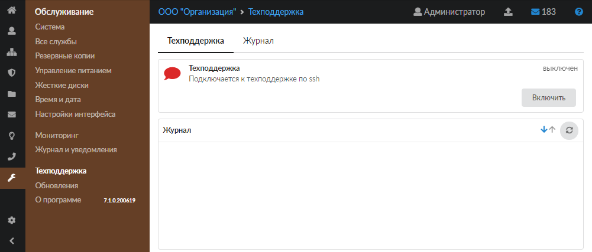
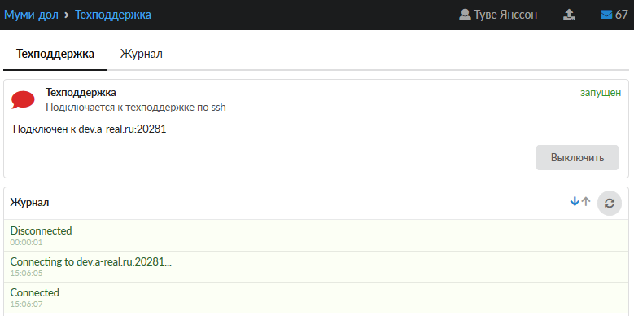
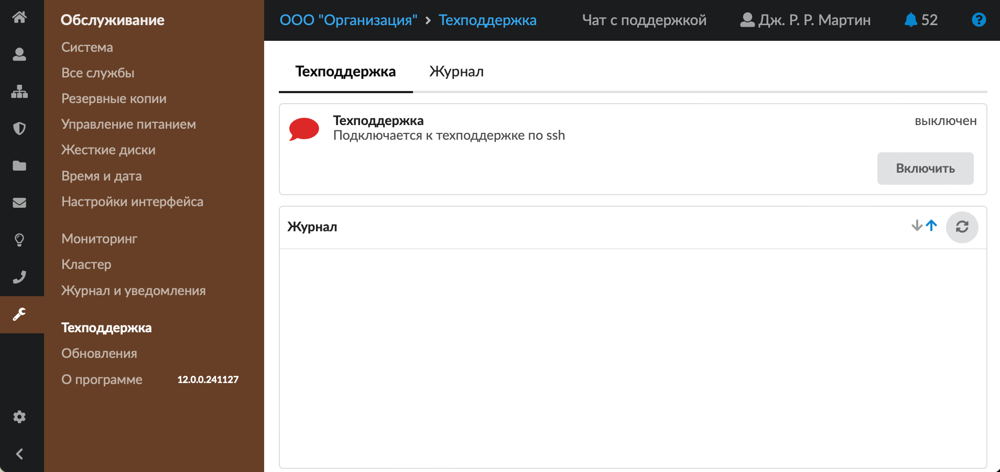
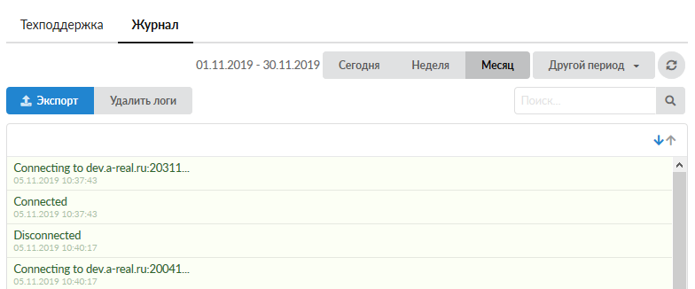

Модуль «Техподдержка» предназначен для предоставления доступа к ИКС сотруднику технической поддержки «А-Реал Консалтинг».

---

Модуль <strong>«Техподдержка»</strong> предназначен для предоставления доступа к ИКС сотруднику технической поддержки «А-Реал Консалтинг». Это может быть полезно для получения помощи по настройке ИКС или устранения каких-либо возникающих проблем в тех случаях, когда ИКС находится:

- за [межсетевым экраном](../o-dokumentacii/slovar-terminov-3.md), который запрещает входящие соединения;
- в серой сети за [NAT](../o-dokumentacii/slovar-terminov-3.md)-устройством (модем, роутер).

Для открытия модуля перейдите в меню <strong>Обслуживание &gt; Техподдержка</strong>.

В модуле расположены следующие вкладки:

- [Техподдержка](#tab1)
- [Журнал](#tab2)

## Техподдержка

На данной вкладке отображаются следующие сведения о службе:

- статус службы (запущен, остановлен, выключен, не настроен);
- кнопка <strong>«Включить»</strong> (<strong>«Выключить»</strong>) — позволяет запустить или остановить службу;
- журнал последних событий.

После старта модуля в сводке под названием службы отобразится порт подключения (обычно это порт 20xxх). Для удаленного подключения сообщите номер порта сотруднику <strong>технической поддержки</strong>: [наши контакты](https://xserver.a-real.ru/#main-footer).

Для Администратора в правом верхнем углу экрана доступна кнопка <strong>«Чат с поддержкой»</strong>. Чат реализован на базе мессенджера Telegram, при нажатии на кнопку происходит переход в [чат-бот техподдержки](https://t.me/xserver_support_bot).

Чат доступен только для коммерческой лицензии ИКС с активным [модулем техподдержки](https://doc.a-real.ru/index.php?article=328).

## Журнал

На данной вкладке отображается сводка всех системных сообщений модуля с указанием даты и времени.

[Журнал](../vebinterfeys-iks/standartnye-elementy-vebinterfeysa.md) является стандартным элементом веб-интерфейса ИКС.
