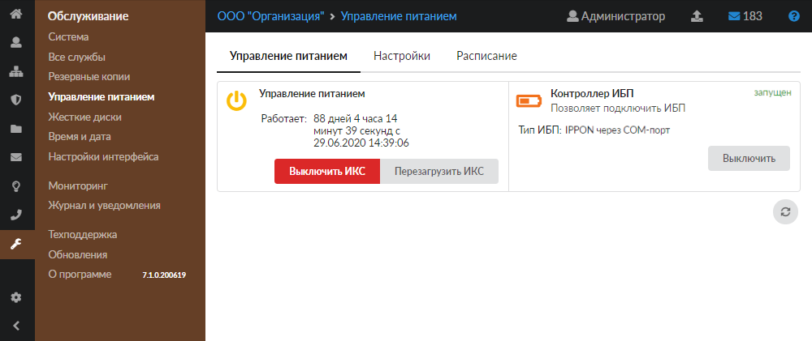
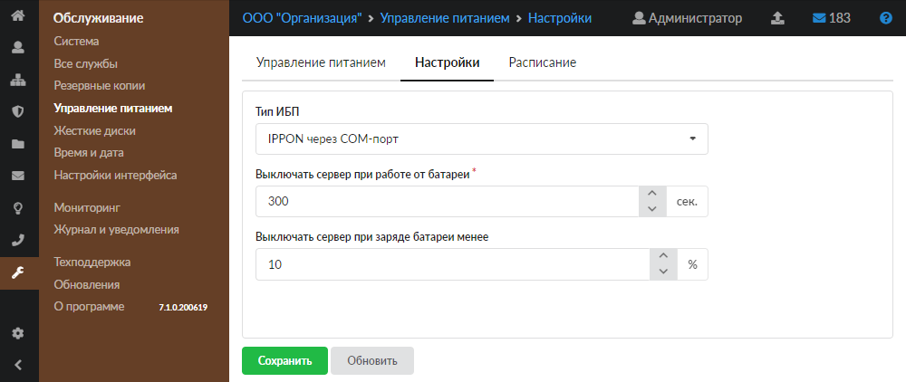
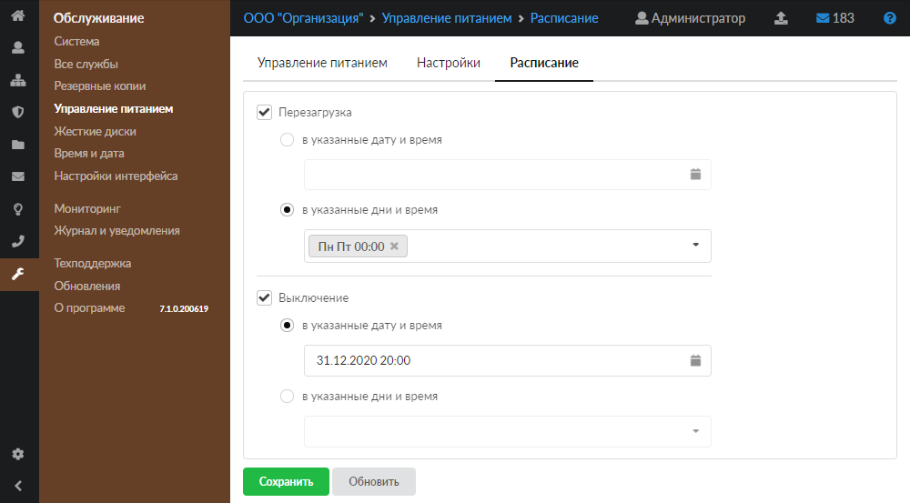

Модуль «Управление питанием» предназначен для настройки и управления источниками питания. Для открытия данного модуля перейдите в меню **Обслуживание > Управление питанием**.

В модуле расположены следующие вкладки:

- Управление питанием
- Настройки
- Расписание

## Управление питанием

На данной вкладке показаны виджеты двух разделов: «Управление питанием» и «Контроллер ИБП».

В виджете **«Управление питанием»** отображаются следующие данные:

- время работы ИКС от сети питания;
- кнопки **«Выключить ИКС»** и **«Перезагрузить ИКС»**.

В виджете **«Контроллер ИБП»** отображаются следующие сведения:

- информация о подключенном ИБП (запущен, остановлен, выключен, не настроен);
- кнопка **«Включить»** (**«Выключить»**) — позволяет запустить или остановить контроллер, который взаимодействует с ИБП (источником бесперебойного питания).

## Настройки

Данная вкладка позволяет задать настройки контроллера для взаимодействия с ИБП.

Выберите **тип ИБП**. Контроллер ИКС может работать с ИБП фирм IPPON и APC по COM-порту или по USB-порту.

На вкладке можно задать порог **времени работы от ИБП** (в секундах) и порог **остаточного заряда батареи** (в процентах). При достижении одного из параметров ИКС перейдет в режим завершения работы и выключится.

> ⚠ Внимание! Для того чтобы ИКС автоматически включился при восстановлении электропитания, необходимо настроить BIOS материнской платы (опция «After power failure»: «Last State» либо аналогичная).

Чтобы выбранные настройки вступили в силу, нажмите **«Сохранить»**.

## Расписание

На данной вкладке можно назначить **дату** либо **день недели** и **время** следующей запланированной перезагрузки ИКС либо его выключения.

Чтобы выбранные настройки вступили в силу, нажмите **«Сохранить»**.
