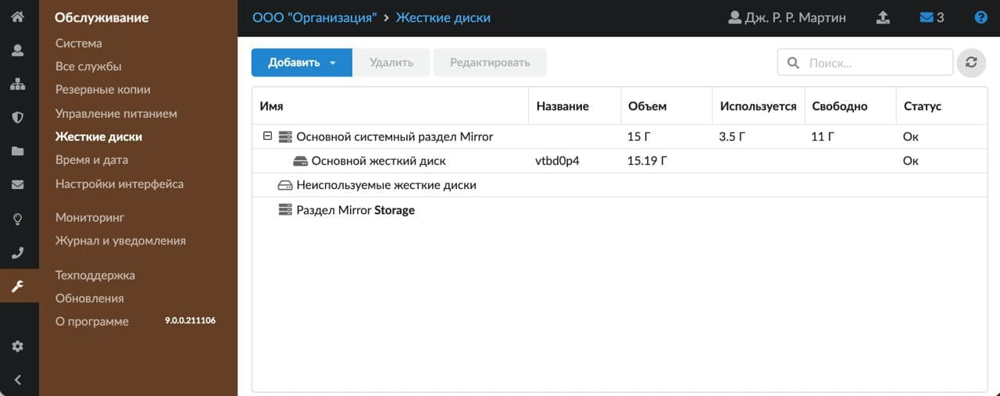
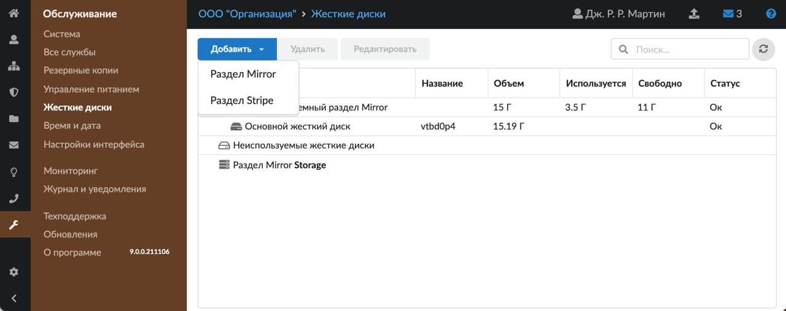
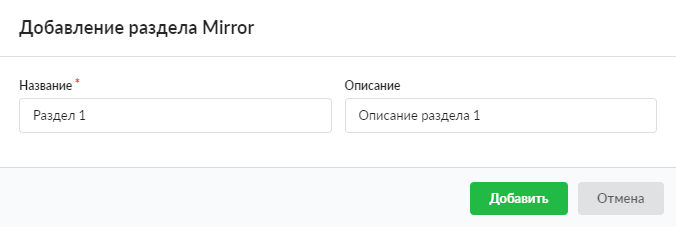
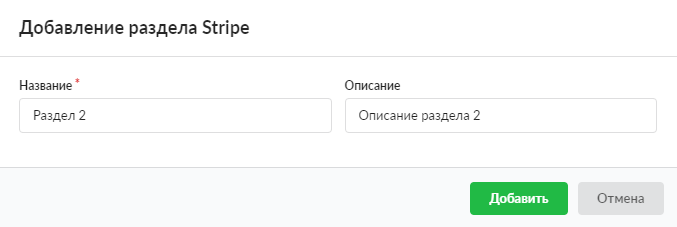

Модуль «Жесткие диски» предназначен для управления жесткими дисками в ИКС.

---

Модуль **«Жесткие диски»** предназначен для управления жесткими дисками в ИКС. Для открытия модуля перейдите в меню **Обслуживание &gt; Жесткие диски**.

На странице модуля отображается список всех жестких дисков, физически подключенных к оборудованию, на котором установлен ИКС.

Список представлен в виде дерева, в котором по умолчанию есть два раздела:

- **«Неиспользуемые жесткие диски»** — здесь отображаются жесткие диски, которые подключены к ИКС и не задействованы в его функционировании.
- **«Основной системный раздел Mirror»** — здесь отображается жесткий диск, на который был установлен ИКС. При добавлении жесткого диска в данный раздел будет образован программный RAID 1. Обязательным требованием к добавляемому жесткому диску является его размер: он должен быть равным основному либо больше.

В списке отображается следующая информация о жестких дисках: название диска, общий объем, используемый объем, свободный объем, статус. У раздела Mirror может быть один из трех статусов:

- **«Ок»** — все диски раздела имеют статус «Ок»;
- **«Сбой»** — в разделе есть диски со статусом «Ок» и диски со статусом «Ошибка»;
- **«Ошибка»** — все диски раздела имеют статус «Ошибка». Если в разделе удалить все диски со статусом «Ошибка», то статус раздела автоматически изменится на «Ок».

## Добавление новых разделов и дисков

В ИКС можно добавлять свои разделы и диски. Для этого нажмите кнопку **«Добавить»**.

Выберите требующийся тип создаваемого раздела. В каждый раздел можно добавить один или больше дисков:

- **Раздел Mirror**:

При перемещении жесткого диска в **Раздел Mirror** будет создан RAID 1. Для добавления в раздел второго и последующих дисков добавляемый диск должен быть такого же или большего размера, чем первый добавленный в раздел диск. Объемом всего раздела будет считаться объем первого (то есть меньшего по размеру) добавленного диска.

> ⚠ Внимание! Добавить дополнительные диски в «Раздел Mirror» можно только при наличии в нем хотя бы одного доступного диска.

- **Раздел Stripe**:

При перемещении жесткого диска в «Раздел Stripe» будет создан RAID 0. При добавлении диска в раздел Stripe система выдаст предупреждение, что вынуть диски из раздела возможно только при удалении всего раздела. Ограничений по размеру добавляемых дисков нет.

> ⚠ Внимание! При перемещении жесткого диска в раздел содержимое перемещаемого диска будет отформатировано.

Разделы можно редактировать: выберите нужный раздел и нажмите **«Редактировать»**. Для перемещения жестких дисков между разделами используется способ DnD (drag-and-drop) — просто зажмите диск левой кнопкой мыши и перетащите. Минимальный размер жесткого диска 64 МБ.

Для каждого раздела в корневой папке [хранилища файлов](/index.php?article=80) появится папка с именем, аналогичным имени созданного раздела. Эти папки можно выбирать при создании файловых ресурсов ([веб](/index.php?article=81), [FTP](/index.php?article=82), [сетевое окружение](/index.php?article=83)).

В ИКС предусмотрена возможность использования подключенных жестких дисков для работы. Например, можно настроить:

- хранение [почтовых писем](/index.php?article=85#tab1) в выбранном разделе (поле **Жесткий диск для хранения почты**);
- сохранение [резервных копий](/index.php?article=109#tab3) ИКС (поле **Жесткий диск для хранения резервных копий**).

> ⚠ Важно! FreeBSD с 13 версии перешла на OpenZFS. После отсоединения жесткого диска с выключенного ИКС информация о нем пропадает, так как информация о дисках не хранится в базе данных, а каждый раз запрашивается у файловой системы.

## Удаление разделов и дисков

Диск из раздела удаляется простым перетаскиванием диска в раздел **«Неиспользуемые жесткие диски»** либо нажатием кнопки **«Удалить»** (кроме раздела типа Stripe).

Удалить раздел можно по кнопке **«Удалить»**. При этом если удаляемый раздел выбран в настройках [почты](/index.php?article=85#tab1) или [резервных копий](/index.php?article=109#tab3), на экране появится соответствующая ошибка.

> ⚠ Разделы «Неиспользуемые жесткие диски» и «Основной раздел Mirror», а также «Основной жесткий диск» в «Основном разделе Mirror» не доступны для удаления.
