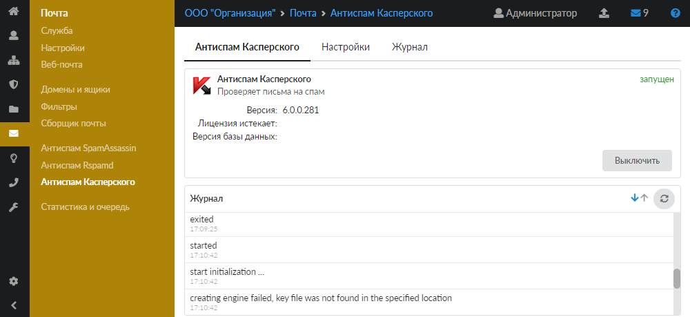
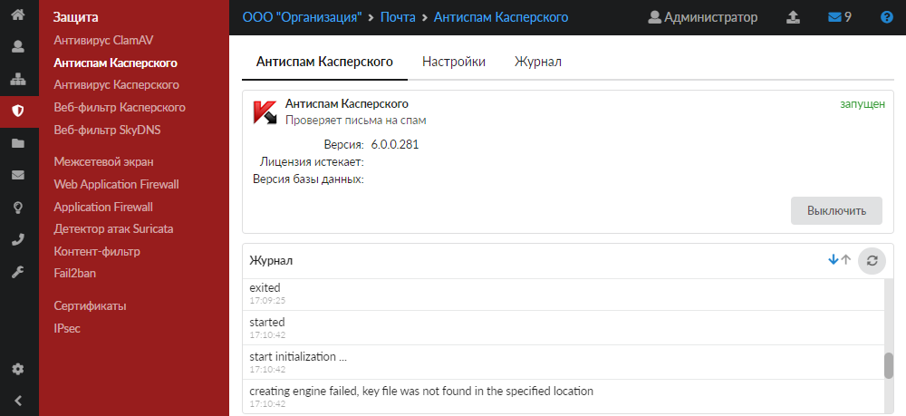
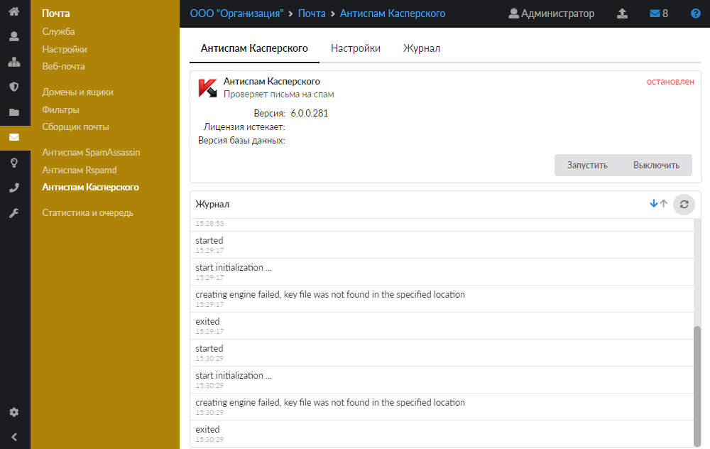
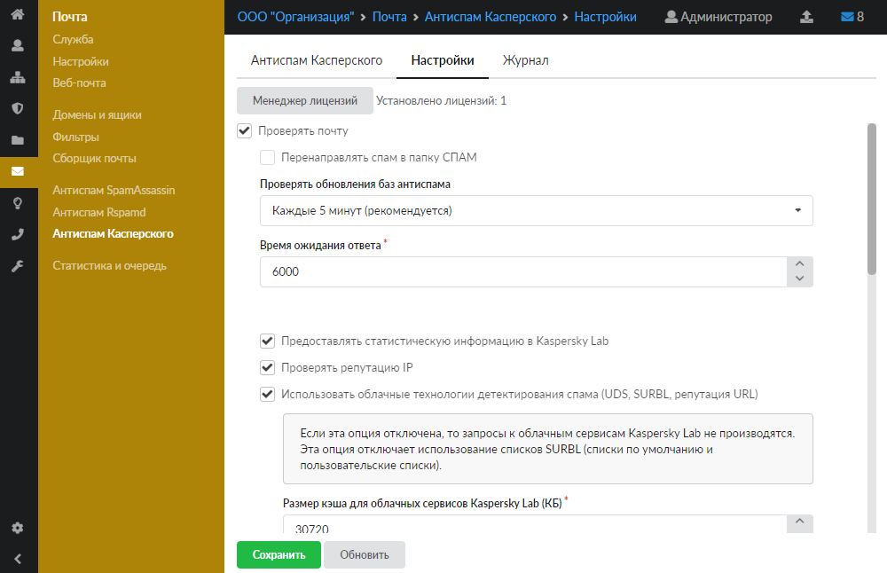
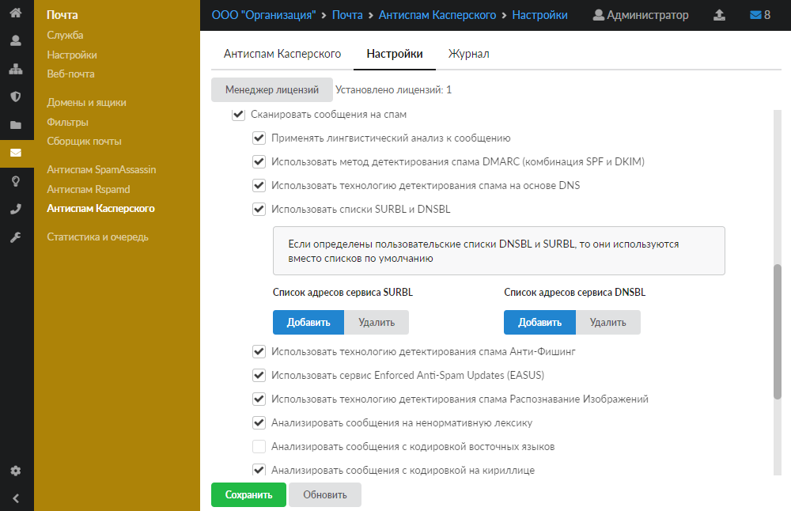
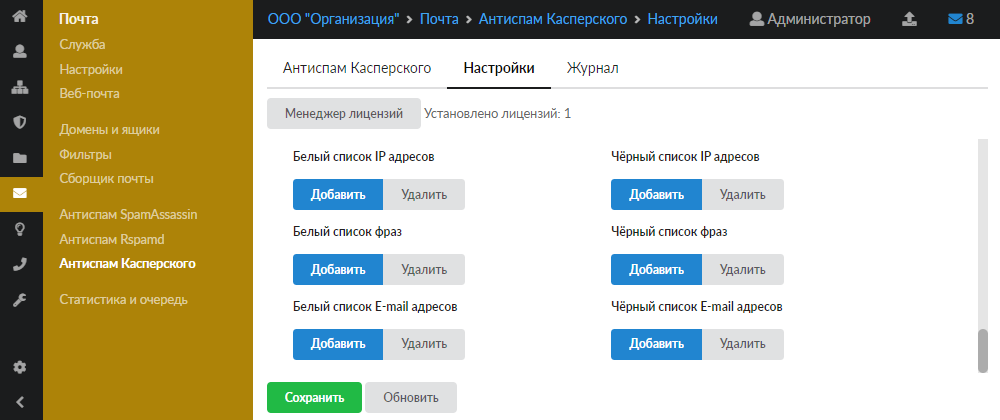
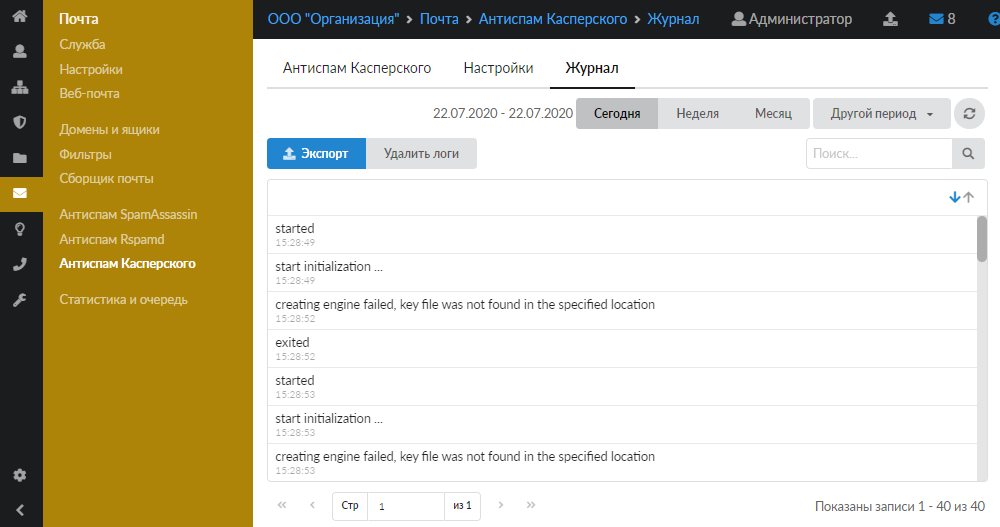

Модуль «Антиспам Касперского» предназначен для защиты от спама. Антиспам проверяет входящие и исходящие почтовые сообщения и сортирует их в соответствии с установленными параметрами.

Открыть модуль можно одним из двух способов:

- в меню **Почта &gt; Антиспам Касперского**:

- в меню **Защита &gt; Антиспам Касперского**:

В модуле расположены следующие вкладки:

- Антиспам Касперского
- Настройки
- Журнал

## Антиспам Касперского

Служба «Антиспам Касперского» отвечает за работоспособность предустановленного Антиспама Касперского, который проверяет почтовые письма. На данной вкладке отображаются следующие сведения о службе:

- статус службы (запущен, остановлен, выключен, не настроен);
- кнопка **«Включить»** (**«Выключить»**) — позволяет запустить или остановить службу;
- виджет с информацией о службе: текущие версии базы данных и антиспама Касперского, дата истечения лицензии;
- журнал последних событий.

## Настройки

Данная вкладка предназначена для установки параметров работы службы.

Кнопка **«Менеджер лицензий»** позволяет загружать и просматривать сведения о файле лицензии программы.

> ⚠ Внимание! По умолчанию служба находится в состоянии «не настроен». Чтобы активировать ее, установите флаг **«Проверять почту»**. При этом у вас должен быть приобретен лицензионный ключ.

При установке флага **«Перенаправлять спам в папку СПАМ»** включится автоматическое перенаправление писем, содержащих спам, в соответствующую папку. Если флаг не установлен, письмам только будет добавляться слово «СПАМ» в тему.

В поле **«Проверять обновления баз антиспама»** можно выбрать период обновления баз антиспама. По умолчанию установлен период каждые 5 минут.

При необходимости можно изменить **время ожидания ответа** (в секундах). По умолчанию установлено значение 6000 секунд.

При помощи следующих флагов устанавливаются параметры проверки писем на спам.

Также на данной вкладке можно настроить вручную **белые** и **черные списки** IP-адресов, почтовых ящиков и ключевых фраз, содержащихся в сообщении. Чтобы внести пункт списка, нажмите кнопку **«Добавить»** и введите нужное значение.

Чтобы изменения вступили в силу, нажмите **«Сохранить»**.

## Журнал

На данной вкладке отображается сводка всех системных сообщений от служб антивируса с указанием даты и времени.

[Журнал](../vebinterfeys-iks/standartnye-elementy-vebinterfeysa.md) является стандартным элементом веб-интерфейса ИКС.

### Больше информации:

[Антивирус и антиспам Касперского для ИКС. Почему не подходят свои ключи?](https://doc.a-real.ru/index.php?article=189)
