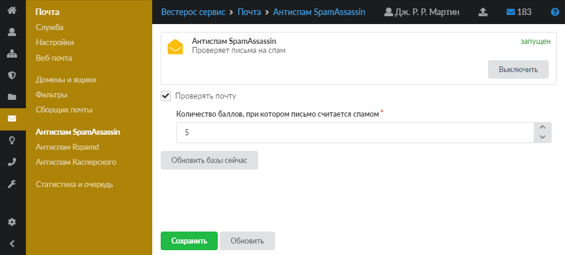
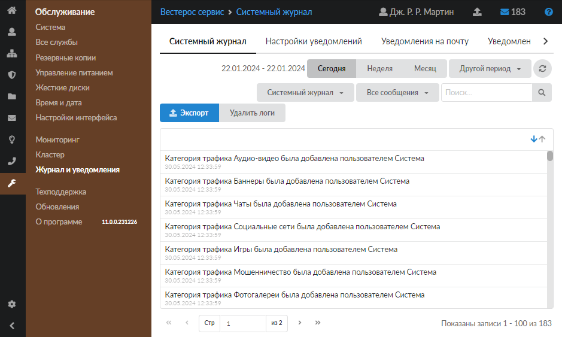

# Антиспам SpamAssassin

Модуль антиспам SpamAssassin предназначен для защиты от спама. Если служба определит, что письмо является спамом, она изменит тему письма.

---

Модуль **«Антиспам SpamAssassin»** предназначен для защиты от [спама](https://doc.a-real.ru/index.php?article=24#spam). Если служба определит, что письмо является спамом, она изменит тему письма. Данный модуль расположен в меню **Почта > Антиспам SpamAssassin**.

На странице модуля отображаются сведения об антиспаме SpamAssassin:

- статус службы (запущен, остановлен, выключен, не настроен);
- кнопка **«Включить»** (или **«Выключить»**) — позволяет запустить или остановить службу;
- настройки службы.

Чтобы активировать работу службы, установите флаг **«Проверять почту»**.

В поле **«Количество баллов, при котором письмо считается спамом»** можно задать порог, при котором служба будет считать письмо спамом.

Кнопка **«Обновить базы сейчас»** запускает немедленную проверку актуальности баз антиспама и в случае необходимости обновляет их.

Чтобы изменения вступили в силу, нажмите **«Сохранить»**.

Журнал событий данного модуля можно посмотреть в меню **Обслуживание > Журнал и уведомления > Системный журнал**. Просто выберите журнал **«Антиспам SpamAssassin»**.

[Журнал](https://doc.a-real.ru/index.php?article=196#summary) является стандартным элементом веб-интерфейса ИКС.

Подробнее о SpamAssassin можно прочитать [здесь](https://wiki.apache.org/spamassassin/RoundingIssues).

---

**Источник:** [Документация ИКС — Антиспам SpamAssassin](https://doc.a-real.ru/index.php?article=90)
