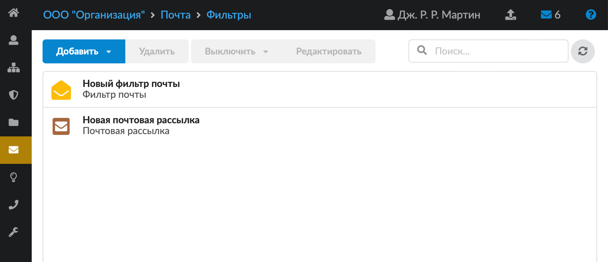
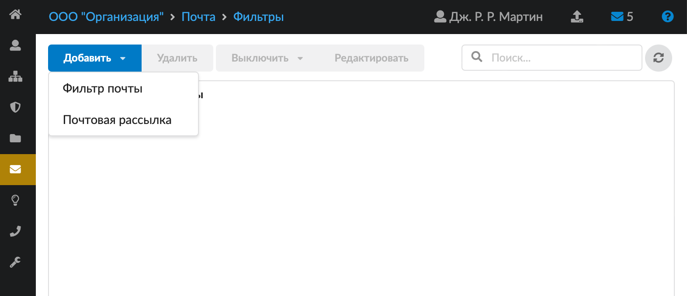
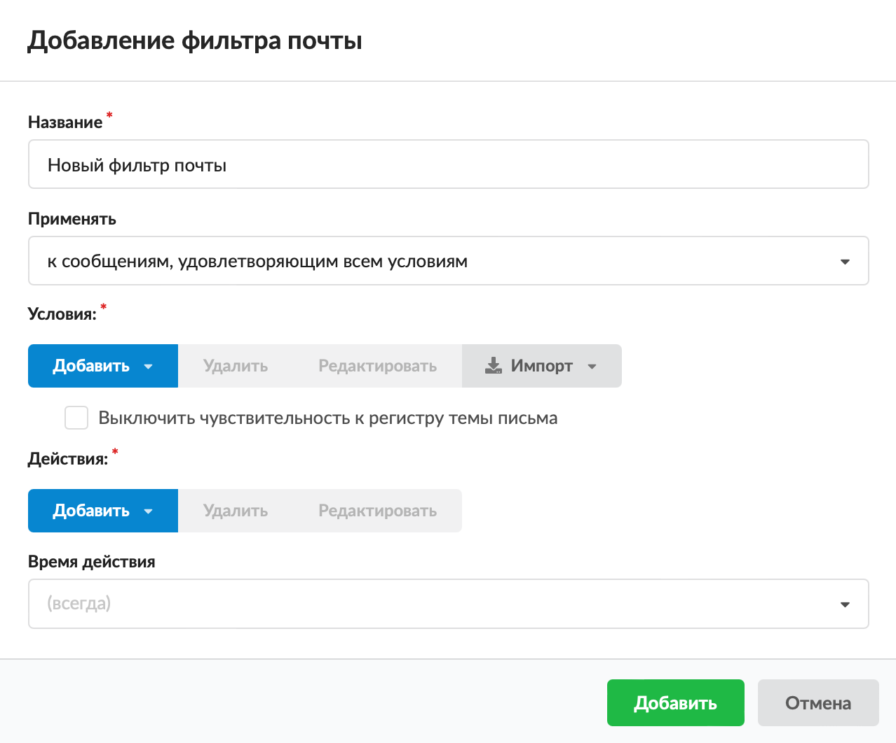
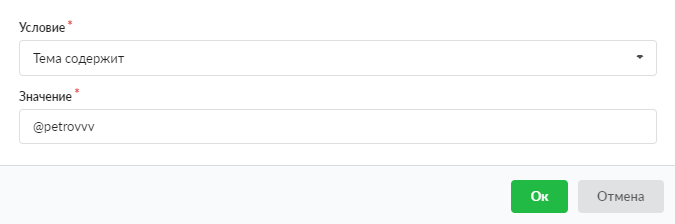
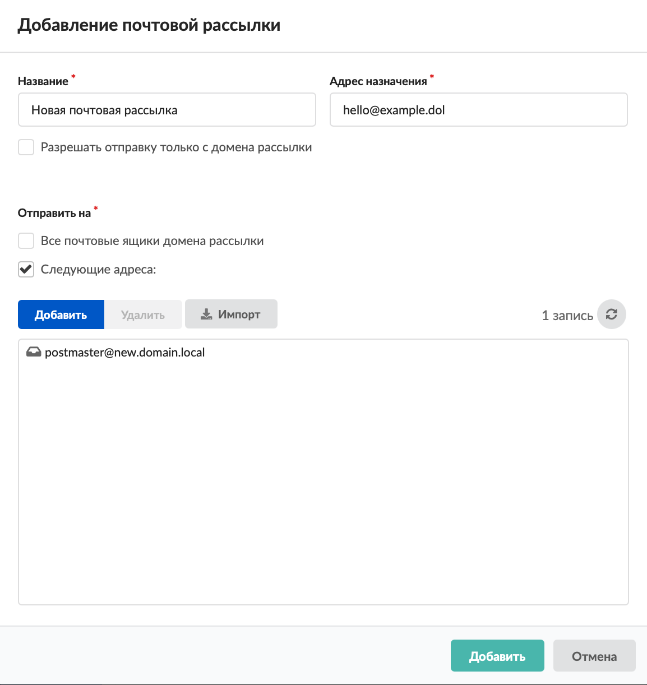

Модуль «Фильтры» обеспечивает настройку автоматических правил для входящих и исходящих писем. С помощью фильтров можно перемещать, удалять, копировать и подменять адресатов в письме. Модуль расположен в меню **Почта > Фильтры**.

В модуле отображается список почтовых фильтров и рассылок, созданных в ИКС. Объекты списка можно добавлять, удалять, выключать (в том числе на определенное время), редактировать.

> ⚠ Внимание! Если на письмо сработают условия двух фильтров, будут произведены действия, указанные в обоих фильтрах. При этом на один почтовый ящик придет не более одной копии письма, а затем удалится оригинал письма.

## Фильтр почты

Чтобы добавить почтовый фильтр, выполните следующие действия:

1. Нажмите **«Добавить»** и выберите **«Фильтр почты»**.

2. Введите **название** фильтра.

3. Выберите, к каким почтовым сообщениям **применять** данный фильтр:

   - к сообщениям, удовлетворяющим всем условиям — почтовый фильтр сработает, если все параметры из блока «Условия» будут выполнены;
   - к сообщениям, удовлетворяющим любому из условий — почтовый фильтр сработает, если хотя бы один параметр из блока «Условия» будет выполнен;
   - ко всем сообщениям — почтовый фильтр применит действия, указанные в блоке «Действия», ко всем почтовым сообщениям.

4. Задайте **условия** срабатывания фильтра. В блоке можно задать любое количество условий. Нажмите кнопку **«Добавить»** и выберите условие: «Тема», «Отправитель», «Получатель», «Размер (Кб)». При выборе условия «Отправитель» или «Получатель» доступен множественный выбор значения.

5. В открывшемся окне выберите **способ проверки** совпадения условия: «содержит», «не содержит», «совпадает с», «не совпадает с», «начинается с», «не начинается с», «заканчивается на», «не заканчивается на». Укажите **значение** для идентификатора.

   

   При необходимости воспользуйтесь функцией **импорта**. Выберите условие импорта: тема, отправитель или получатель.

6. Если в условии срабатывания фильтра выбрана тема, можно установить флаг **«Выключить чувствительность к регистру темы письма»**.

7. Задайте **действие**, применяемое к почтовому сообщению при срабатывании условия. В блоке можно задать любое количество действий, которые применятся к письму при срабатывании блока «Условия». Нажмите кнопку **«Добавить»** и выберите действие: «Переместить в», «Отправить копию на», «Удалить», «Заменить домен отправителя на», «Заменить домен получателя на».

8. В открывшемся окне введите значение для выбранного действия. Его можно выбрать в раскрывающемся списке либо ввести вручную (исключением является действие «Удалить»). Примеры настройки почтовых фильтров можно посмотреть [здесь](primery-pochtovyh-filtrov.md).

9. Если требуется, укажите [время действия](../../vebinterfeys-iks/standartnye-elementy-vebinterfeysa.md) фильтра.

10. Нажмите **«Добавить»** — новый почтовый фильтр появится в списке.

## Почтовая рассылка

Почтовая рассылка предназначена для управления фильтром, который рассылает копии писем указанному списку адресов при условии совпадения адреса назначения.

Для создания почтовой рассылки выполните следующие действия:

1. Нажмите **«Добавить»** и выберите **«Почтовая рассылка»**.

2. Введите **название** почтовой рассылки.

3. Укажите **адрес назначения**. Это почтовый ящик, на который будет приходить письмо-оригинал. Данный ящик не должен быть заведен в ИКС, поскольку представляет собой ссылку.

4. При необходимости установите флаг **«Разрешать только с домена рассылки»**. Тогда рассылка будет происходить только в том случае, если отправитель письма-оригинала имеет тот же домен, что и ссылка, указанная в поле «Адрес назначения».

5. При необходимости установите флаг **«Все почтовые ящики домена рассылки»**. Если флаг установлен, список почтовых ящиков для рассылки отключится, а письма, направленные на почтовый ящик из поля «Адрес назначения», будут отправляться на все почтовые ящики домена этой электронной почты. Для этого (при сохранении почтовой рассылки или добавлении нового адреса почты в домене) изменяется конфигурационный файл службы postfix — `/usr/local/etc/postfix/alias.list`.

6. Укажите **почтовые ящики**, на которые необходимо отправить письмо-оригинал. Их можно выбрать в раскрывающемся списке, ввести вручную либо импортировать. Для импорта списка почтовых адресов в рассылку используйте файл, в котором каждый адрес начинается с новой строки.

7. Нажмите **«Добавить»** — новая почтовая рассылка появится в списке.
