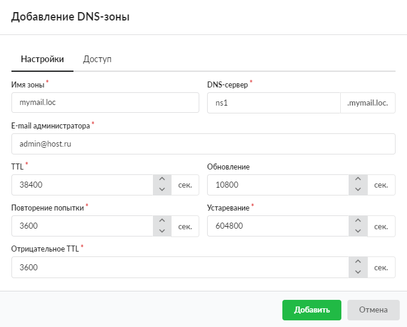
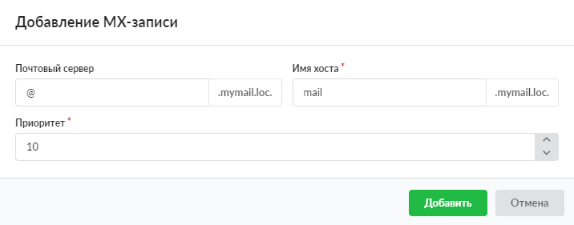
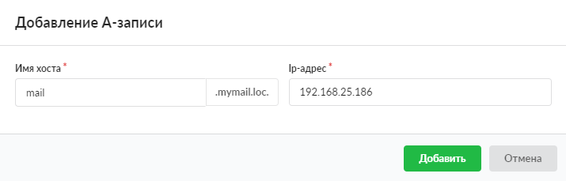
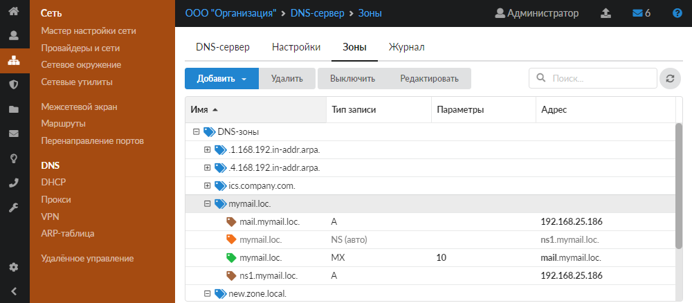
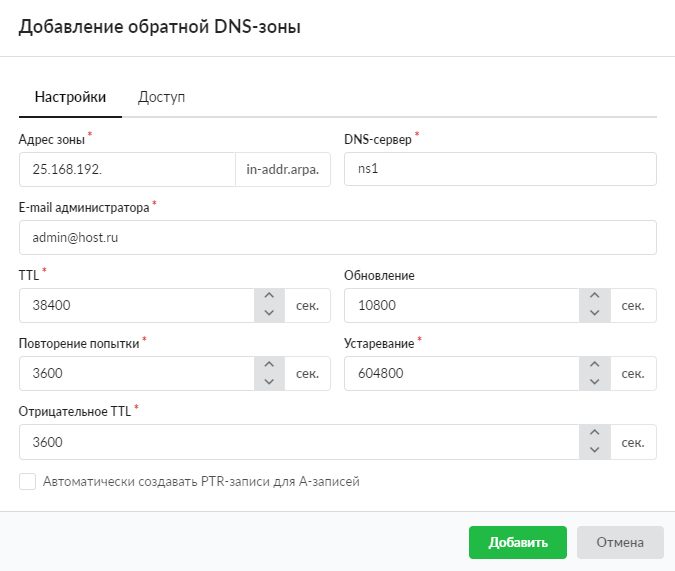

Чтобы почтовый сервер был доступен из внешней сети, необходимо правильно настроить DNS-записи. Это можно сделать двумя способами.

---

Чтобы [почтовый сервер](/index.php?article=84) был доступен из внешней сети, необходимо правильно настроить [DNS](/index.php?article=24#dns)-записи. Это можно сделать двумя способами:

- Через панель управления хостингом домена
- Через DNS-сервер ИКС

**Способ 1. Через панель управления хостингом домена**

Настройка DNS-записей осуществляется в панели управления хостингом вашего домена.

Пример записей на хостинге `reg.ru` можно посмотреть на [сайте](https://help.reg.ru/support/dns-servery-i-nastroyka-zony/nastroyka-resursnykh-zapisey-dns/nastroyka-resursnykh-zapisey-na-hostinge).

**Способ 2. Через DNS-сервер ИКС**

Если NS-сервером будет прописан белый адрес ИКС, то [DNS-зону](/index.php?article=24#dns-zone) можно настроить на нем. Для этого выполните следующие действия:

1. В меню **Сеть &gt; DNS &gt; Зоны** создайте [новую зону](/index.php?article=225), соответствующую имени вашего домена.

   

2. В созданной зоне автоматически создается [NS-запись](/index.php?article=229#ns) для имени хоста, которое указано в поле **«DNS-сервер»**.

3. Чтобы указать зоне IP-адрес хоста `ns1.mymail.loc`, добавьте [А-запись](/index.php?article=229#a) для данного хоста. В данном случае `192.168.25.186` — это внешний адрес ИКС, поскольку он сам является DNS-сервером.

   

4. Для указания почтового сервера добавьте [MX-запись](/index.php?article=229#mx).

   

5. Создайте А-запись для связанного с MX-записью имени хоста. В качестве адреса хоста снова выступает внешний адрес ИКС, как в **Шаге 3**.

   

6. В результате должно получиться следующее дерево записей зоны почтового сервера:

   

7. Для соответствия имени хоста и его IP-адреса также желательно добавить [обратную DNS-зону](/index.php?article=227). После создания зоны обратные А-записи для созданных хостов прямой зоны добавятся автоматически.

   

8. Отправьте запрос вашему интернет-провайдеру для создания [PTR-записи](/index.php?article=229#ptr), связанной с внешним адресом ИКС. Укажите в качестве первичного DNS-сервера для домена `mymail.com` в настройках DNS-сервера хостера вашего домена.
