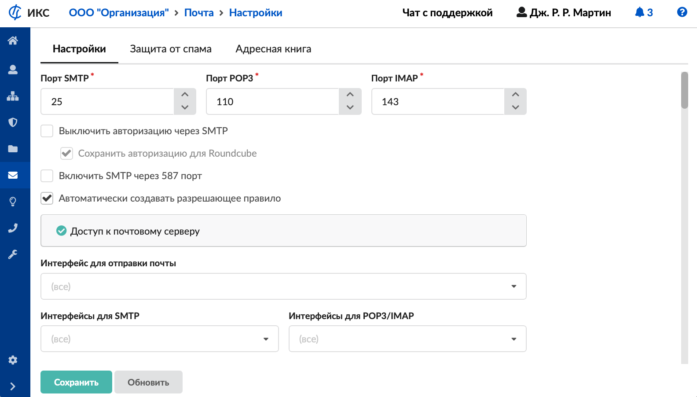
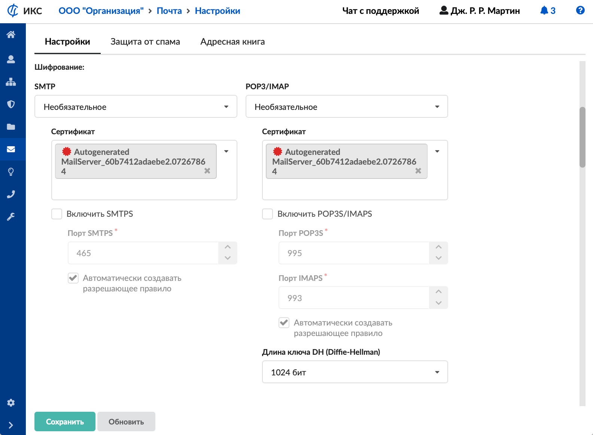
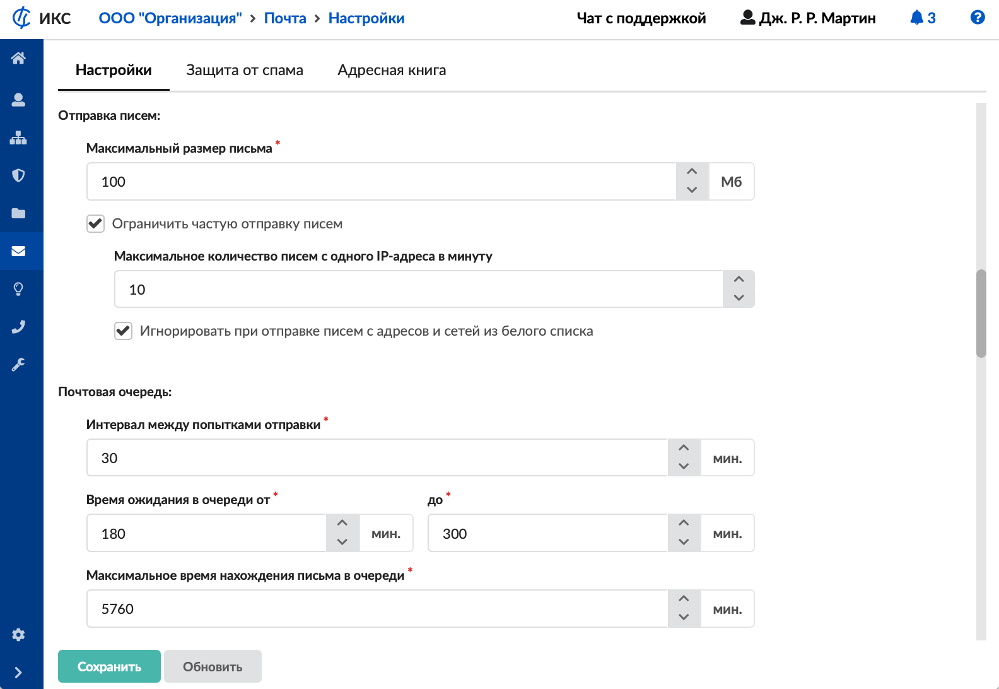
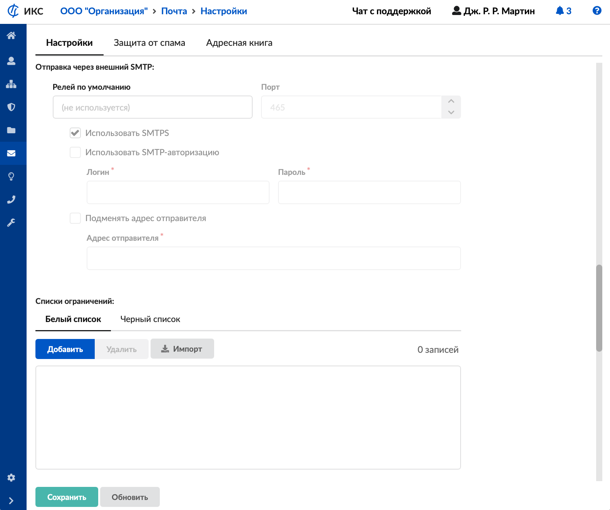
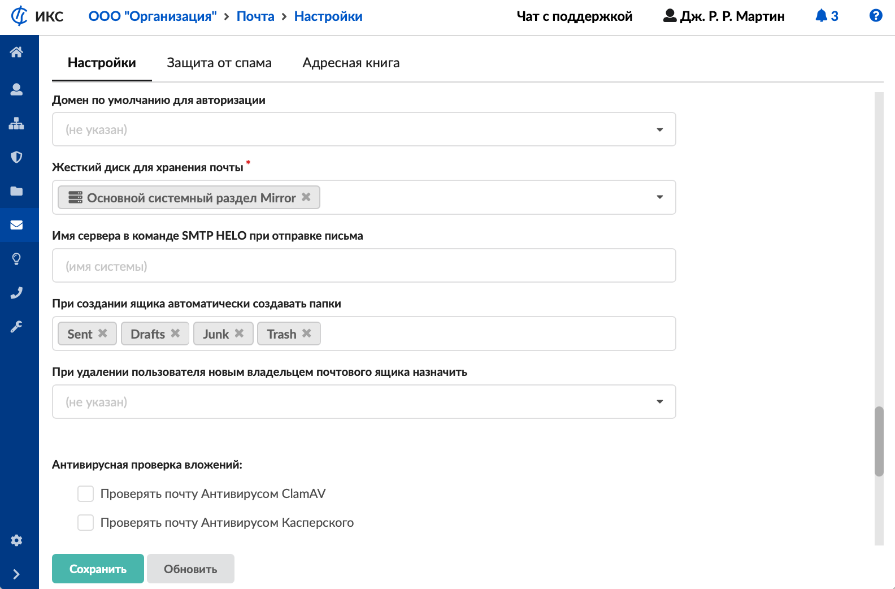
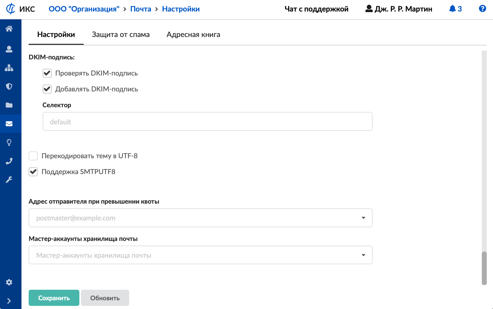
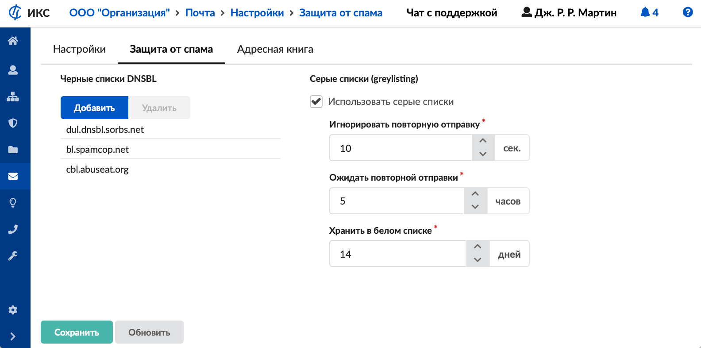
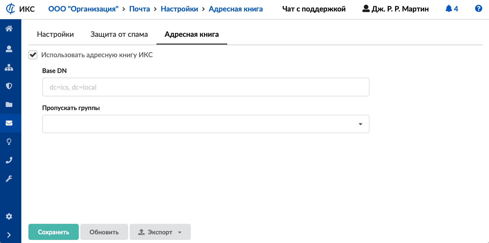
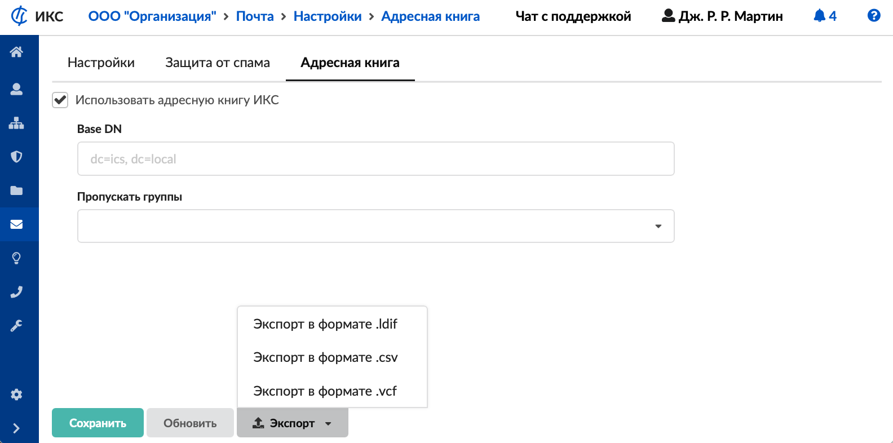

В модуле «Настройки» можно установить параметры работы почтового сервера. Для открытия модуля перейдите в меню Почта &gt; Настройки.

В модуле расположены следующие вкладки:

- [Настройки](#tab1)
- [Защита от спама](#tab2)
- [Адресная книга](#tab3)

## Настройки

На данной вкладке устанавливаются основные параметры работы почтового сервера.

### Сетевые настройки

В соответствующих полях можно изменить стандартные порты приема и отправки почтовых сообщений ([SMTP](../o-dokumentacii/slovar-terminov-3.md), [POP3](../o-dokumentacii/slovar-terminov-3.md), [IMAP](../o-dokumentacii/slovar-terminov-3.md)).

Если установлен флаг **«Выключить авторизацию через SMTP»**, почтовые клиенты не смогут авторизоваться на почтовом сервере по SMTP. Будет доступна авторизация только по SMTPS. При этом можно установить флаг **«Сохранить авторизацию для Roundcube»**, который дает возможность авторизоваться по SMTP локальному клиенту ИКС-Roundcube, а также, если в настройках [отправки писем](#send) установлен флаг **«Игнорировать при отправке писем c адресов и сетей из белого списка»**, по SMTP смогут авторизоваться клиенты из сетей в белом списке.

Флаг **«Включить SMTP через 587 порт»** позволяет почтовым клиентам (по умолчанию Mozilla Thunderbird) подключаться к серверу почты ИКС по 587/ТСР порту вместо 25.

> ⚠ Внимание! Флаг не заменяет настройку «Порт SMTP», а дополняет ее.

При установке флага **«Автоматически создавать разрешающее правило»** в межсетевом экране будет создано [разрешающее правило](../set/mezhsetevoy-ekran/razreshayuschee-pravilo-mezhsetevogo-ekrana-2.md) для доступа извне на порты SMTP, POP3 и IMAP. Перейти к списку существующих правил и их настройке можно нажатием на появившуюся гиперссылку «Доступ к почтовому серверу».

В поле **«Интерфейс для отправки почты»** можно указать IP-адрес, провайдер или сеть, который привяжет отправку почты к конкретному сетевому интерфейсу.

В полях **«Интерфейсы для SMTP»** и **«Интерфейсы для POP3/IMAP»** можно указать интерфейсы, заданные на ИКС, на которых будут работать протоколы SMTP, POP3 и IMAP. По умолчанию работа идет на всех интерфейсах.

### Шифрование

В полях **«SMTP»** и **«POP3/IMAP»** можно выбрать режим шифрования:

- Почтовый сервер ИКС по умолчанию работает в режиме **«Не использовать»** по протоколам SMTP, POP3/IMAP.

  > ⚠ Поскольку в данном режиме злоумышленники при помощи прослушивания канала могут получить информацию об имени и пароле пользователя, такой режим рекомендуется использовать только в защищенной сети.

- Режим **«Необязательное»**. Если ПО клиента не поддерживает шифрование, пароль передается по незашифрованному каналу, в открытом виде. Если ПО клиента поддерживает шифрование, то авторизация происходит уже внутри шифрованного соединения.
- Режим **«Обязательное»**. При авторизации пользоваться по протоколам SMTP, POP3/IMAP, [STARTTLS](../o-dokumentacii/slovar-terminov-3.md) пароль передается только внутри шифрованного соединения.

При выборе режимов «Необязательное» либо «Обязательное» установите следующие параметры:

- **«Сертификат для SMTP»** — позволяет выбрать [сертификат](../zaschita/sertifikaty/sertifikaty-obzor-4.md) для протокола SMTP из заведенных на ИКС. Включает использование шифрованного соединения по методу STARTTLS поверх использования обычного [TCP](../o-dokumentacii/slovar-terminov-3.md)-соединения по протоколу SMTP на стандартном порту 25. Данное шифрование является компромиссным. Если удаленная сторона не поддерживает шифрование, то письмо будет отправляться (приниматься) по нешифрованному протоколу SMTP.
- **«Сертификат для IMAP/POP3»** — позволяет выбрать [сертификат](../zaschita/sertifikaty/sertifikaty-obzor-4.md) для протоколов IMAP и POP3 из заведенных на ИКС. Включает использование шифрованного соединения по методу STARTTLS поверх использования обычного TCP-соединения по протоколам IMAP и POP3 на стандартных портах 143 и 110 соответственно.
- Флаги **«Включить SMTPS»** и **«Включить POP3S/IMAPS»** — позволяют включить шифрование для протоколов SMTPS, IMAPS, POP3S на неклассических портах в параллель 25, 110 и 143 портам. Главным отличием является обязательное использование шифрования, компромисс невозможен.

  > ⚠ В почтовом сервере ИКС используются только криптографические протоколы TLSv1.2 и TLSv1.3. Использование SSLv2, SSLv3, TLSv1, TLSv1.1 для безопасности отключено.

- **«Порт SMTPS»**, **«Порт POP3S»**, **«Порт IMAPS»** — позволяют задать номера портов для протоколов SMTPS, IMAPS и POP3S соответственно.
- **«Длина ключа DH (Diffie-Hellman)»** — позволяет установить длину ключа при шифровании методом STARTTLS и для криптографических протоколов [TLS](../o-dokumentacii/slovar-terminov-3.md) различных версий при использовании протоколов IMAP/POP3 и IMAPS/POP3S. Рекомендуемая длинна ключа 2048 бит. По умолчанию установлена длина 1024 бита, это требуется для оптимизации первого запуска ИКС.
- Флаг **«Автоматически создавать разрешающее правило»** — позволяет автоматически создавать в межсетевом экране [разрешающее правило](../set/mezhsetevoy-ekran/razreshayuschee-pravilo-mezhsetevogo-ekrana-2.md).

### [Отправка писем](#send)

Для задания различных ограничений при отправке писем можно использовать следующие настройки:

- **«Максимальный размер письма»** — задает ограничение на загрузку вложений через [веб-почту](vebpochta/vebpochta-obzor-2.md) (встроенный клиент Roundcube). Значение устанавливается в мегабайтах;
- флаг **«Ограничить частую отправку писем»** — включает ограничения на отправку писем через почтовый сервер ИКС;
- **«Максимальное количество писем с одного IP-адреса в минуту»** — задает величину максимального количества писем, отправляемых за одну минуту, с одного [IP-адреса](../o-dokumentacii/slovar-terminov-3.md). Данное ограничение не действует на письма, которые отправлены из веб-интерфейса предустановленного клиента электронной почты;
- флаг **«Игнорировать при отправке писем c адресов и сетей из белого списка»** — создает исключение в ограничении частой отправки писем для IP-адресов и сетей, указанных в [блоке «Белый список»](#lists).

### Почтовая очередь

Почтовые сообщения, которые не были отправлены, помещаются в очередь на повторную отправку. Для задания различных интервалов времени при повторной отправке почтовых сообщений можно указать следующие настройки:

- **«Интервал между попытками отправки»** — позволяет задать время, по истечении которого после отправки письма [демон](../o-dokumentacii/slovar-terminov-3.md) будет проверять срок нахождения письма в очереди (в минутах). По умолчанию установлено 30 минут.
- **«Время ожидания в очереди»** — позволяет задать интервал времени для письма в очереди, при котором демон попытается повторно отправить данное письмо из очереди (в минутах). По умолчанию установлено от 180 минут до 300 минут.

  > Пример
  >
  > Письмо не было отправлено, при этом демон по умолчанию запускается каждые 30 минут. Это означает, что демон запустится через время delta, где delta может принимать значение из промежутка `[0m;30m]`. Таким образом, повторная отправка будет произведена через 180+delta. Если повторная отправка не произошла, письмо вновь попадает в очередь отправки, счетчик времени нахождения письма в очереди становится равным нулю и нижняя граница (в примере это 180 минут) для данного письма будет сдвинута автоматически, но не превысит верхней границы.
  >
  > Попытки отправить письмо будут повторятся до тех пор, пока общее время нахождения письма в очереди не достигнет значения, указанного в поле «Максимальное время нахождения письма в очереди».

- **«Максимальное время нахождения письма в очереди»** — позволяет указать максимальное общее время нахождения письма в очереди, по достижении которого отправителю придет уведомление о том, что его письмо не было отправлено (в минутах). По умолчанию установлено 5760 минут.

### Отправка через внешний SMTP

В ИКС есть возможность настроить отправку исходящей почты через другой SMTP-сервер для всех писем, кроме писем, адресом назначения которых является локальный домен или получатель.

Чтобы включить отправку исходящей почты через другой SMTP-сервер, введите его адрес (доменное имя или IP) в поле **«[Релей](../o-dokumentacii/slovar-terminov-3.md) по умолчанию»** и задайте порт для подключения.

Флаг **«Использовать SMTPS»** используется только для соединения по протоколу SMTPS на порту 465. Таким образом, флаг для отправки писем на порт назначения 465 обязателен. При соединении на порт 25 флаг устанавливать не нужно, так как шифрование соединения через расширение STARTTLS будет выбрано автоматически, в зависимости от поддержки данного способа шифрования соединения удаленной стороной.

Если внешний SMTP-сервер требует аутентификацию пользователя, установите флаг **«Использовать SMTP-авторизацию»** и укажите логин и пароль пользователя.

При отправке почтовых сообщений через SMTP-серверы `mail.ru`, `yandex.ru`, `gmail.com` и др. установите флаг **«Подменять адрес отправителя»**. Это нужно потому, что для данных почтовых серверов необходимо, чтобы адрес отправителя (заголовок FROM) совпадал с пользователем, под которым была выполнена авторизация. В поле **«Адрес отправителя»** задайте адрес отправителя.

### [Списки ограничений](#lists)

Блок позволяет добавлять списки белых и черных адресов, с которых разрешена или запрещена входящая корреспонденция.

Белый список добавляется на вкладке **«Белый список»**. Нажмите на кнопку **«Добавить»** и заполните появившуюся строку. Это могут быть IP-адреса, диапазоны IP-адресов, доменные имена, сети (в том числе заведенные в ИКС), почтовые серверы (например, `@mail.ru`), почтовые ящики.

С указанных адресов ИКС будет всегда принимать почтовые сообщения без проверки серыми списками и без проверки соответствия прямой и обратной записей в [DNS](../o-dokumentacii/slovar-terminov-3.md), а также без авторизации.

> ⚠ Внимание! Заносите в белый список только тех отправителей, которым действительно стоит доверять.

Черный список добавляется на вкладке **«Черный список»**. Нажмите на кнопку **«Добавить»** и заполните появившуюся строку. Это могут быть IP-адреса, диапазоны IP-адресов, доменные имена, сети, почтовые серверы (например, `@mail.ru`), почтовые ящики.

Пункты белого и черного списков можно **удалить**, а также **импортировать**.

С указанных адресов ИКС не будет принимать почтовые сообщения.

### [Общие настройки](#other)

**«Домен по умолчанию для авторизации»** — позволяет выбрать заведенный на ИКС почтовый домен при авторизации клиента. Например, на ИКС заведен почтовый домен `domain.local`, а пользователю из данного домена задано имя ящика `usermail`. Если в данном блоке выбрано значение «domain.local», пользователь при обращении к почтовому серверу ИКС через почтового клиента или через веб-интерфейс в поле «Имя пользователя» сможет указывать только «usermail», а не «usermail@domain.local».

Устанавливать домен по умолчанию для авторизации следует после всех настроек почты, перед началом использования почтового сервера. Смена домена по умолчанию может привести к некоторым проблемам в работе системы. После изменения (удаления) домена по умолчанию рекомендуется очистить базу Roundcube в [настройках веб-почты](vebpochta/vebpochta-obzor-2.md).

> ⚠ Внимание! После очистки базы будут утеряны все персонализированные настройки почты и персональные адресные книги в Roundcube.

**«Жесткий диск для хранения почты»** — позволяет переместить хранилище почты на отдельный [жесткий диск](https://doc.a-real.ru/index.php?article=111). По умолчанию почта хранится в основном системном разделе (там, где установлен ИКС). При изменении места хранения почты будет произведено копирование всех писем с текущего жесткого диска на новый. Ход копирования почты с диска на диск можно отслеживать в [меню](../obsluzhivanie/sistema-2.md) **Обслуживание &gt; Система &gt; Задачи**. Если новый жесткий диск уже содержит файлы с почтой, копирование производиться не будет.

**«Имя сервера в команде SMTP HELO при отправке письма»** — позволяет задать имя хоста, которое будет передано удаленной стороне при отправке письма в команде SMTP HELO или EHLO.

**«При создании ящика автоматически создавать папки»** — позволяет задать список стандартных папок, которые будут создаваться в почтовом ящике. При необходимости можно изменить состав.

**«При удалении пользователя новым владельцем почтового ящика назначить»** — позволяет указать пользователя, на которого будут переназначены почтовые ящики других пользователей в случае их удаления.

### [Антивирусная проверка вложений](#antivirus)

Блок включает проверку входящих и исходящих писем на наличие в них вирусов. При положительном результате вместо письма получателю придет сообщение о результатах проверки, а само письмо будет во вложении к сообщению. Чтобы активировать проверку [антивирусом ClamAV](https://doc.a-real.ru/index.php?article=66) либо [антивирусом Касперского](../zaschita/antivirus-kasperskogo-2.md), установите соответствующий флаг.

### DKIM-подпись

В данном блоке выполняются следующие настройки:

- флаг **«Проверять DKIM-подпись»** — включает проверку входящих писем на наличие и правильность [DKIM-подписи](../o-dokumentacii/slovar-terminov-3.md);

  > ⚠ Внимание! При использовании сборщика почты и релея по умолчанию флаг **«Проверять DKIM-подпись»** следует убрать.

- флаг **«Добавлять DKIM-подпись»** — активирует добавление DKIM-подписи в отправленные с ИКС письма;
- **«Селектор»** — позволяет для каждого почтового сервера в одном домене создавать свой [DKIM](../o-dokumentacii/slovar-terminov-3.md)-селектор. Это нужно потому, что для одного домена может быть несколько почтовых серверов. По умолчанию в ИКС используется селектор default.

### Разное

Блок содержит следующие флаги:

- **«Перекодировать тему в UTF-8»** — если флаг установлен, письма, которые отправляются с почтового сервера ИКС, будут иметь кодировку темы письма UTF-8.
- **«Поддержка SMTPUTF8»** — включает (выключает) поддержку кодировки UTF-8 при приеме и отправке писем.

В поле **«Адрес отправителя при превышении квоты»** можно выбрать ящик из почтовых ящиков ИКС либо вписать адрес вручную. В таком случае, если произвести отправку письма на ящик, в котором объем писем превысил квоту, адрес отправителя будет изменен.

В поле **«Мастер-аккаунт хранилища почты»** можно указать ящик или несколько ящиков из тех, что созданы в ИКС, но не синхронизированы. Такие ящики смогут заходить на любой ящик в системе (синхронизированный ящик или обычный, в любом почтовом домене). Подключение к таким ящикам по умолчанию ограничено: если в поле «Интерфейсы для POP3/IMAP» указаны какие-либо сети, то подключаться можно будет только из них, в противном случае (если в поле указано «все») — только из локальных сетей ИКС.

Чтобы изменения вступили в силу, нажмите **«Сохранить»**.

## [Защита от спама](#tab2)

Данная вкладка предназначена для настройки серверов, содержащих черные списки, а также режима работы серого списка в ИКС.

### Черные списки DNSBL

Блок позволяет добавлять и удалять хосты, содержащие [черные списки DNSBL](../o-dokumentacii/slovar-terminov-3.md). Данные списки используются для борьбы со спамом.

Сформируйте список при помощи кнопок **«Добавить»** и **«Удалить»**.

#### Серые списки (greylisting)

Блок предназначен для установки автоматической блокировки спама.

При установке флага **«Использовать [серые списки](../o-dokumentacii/slovar-terminov-3.md)»** ИКС будет отслеживать поведение почтовых серверов, которые отправляют письма на ИКС. О методологии блокировки можно прочитать [здесь](https://ru.wikipedia.org/wiki/Серый_список).

Настройка серых списков происходит по трем параметрам, которые регулируются в соответствующих полях:

- **«Игнорировать повторную отправку»** — время, за которое достоверный почтовый сервер не отправит письмо повторно (в секундах);
- **«Ожидать повторной отправки»** — время, не позже которого должно прийти письмо (в часах). Если указанное время прошло, осуществляется повторная отправка;
- **«Хранить в белом списке»** — количество дней, когда сервер, уже прошедший проверку, не будет подвержен проверке снова (в днях).

Чтобы изменения вступили в силу, нажмите **«Сохранить»**.

## [Адресная книга](#tab3)

На данной вкладке можно установить следующие параметры адресной книги почтового сервера ИКС для клиентских программ пользователей:

- флаг **«Использовать Адресную книгу ИКС»** — позволяет включить или выключить использование адресной книги всеми почтовыми клиентами. Передача адресной книги в Roundcube настраивается в [веб-почте](vebpochta/vebpochta-obzor-2.md);
- **«Base DN»** — позволяет настроить параметр Base DN (базу поиска для [LDAP](../o-dokumentacii/slovar-terminov-3.md)), можно указать несколько через точку с запятой;
- **«Пропускать группы»** — позволяет выбрать группы, которые не будут отображаться в адресной книге. Если указать группу, она не будет отображаться (в том числе подгруппы, если они есть). В частном случае при указании группы «Корневая группа» не будет отображена ни одна группа.

Также на вкладке можно **экспортировать** адресную книгу в одном из следующих форматов:

- .ldif;
- .csv;
- .vcf (рекомендуется использовать не для Microsoft Outlook, а для адресной книги самой ОС Windows — Контакты Windows).

> ⚠ В файлы экспорта попадут только те пользователи, у которых есть почтовый ящик. Если у пользователя указана какая-либо информация (например, должность, адрес, номер телефона), он также попадет в файлы экспорта.

Чтобы изменения вступили в силу, нажмите **«Сохранить»**.
