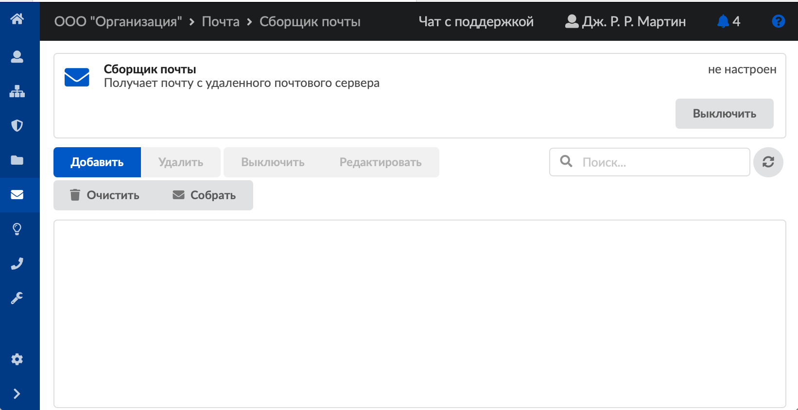
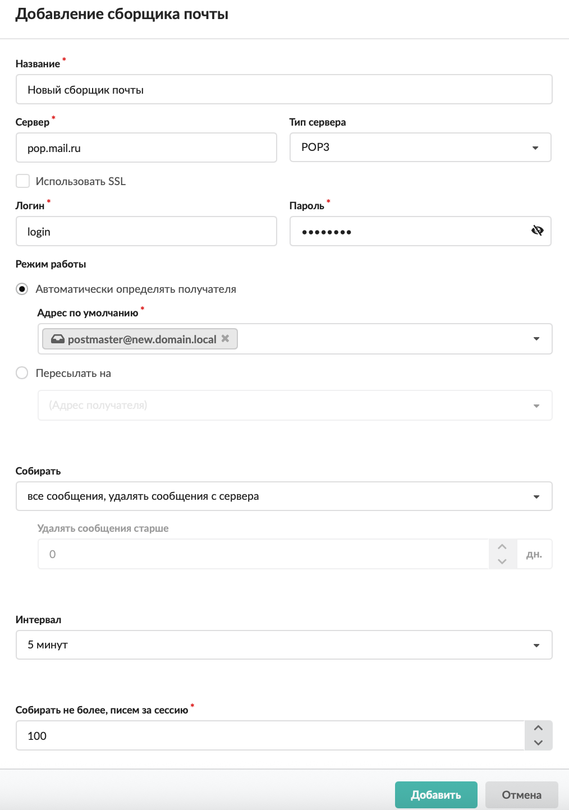
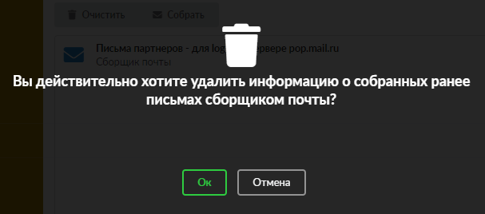
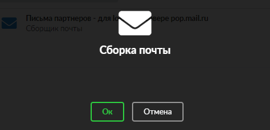

# Сборщик почты

Модуль «Сборщик почты» предназначен для управления почтовыми аккаунтами, расположенными на других почтовых серверах. Для открытия модуля перейдите в меню **Почта > Сборщик почты**.

На странице модуля отображаются сведения о сборщике почты:

- статус службы (**запущен**, **остановлен**, **выключен**, **не настроен**);
- кнопка **«Включить»** («Выключить») — позволяет запустить или остановить службу;
- настроенные сборщики почты;
- функциональные кнопки для действий со сборщиками почты: добавить, удалить, выключить, редактировать, очистить, собрать.

## Добавить сборщик почты

Чтобы добавить сборщик почты, выполните следующие действия:

1. Нажмите **«Добавить»**.
2. Введите **название** сборщика почты.
3. Укажите **настройки подключения** к внешнему почтовому серверу:
   - сервер — IP-адрес или доменное имя сервера, с которого будет происходить сбор почты;
   - тип сервера — **POP3** или **IMAP**;
   - флаг «Использовать **SSL**» — установите, если требуется использование шифрованного соединения;
   - логин и пароль — данные для входа на удаленный почтовый ящик, с которого будет осуществляться сбор почты.

4. Выберите **режим работы** сборщика:
   - **Автоматически определять получателя** — предполагает автоматическое распределение писем по почтовым ящикам в зависимости от того, на какую ссылку они пришли. Если на ИКС заведено несколько ящиков с одинаковым именем, то письма будут собираться в ящик, у которого домен совпадает с доменом ящика по умолчанию.

     **Пример**

     Внешний почтовый домен (например, `@почта.рф`), где расположен почтовый ящик (например, `пример@почта.рф`), с которого собираются почтовые сообщения, имеет ряд ссылок на себя (например, `раз@почта.рф`, `два@почта.рф`, `три@почта.рф`). А на почтовом сервере ИКС располагается домен (например, `@икс.рф`) и заведены почтовые ящики (`раз@икс.рф`, `два@икс.рф` и `три@икс.рф`).

     Тогда сборщик почты ИКС, работающий в режиме «Автоматически определять получателя», будет собирать почтовые сообщения с `пример@почта.рф` и автоматически распределять письма на `раз@икс.рф`, `два@икс.рф` и `три@икс.рф` в зависимости от того, на какую ссылку они пришли (`раз@почта.рф`, `два@почта.рф` и `три@почта.рф` соответственно). Если в необязательном поле указан почтовый ящик по умолчанию, сборщик почты будет туда помещать почтовые сообщения, для которых он не смог автоматически определить получателя.

   - **Пересылать на** — предполагает указание одного почтового ящика, куда будет производиться сборка почтовых сообщений с внешнего почтового ящика.

5. Выберите, как будет производиться **сборка** почтовых сообщений:
   - все сообщения, удалять сообщения с сервера;
   - только не собранные ранее сообщения, удалять сообщения с сервера;
   - только не собранные ранее сообщения, оставлять сообщения на сервере.
6. При необходимости укажите, **старше какого срока** удалять сообщения (в днях).
7. Если требуется, измените **интервал** между обращениями к удаленному почтовому серверу для сбора почтовых сообщений. По умолчанию установлен интервал каждые пять минут. Минимальное значение — каждые пять секунд, максимальное значение — раз в сутки.
8. В поле **«Собирать не более, писем за сессию»** можно изменить максимальное количество почтовых сообщений, собираемых за одну сессию. По умолчанию установлено 100 почтовых сообщений.
9. Нажмите **«Добавить»** — новый сборщик почты появится в списке.

## Очистить сборщик почты

Для удаления информации о собранных ранее письмах нажмите кнопку **«Очистить»**, а затем — **«Ок»** в окне подтверждения действия. Данные удалятся, и при очередной сборке будут получены более ранние письма. Такая операция полезна, например, при необходимости заново получить уже собранные письма.

## Принудительная сборка писем

Для принудительной сборки писем нажмите кнопку **«Собрать»**, а затем — **«Ок»** в окне подтверждения действия. Система произведет внеочередную попытку сборки писем в соответствии с настройками созданных сборщиков.

В ИКС при помощи почтового клиента также можно [настроить миграцию почты со стороннего домена](https://doc.a-real.ru/index.php?article=412).

---

**Источник:** [Документация ИКС — Сборщик почты](https://doc.a-real.ru/index.php?article=89)
