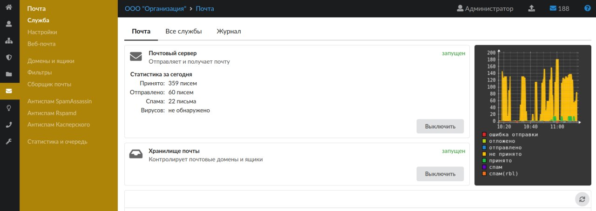
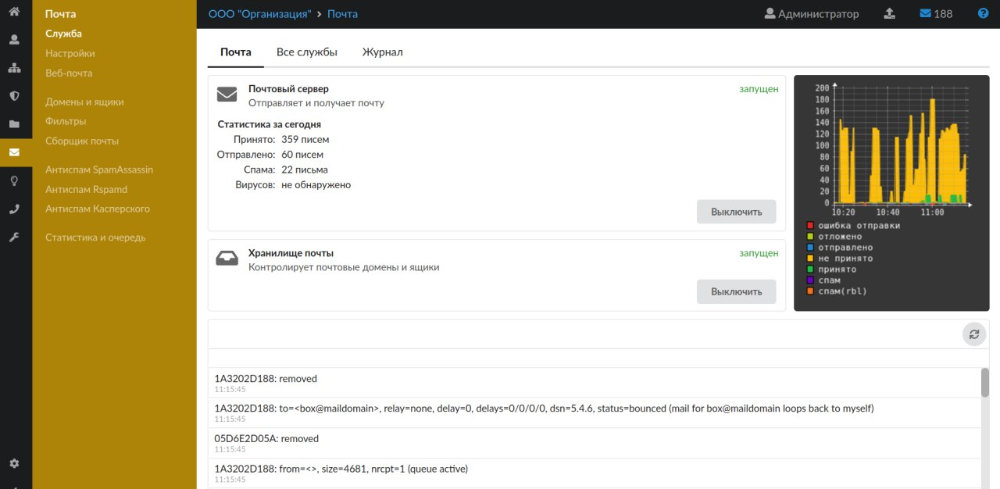
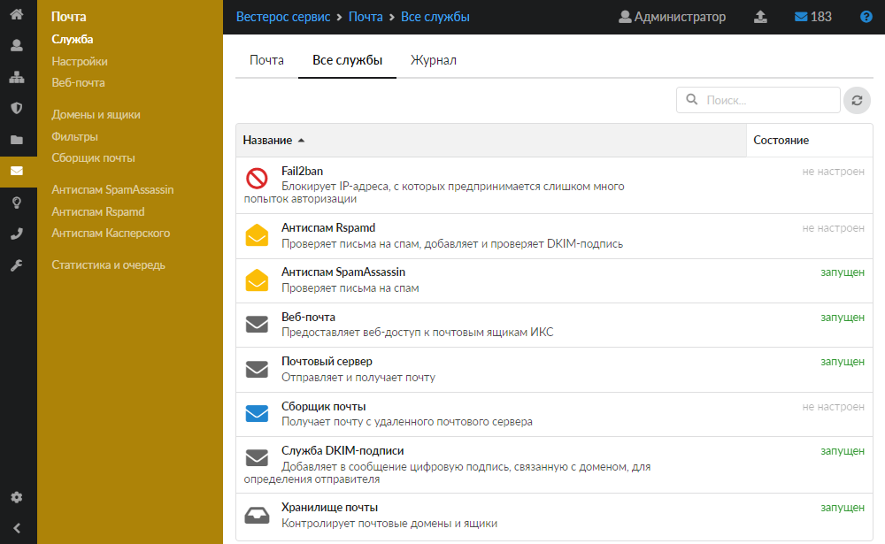
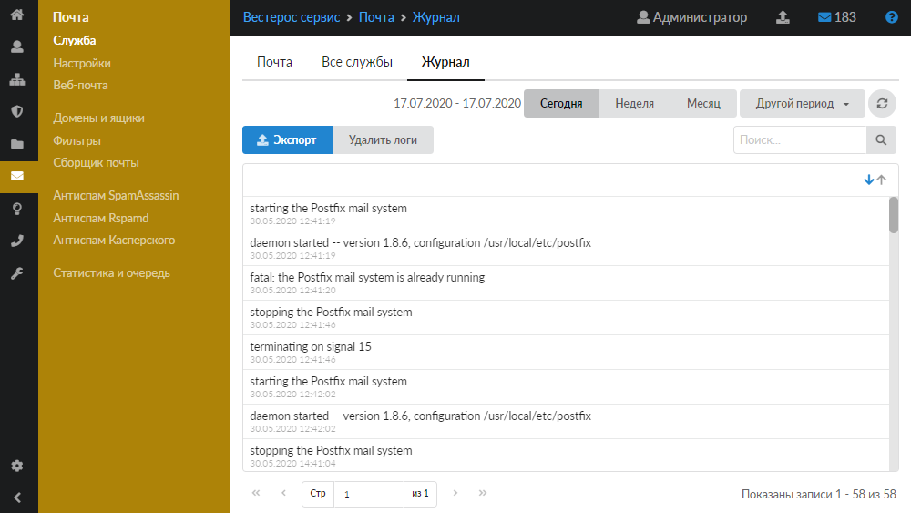

Модуль «Служба» отвечает за работу почтового сервера. Отображает состояние основных служб почтового сервера и хранилища почты с возможностью включения/выключения каждой службы.

---

Модуль «Служба» отвечает за работу почтового сервера. Для открытия модуля перейдите в меню **Почта &gt; Служба**.

В модуле расположены следующие вкладки:

- [Почта](#tab1)
- [Все службы](#tab2)
- [Журнал](#tab3)

## Почта

На данной вкладке отображается состояние основных служб почтового сервера — почтового сервера и хранилища почты:

- статус службы (**запущен**, **остановлен**, **выключен**, **не настроен**);
- кнопка **«Включить»** (**«Выключить»**) — позволяет запустить или остановить службу;
- информация о полученных и отправленных письмах;
- график статистики почты;
- журнал последних событий.

## Все службы

На данной вкладке отображается состояние всех служб почтового сервера, которые есть в ИКС, с возможностью выключить (включить) каждую из них.

Заголовок каждой службы является ссылкой на соответствующий модуль:

- [Fail2ban](/index.php?article=77) — блокирует [IP-адреса](/index.php?article=24#ip-address), с которых предпринимается слишком много попыток авторизации;
- [Антиспам Rspamd](/index.php?article=92) — проверяет письма на спам, добавляет и проверяет [DKIM-подпись](/index.php?article=24#dkim-sign);
- [Антиспам SpamAssassin](/index.php?article=90) — проверяет письма на спам;
- [Веб-почта](/index.php?article=86) — предоставляет веб-доступ к почтовым ящикам ИКС;
- [Почтовый сервер](/index.php?article=84) — отправляет и получает почту;
- [Сборщик почты](/index.php?article=89) — получает почту с удалённого почтового сервера;
- Служба DKIM-подписи — добавляет в сообщение цифровую подпись, связанную с доменом, для определения отправителя;
- [Хранилище почты](/index.php?article=87) — контролирует почтовые домены и ящики.

## Журнал

На данной вкладке отображается сводка всех системных сообщений модуля с указанием даты и времени.

Начиная с версии ИКС 10.0 в журнале также отображается статистика по спаму от [Антиспама Касперского](/index.php?article=67).

[Журнал](/index.php?article=196#summary) является стандартным элементом веб-интерфейса ИКС.
