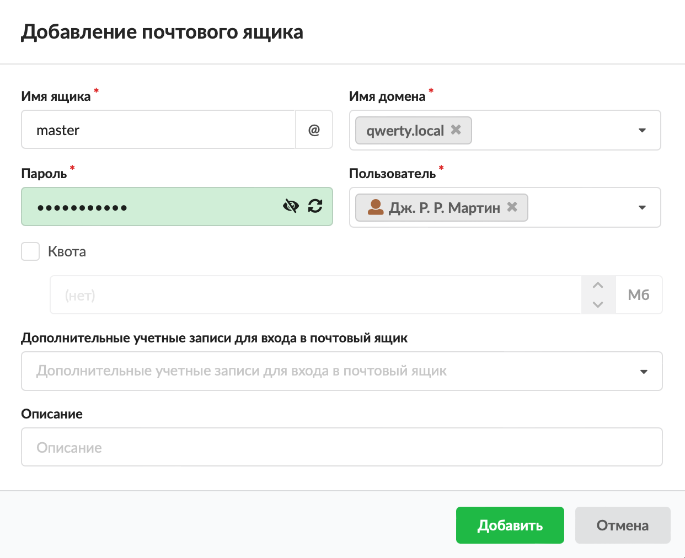
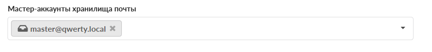
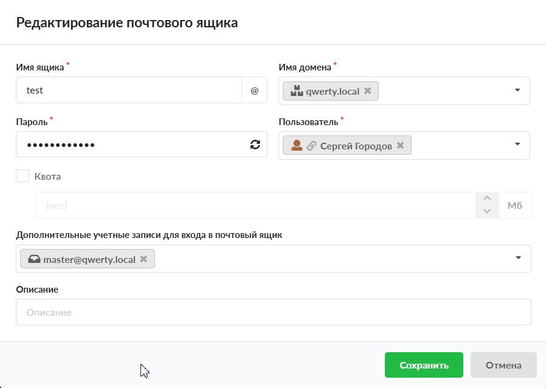
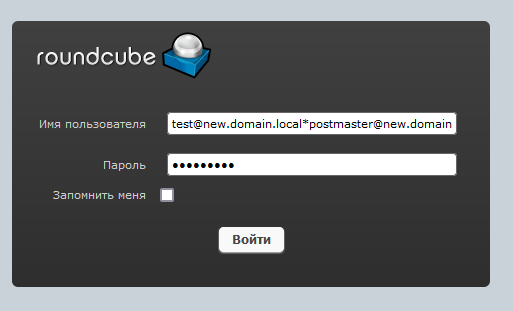
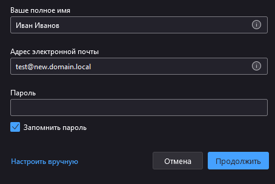
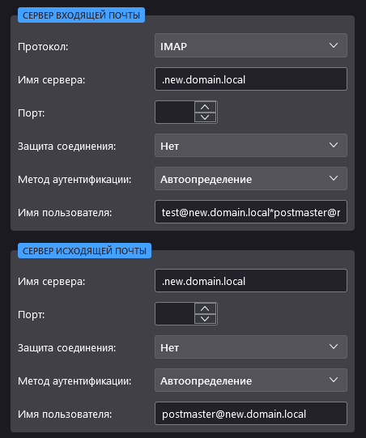
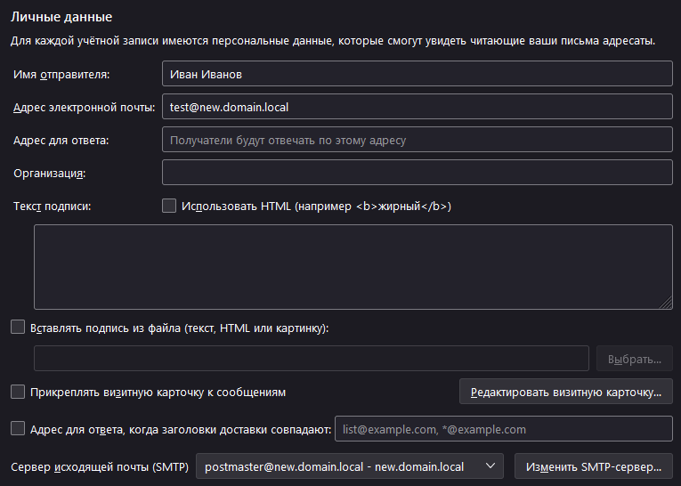
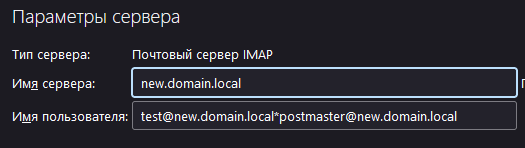
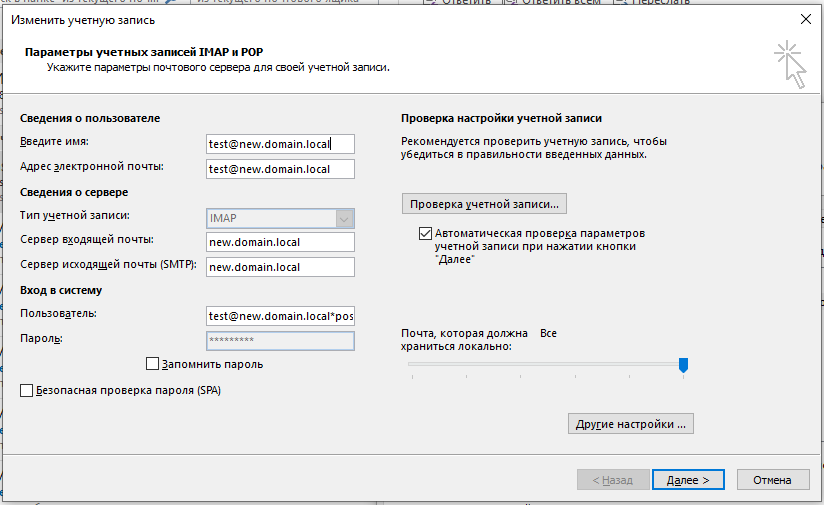

Настройка подключения мастер-аккаунтов позволит получать письма целевого ящика и взаимодействовать с ними, а также отправлять письма от его имени.

---

1. Перейдите в модуль **«Почта > Домены и ящики»** и создайте мастер-аккаунт.

   Мастер-аккаунт должен находиться в том же почтовом домене.

   

2. Зайдите в настройки почтового сервера и укажите созданный почтовый ящик в мастер-аккаунтах для хранилища почты.

   

3. Выберите, к каким ящикам будет иметь доступ мастер-аккаунт. Для этого откройте почтовый ящик для редактирования и укажите мастер-аккаунт в поле **«Дополнительные учетные записи для входа в почтовый ящик»**.

   

Рассмотрим процесс входа на целевой ящик в зависимости от почтового клиента:

- Roundcube
- Thunderbird
- Outlook

## Roundcube

Для того чтобы зайти на целевой ящик, необходимо в строке логина написать
`<user@user_domain>*<master@master_domain>`
и указать пароль мастер-аккаунта.

Благодаря этой настройке можно получить доступ ко всем письмам, иметь возможность их читать, перемещать, удалять.

> ⚠ Важно! Поскольку Roundcube для подключения по IMAP и SMTP использует единый логин/пароль (тот, что указан при входе), отправлять письма после входа на целевой ящик не получится, так как Roundcube будет представляться адресом `<user@user_domain>*<master@master_domain>`, который отсутствует в списке ящиков. В журнале появится ошибка: `<Sender address rejected: User unknown in virtual mailbox table.">`

Чтобы избежать указанных проблем, рассмотрим другие варианты подключения.

## Thunderbird

Для входа на целевой ящик требуется выполнить следующие действия.

1. Создайте **учетную запись**, как указано на рисунке.

   

2. В поле «Адрес электронной почты» укажите **целевой ящик**.

3. Нажмите **«Настроить вручную»**.

4. В **настройке сервера входящей почты** введите имя пользователя в виде `<user@user_domain>*<master@master_domain>`.

5. В **настройке сервера исходящей почты** укажите `<master@master_domain>`.

   

6. Остальные настройки идентичны настройке обычной учетной записи.

   Везде следует указывать пароли от мастер-ящика.

   Таким образом, учетная запись должна выглядеть, как на рисунках ниже.

   

   

## Outlook

> ⚠ Внимание! Подключение возможно не на всех версиях MS Outlook! Например, в Outlook 365 отсутствуют необходимые поля.

1. Добавьте **новую учетную запись**.

2. В опции **Ручная настройка или дополнительные типы серверов** выберите Протокол POP или IMAP.

   

3. В поле «Адрес электронной почты» укажите **целевой ящик**.

4. В поле **Пользователь** введите `<user@user_domain>*<master@master_domain>`.

5. Укажите **пароль** от мастер-ящика.

6. Заполните остальные поля в соответствии с **настройками сервера**.
