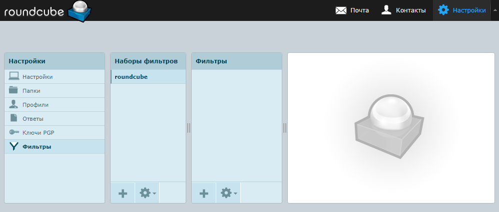
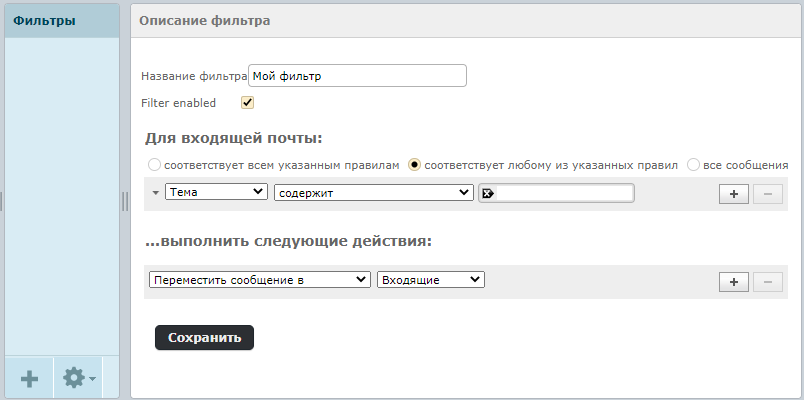

В Roundcube можно создавать фильтры для обработки писем, которые поступают в почтовый ящик. При помощи фильтров настраиваются действия, которые будут выполняться при заданных условиях (например, пересылать письма от определенных пользователей или с определенным текстом на другой ящик либо в папку).

Для создания фильтра выполните следующие действия.

1. Перейдите в раздел **«Настройки»**, который расположен в правом верхнем углу веб-почты.

2. Перейдите в меню **Фильтры > roundcube** и нажмите кнопку  в колонке **«Фильтры»**.

   

3. В появившемся справа окне укажите название фильтра, условия и действия, которые нужно выполнить в случае срабатывания заданных условий. Добавить новое условие или действие можно по кнопке .

   

4. Нажмите кнопку **«Сохранить»**.

5. Проверьте работу фильтра. Для этого воспроизведите условия, при которых он должен сработать.

   Впоследствии созданные фильтры впоследствии можно будет в любой момент отредактировать, отключить или удалить.

Фильтры также можно [настроить](nastroyka-filtrov-v-vebpochte-3.md) при помощи языка Sieve.
