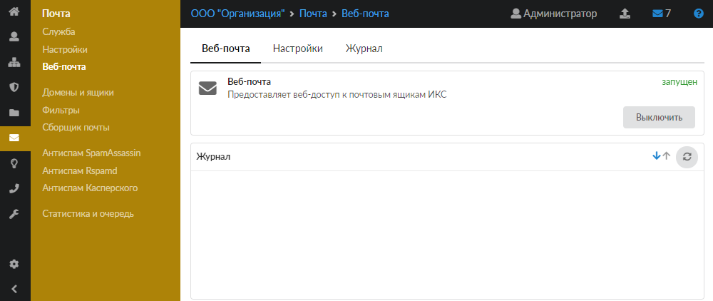
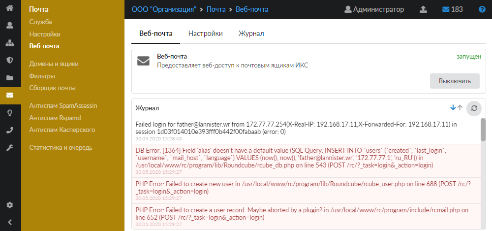
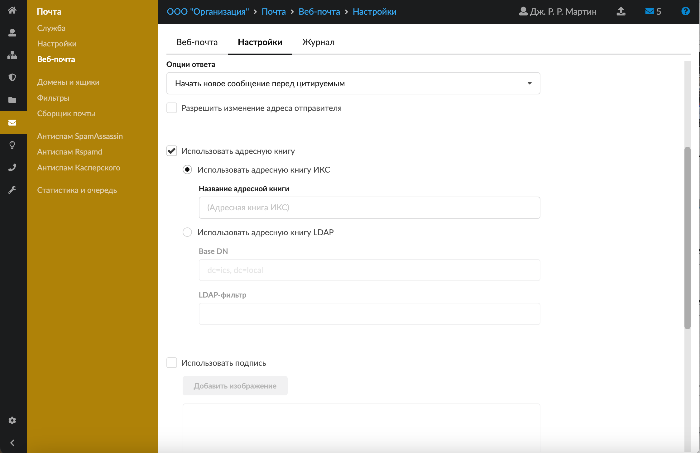
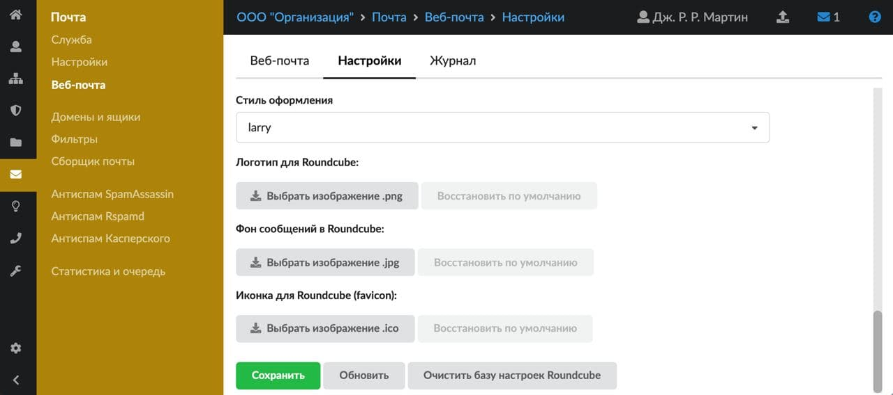
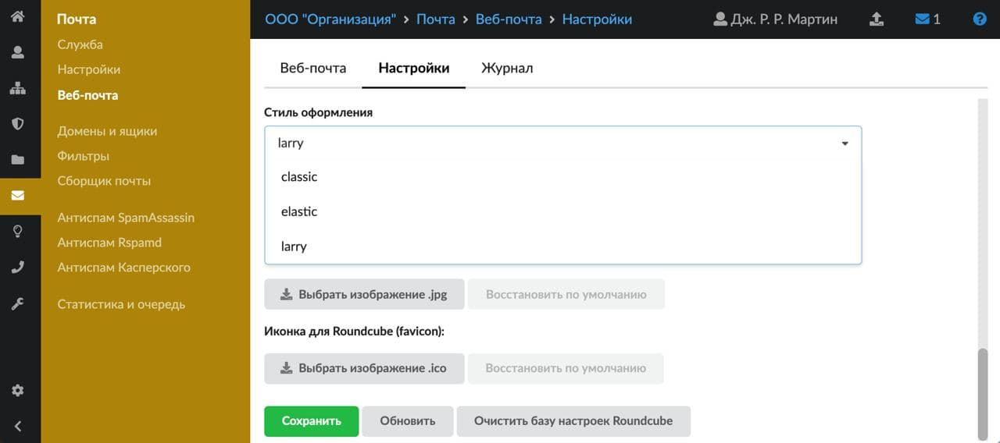
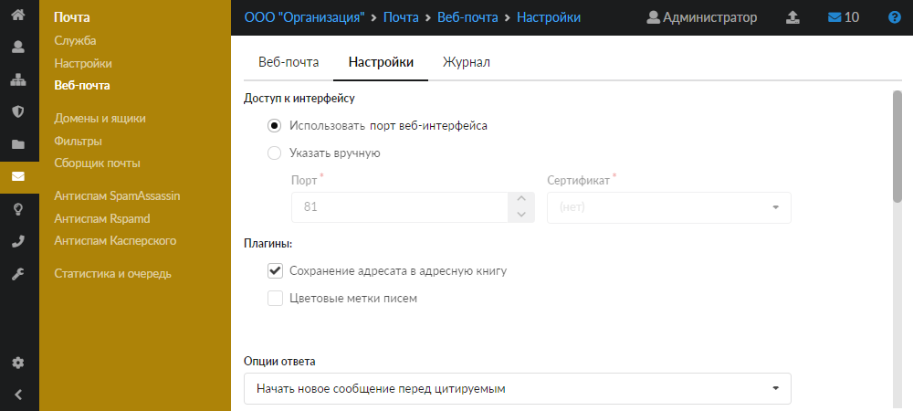
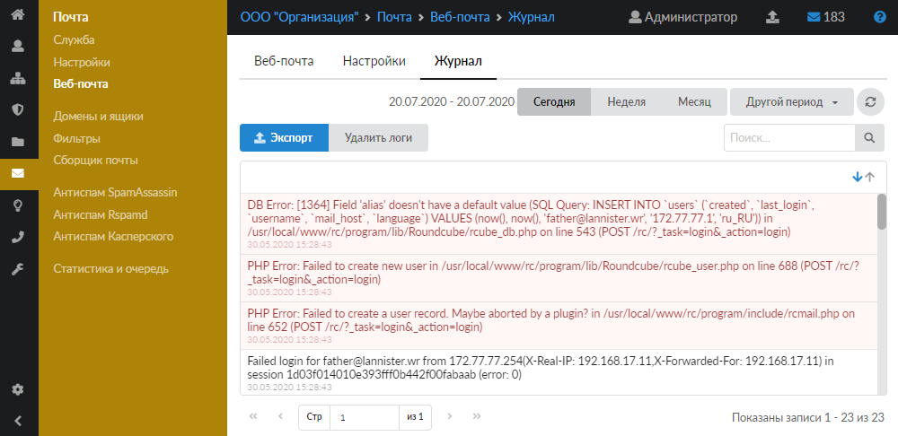

# Веб-почта

Модуль «Веб-почта» предоставляет доступ к почтовым ящикам почтового сервера ИКС с помощью веб-приложения Roundcube.

---

Модуль **«Веб-почта»** предоставляет доступ к почтовым ящикам **почтового сервера** ИКС с помощью **веб-приложения Roundcube**.

Для открытия модуля **«Веб-почта»** перейдите в меню **Почта > Веб-почта**.

В модуле расположены следующие вкладки:

- Веб-почта
- Настройки
- Журнал

## Веб-почта

На данной вкладке отображается состояние службы «Веб-почта»:

- статус службы (запущен, остановлен, выключен, не настроен);
- кнопка **«Включить»** (**«Выключить»**) — позволяет запустить или остановить службу;
- журнал последних событий.

## Настройки

Данная вкладка позволяет устанавливать различные настройки для веб-интерфейса Roundcube.

### Доступ к интерфейсу

По умолчанию установлен переключатель **«Использовать порт веб-интерфейса»**. При установке флага **«Указать вручную»** можно задать:

- **«Порт»** — позволяет задать порт, на котором работает веб-интерфейс почты ИКС (Roundcube);
- При изменении порта по умолчанию укажите **сертификат** в поле **«Сертификат»**, так как веб-интерфейс почты ИКС работает через **прозрачный прокси**.

> Примечание: Формат для доступа к интерфейсу: `<IP-адрес ИКС>:<вновь заданный порт>`.

### Плагины

Флаг **«Сохранить адресата в адресную книгу»** отвечает за сохранение адресата в адресную книгу.

При установке флага **«Цветовые метки писем»** в веб-интерфейсе Roundcube добавится рамка для цветовой маркировки писем.

### Опции ответа

Блок позволяет установить **вариант формирования ответа** на письмо:

- Не цитировать оригинальное сообщение;
- Начать новое сообщение перед цитируемым;
- Начать новое сообщение после цитируемого.

Дополнительные плагины можно активировать установлением следующих флагов:

- **«Разрешить изменение адреса отправителя»** — разрешает подмену адреса отправителя на произвольный при отправке письма;
- **«Использовать адресную книгу»** — позволяет выбирать адресата из существующей адресной книги **ИКС** или **LDAP**;
- **«Использовать подпись»** — позволяет в создаваемом письме устанавливать подпись автора.

Подпись автоматически сгенерируется только для аккаунтов, созданных после настройки подписи.

В подписи можно использовать переменные в виде `[имя переменной]`. Возможные значения:

- `cn` — имя пользователя;
- `ou` — группа, в которой находится пользователь;
- `mail` — почтовый адрес;
- `description` — поле «Описание» пользователя;
- `notes` — поле «Комментарий» пользователя;
- `telephonenumber` — поле «Телефон» пользователя;
- `title` — поле «Должность» пользователя;
- `url` — поле «Веб-сайт» пользователя;
- `postaladdress` — поле «Адрес» пользователя;
- `pager` — поле «ICQ» пользователя;
- `ounotes` — поле «Описание» группы, в которой состоит пользователь.

Значения переменных берутся из описания пользователя. Для вставки изображений используется формат `data:url` (например, `&lt;img class="popup" tabindex="1" src="data:image/png;…" ...&gt;`).

### Внешний вид Roundcube

В блоке можно загрузить и изменить логотип, фон сообщений и иконку для Roundcube.

Для изменения **стиля оформления** установите в соответствующем поле одно из значений:

По кнопке **«Очистить базу настроек Roundcube»** можно очистить базу Roundcube. Это триггер, а не ссылка — перейдите в **настройках почтового сервера**.

> ⚠ Внимание! После очистки базы будут утеряны все персонализированные настройки почтового клиента.

Чтобы изменения вступили в силу, нажмите **«Сохранить»**.

## Журнал

На данной вкладке отображается сводка всех системных сообщений модуля с указанием даты, времени и уровня важности события.

Журнал является стандартным элементом веб-интерфейса ИКС.

---

**Источник:** [Документация ИКС — Веб-почта](https://doc.a-real.ru/index.php?article=86)
