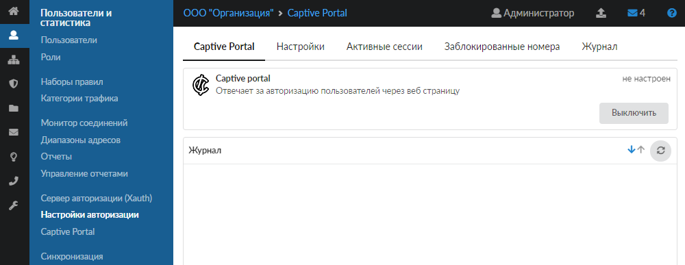
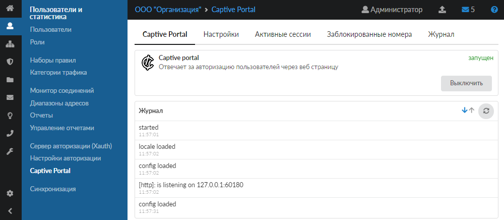
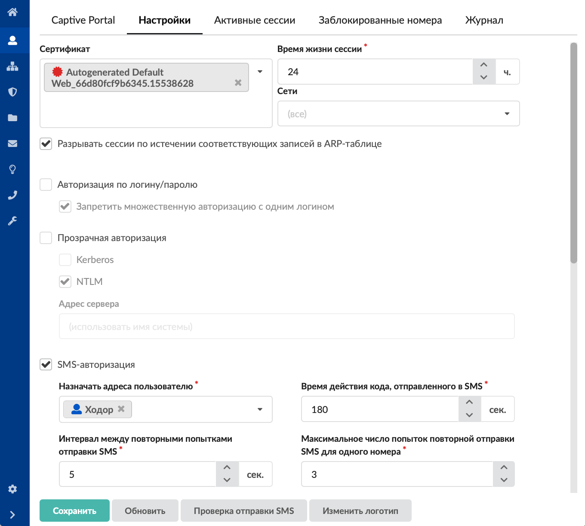
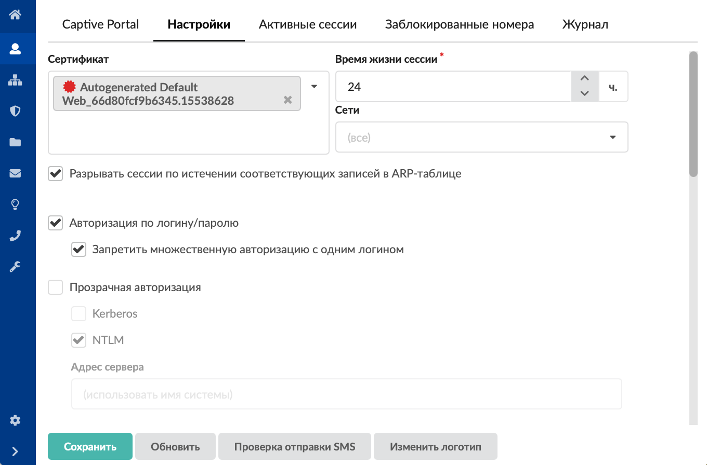
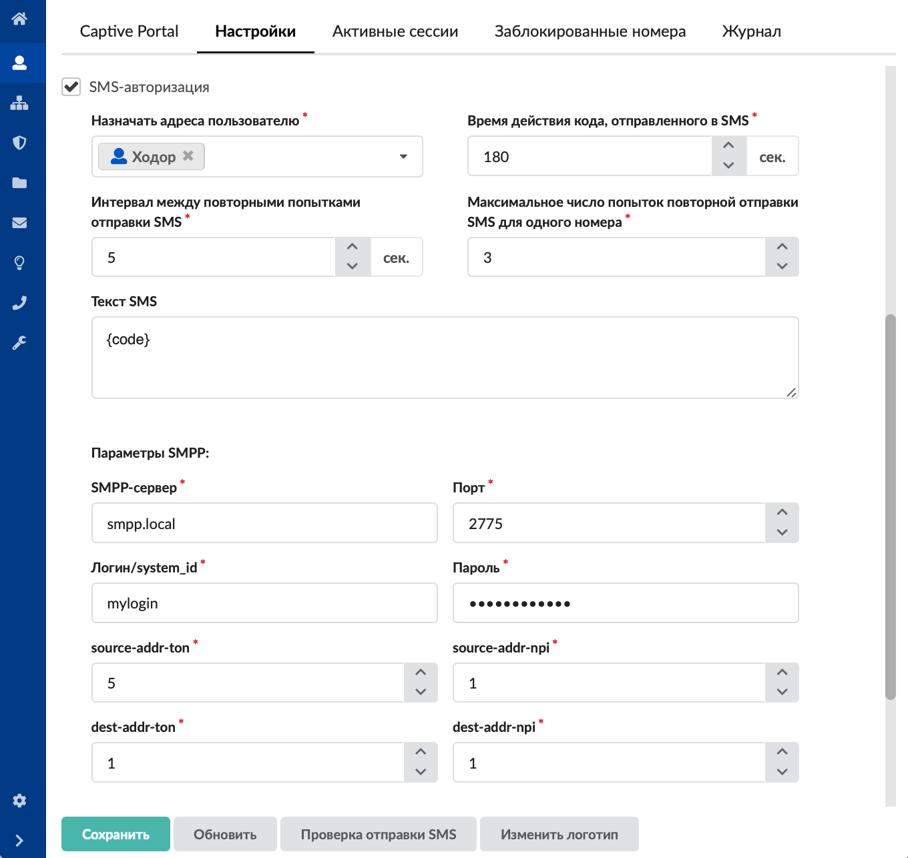
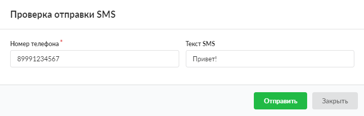
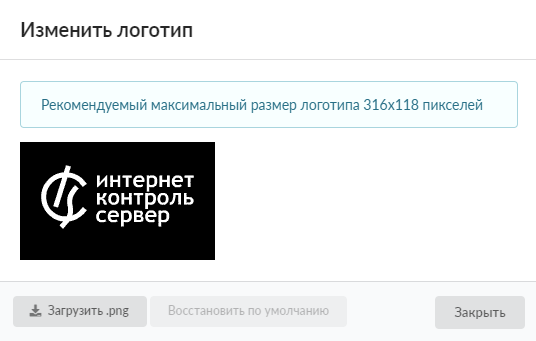

Модуль Captive Portal предоставляет возможность авторизации пользователей на ИКС для доступа к сети Интернет и объединяет настройку веб-авторизации, SMS-авторизации и авторизации по звонку.

---

## Captive Portal

На данной вкладке отображаются:

- статус службы (запущен, остановлен, выключен, не настроен);
- кнопка **«Включить»** (**«Выключить»**) — позволяет запустить или остановить службу;
- журнал последних событий.



Все TCP-запросы на порты 80 и 443 от всех неизвестных пользователей перехватывает [межсетевой экран](/index.php?article=24/#firewall) и перенаправляет в модуль «Captive Portal». Неавторизованному пользователю в браузере выдаётся окно авторизации.

> ⚠ Внимание! Не все браузеры способны автоматически выдать окно авторизации Captive Portal. В таком случае пользователь должен обратиться на:
> 
> `<IP_ICS>:81/portal/`

Вместо обращения `<IP_ICS>:81/portal/` на ИКС можно создать [виртуальный хост с перенаправлением](/index.php?article=81). Таким образом, пользователь будет обращаться на локально созданное доменное имя, а попадать на `<IP_ICS>:81/portal/`.

> ⚠ Внимание! Авторизация на Captive Portal будет работать только из локальных сетей ИКС.

> ⚠ Для успешной авторизации доменного пользователя ИКС должен находиться в домене. Настроить это можно в [модуле](/index.php?article=56) «Сетевое окружение».

В модуле расположены следующие вкладки:

- [Captive Portal](#tab1)
- [Настройки](#tab2)
- [Активные сессии](#tab3)
- [Заблокированные номера](#tab4)
- [Журнал](#tab5)

## Настройки

На данной вкладке можно выбрать режим работы Captive Portal. Для этого просто установите соответствующие флаги:

- **«Авторизация по логину/паролю»** — в качестве сервиса веб-авторизации;
- **«Прозрачная авторизация»** — авторизация через Kerberos либо NTLM;
- **«SMS-авторизация»** — в качестве сервиса SMS-авторизации;
- **«Авторизация по звонку»** — в качестве сервиса авторизации по звонку;
- совместная работа в любой комбинации (при установке нескольких флагов одновременно).



Чтобы при обращении пользователя к [HTTPS](/index.php?article=24/#https)-ресурсам корректно работало перенаправление на страницу авторизации, в поле **«Сертификат»** установите конечный [сертификат](/index.php?article=78), а также используйте [прозрачный прокси](/index.php?article=62).

Каждый авторизованный пользователь в Captive Portal сохраняется как сессия на основе [MAC-адреса](/index.php?article=24#mac-address) данного пользователя. Идентификация по MAC-адресу используется вместо идентификации по [IP-адресу](/index.php?article=24#ip-address). Это помогает избежать случаев с подменой IP-адреса или случаев, когда IP-адрес ещё не истёкшей сессии выдаётся другому пользователю по [DHCP](/index.php?article=24#dhcp).

Каждая сессия имеет **время жизни**, по истечении которого пользователь автоматически разлогинивается. Время жизни сессии можно изменить в одноимённом поле. Также Captive Portal каждую минуту проверяет кеш [ARP](/index.php?article=24#arp) операционной системы.

По умолчанию Captive Portal работает во всех **сетях**. В соответствующем поле можно указать конкретную сеть. Это может быть локальная сеть либо Wi-Fi.

- Если MAC-адрес авторизованного пользователя отсутствует в кеше, то Captive Portal считает, что пользователь неактивен и автоматически разлогинивает его.
- Если MAC-адресу был присвоен другой IP-адрес, то Captive Portal обновляет у сессии IP-адрес, при этом сессия не закрывается.

Для своевременного разрыва сессий установите флаг **«Разрывать сессии по истечении соответствующих записей в ARP-таблице»**.

### Авторизация по логину/паролю

1. Установите флаг **«Авторизация по логину/паролю»**. Тогда в модуле «Captive Portal» будет включён и запущен сервер веб-авторизации. При первом обращении пользователя к какому-либо ресурсу ему будет предложено ввести логин и пароль, закреплённый за его учётной записью в ИКС.



2. При необходимости установите флаг **«Запретить множественную авторизацию с одним логином»**. Тогда пользователь, использующий конкретный логин, не сможет одновременно авторизоваться при помощи Captive Portal с различных устройств (IP-адресов). Аналогичная опция присутствует в настройках [сервера авторизации (Xauth)](/index.php?article=51), однако действие этих опций не перекрывается и каждая из них влияет только на соответствующую службу.

   Пример для двух пользователей. В системе два пользователя. Снят флаг «Запретить множественную авторизацию с одним логином». В Captive Portal авторизованы несколько пользователей под одним логином и паролем. Если установить флаг «Запретить множественную авторизацию с одним логином», то множественная авторизация сработает только тогда, когда новый пользователь авторизуется в Captive Portal под этим же логином и паролем. В таком случае все подключённые пользователи будут отключены и активная сессия будет только у нового пользователя. А если нового пользователя не будет, то у текущих пользователей сессии будут активны и оборвутся в тот момент, когда закончится время жизни сессии (установлено в [настройках Captive Portal](#tab2)).

3. Нажмите **«Сохранить»**.

> ⚠ Внимание! При данном типе авторизации, если вы нажали кнопку выхода из сети Интернет, войти снова не получится до тех пор, пока соединение не восстановится.

### Прозрачная авторизация

Благодаря прозрачной аутентификации пользователю не нужно явным образом аутентифицироваться во всех ситуациях.

Установите флаги для определения способа прозрачной авторизации — через **Kerberos** либо **NTLM**.

Укажите **адрес сервера**, на который будет происходить перенаправление для прозрачной аутентификации.

Авторизация работает только для доменных пользователей с использованием NTLM или Kerberos.

**Адрес портала**, куда перенаправляется пользователь, формируется в виде `https://<имя системы>:<порт веб интерфейса>/portal/transparent_auth`, где имя системы — это, например, `krbtest.office1.a-real.ru`. Это имя должно быть разрешено у клиента в адрес ИКС и на это имя должен быть сформирован keytab.

#### Авторизация через Kerberos

Для того чтобы пользователь авторизовался через Kerberos, выполните следующие шаги.

1. Настройте Kerberos с импортом keytab.
2. Убедитесь, что ИКС прописан у пользователя шлюзом.
3. Настройте браузер клиента.

   **Для Firefox** зайдите в настройки браузера через адресную строку `about:config` и добавьте имя ИКС в домене (например, `krbtest.office1.a-real.ru`) в опцию `network.negotiate-auth.trusted-uris`.

   **Для Edge и Chrome** нажмите Win+R, выполните `inetcpl.cpl`, перейдите на вкладку «Безопасность / Местная интрасеть / Сайты» и впишите туда `https://krbtest.office1.a-real.ru` и `http://krbtest.office1.a-real.ru`.

#### Авторизация через NTLM

Для того чтобы пользователь авторизовался через NTLM, выполните следующие действия.

1. Введите ИКС в домен.
2. Убедитесь, что ИКС прописан у пользователя шлюзом.
3. Настройте браузер клиента.

   **Для Firefox** зайдите в настройки браузера через адресную строку `about:config` и добавьте имя ИКС в домене (например, `krbtest.office1.a-real.ru`) в опцию `network.automatic-ntlm-auth.trusted-uris`.

   **Для Edge и Chrome** нажмите Win+R, выполните `inetcpl.cpl`, перейдите на вкладку «Безопасность / Местная интрасеть / Сайты» и впишите туда `https://krbtest.office1.a-real.ru` и `http://krbtest.office1.a-real.ru`.

Для автоматического разлогинивания при выходе пользователя из операционной системы можно использовать следующий PowerShell-скрипт:

```powershell
$domain = "krbtest.office1.a-real.ru:81"
$uri = "https://$domain/portal/api/v1/logout"

[System.Net.ServicePointManager]::ServerCertificateValidationCallback = { $true }
[Net.ServicePointManager]::SecurityProtocol = [Net.SecurityProtocolType]::Tls12

try {
    $req = [System.Net.HttpWebRequest]::Create($uri)
    $req.Method = "POST"
    $req.AllowAutoRedirect = $false
    $req.ContentLength = 0
    $resp = $req.GetResponse()
    $resp.Close()
} catch {
}
```

Скрипт можно поставить в операционную систему для выполнения в тех случаях, когда пользователь выходит из своей учётной записи.

### SMS-авторизация

1. Установите флаг **«SMS-авторизация»** — тогда пользователи будут проходить [авторизацию через SMS](/index.php?article=191).
2. В поле **«Назначать адреса пользователю»** выберите одного из пользователей, заведённых на ИКС. Данному пользователю для каждой новой сессии будут выдаваться [динамические IP-адреса](/index.php?article=24#dynamic_ip).
3. В поле **«Время действия кода, отправленного в SMS»** укажите время действительности кода в секундах (от 60 до 999999). Если время действия кода истекло и код не был введён, то пользователю необходимо вновь запросить код, нажав соответствующую кнопку в форме веб-авторизации. По умолчанию установлено значение 180 секунд.
4. В поле **«Интервал между повторными попытками отправки SMS»** задайте время блокировки кнопки **«Отправить СМС повторно»** для пользователя при SMS-авторизации. Значение, задаваемое в данном поле, не должно превышать время действия кода, указанное в шаге 3.
5. В поле **«Максимальное число попыток повторной отправки SMS для одного номера»** укажите число попыток повторной отправки SMS, которое может совершить пользователь для одного абонентского номера. При этом время между попытками будет вычисляться по формуле: номер попытки × «Интервал между повторными попытками отправки SMS». Если пользователь исчерпал указанное число попыток отправки SMS, он сможет изменить абонентский номер для отправки SMS. При смене абонентского номера число попыток обнулится.
6. В поле **«Текст SMS»** введите текст сообщения, которое будет отправлено пользователю при авторизации. Данное сообщение обязательно должно содержать шаблон `{code}`. Вместо этого шаблона SMS-сервер вставит четырёхзначное число.
7. Для подключения сервера [SMPP](/index.php?article=24#smpp) заполните в блоке **«Параметры SMPP»** следующие поля: **«SMPP-сервер»**, **«Порт»**, **«Логин/system_id»** и **«Пароль»**.

   Значения дополнительных параметров подключения **«source-addr-ton»**, **«source-addr-npi»**, **«dest-addr-ton»**, **«dest-addr-npi»** должны быть указаны в документации к подключаемому серверу SMPP. В большинстве случаев они такие:

   - `source-addr-ton` — 5
   - `source-addr-npi` — 1
   - `dest-addr-ton` — 1
   - `dest-addr-npi` — 1

8. Нажмите **«Сохранить»**.

Чтобы проверить правильность введённых настроек, воспользуйтесь функцией **тестовой отправки**. Для этого:

1. Нажмите **«Проверка отправки SMS»**.
2. В открывшемся окне заполните поле **«Номер телефона»** (является обязательным). Вводимые номера должны иметь следующий формат: `<код страны или выход на зоновую/междугороднюю нумерацию> <десятизначный номер абонента в операторской сети>`. Все вводимые номера должны содержать только цифры (не менее одиннадцати), без скобок и дефисов (например, `+79991112233` или `85554447799`).
3. В поле **«Текст SMS»** можно ввести любой текст для отправки.
4. Нажмите **«Отправить»**. Если сообщение было успешно отправлено, будет показана соответствующая информация, в противном случае отобразится ошибка отправки и код ошибки.

### Авторизация по звонку

1. Установите флаг **«Авторизация по звонку»** — тогда пользователи будут проходить [авторизацию по звонку](/index.php?article=237).
2. В поле **«Назначать адреса пользователю»** выберите одного из пользователей, заведённых на ИКС. Данному пользователю для каждой новой сессии будут выдаваться динамические IP-адреса.
3. В поле **«Провайдер телефонии для приёма звонков»** задайте [SIP](/index.php?article=24#sip)-провайдера модуля IP-телефонии ИКС, который будет ожидать входящий звонок от авторизуемого пользователя.
4. В поле **«Номер для звонка»** укажите внешний номер провайдера, на который необходимо совершить звонок авторизуемому пользователю.
5. В поле **«Время ожидания звонка»** задайте время (в секундах), в течение которого авторизуемый пользователь должен совершить звонок на указанный номер.
6. Нажмите **«Сохранить»**.

### Изменить логотип

На вкладке «Настройки» также можно изменить приветственный логотип для SMS-авторизации и авторизации по логину/паролю. Для этого:

1. Нажмите кнопку **«Изменить логотип»** — в открывшемся окне отобразится текущий логотип (по умолчанию это логотип ИКС).
2. Нажмите **«Загрузить .png»** и выберите файл формата `.png`. Рекомендуемый размер загружаемого логотипа 316×118 пикселей. Кнопка **«Восстановить по умолчанию»** позволяет вернуть логотип ИКС.
3. Нажмите **«Закрыть»**.



## Активные сессии

На данной вкладке отображаются текущие сеансы пользователей, авторизованных через Captive Portal, с присвоенными им динамическими IP-адресами в ИКС.



## Заблокированные номера

На данной вкладке показаны номера абонентов, которые исчерпали все попытки ввода кода. Блокировка на данные номера устанавливается на время жизни сессии. Блокировка может быть принудительно снята пользователем ИКС, имеющим [права администратора](/index.php?article=44).



## Журнал

На данной вкладке отображается сводка всех системных сообщений соответствующих серверов с указанием даты и времени.



[Журнал](/index.php?article=196#summary) является стандартным элементом веб-интерфейса ИКС.
