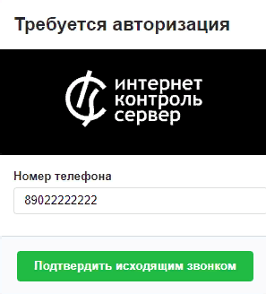
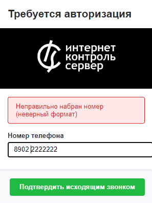
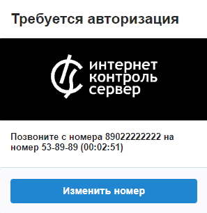

# Настройка авторизации по звонку

Авторизация по звонку имеет ряд преимуществ: возможность авторизоваться с любого номера, бесплатность для администратора ИКС и возможность вставки собственного логотипа.

---

Авторизация по звонку имеет ряд преимуществ:

- возможность авторизоваться по звонку с любого номера;
- для администратора ИКС данная авторизация бесплатна (входящий звонок будет сбрасываться и тарификация не начнется);
- возможность вставить свой логотип.

Процесс авторизации проходит следующим образом:

1. Пользователь подключается к точке Wi-Fi.
2. Пользователь заходит в браузер, вводит свой номер телефона и нажимает кнопку **«Подтвердить исходящим звонком»**. Номер телефона должен состоять из 11—13 цифр (+79101234567 либо 89101234567).

   

   Если номер набран неверно, на экране появится соответствующее сообщение.

   

3. Пользователь совершает звонок с введенного номера на номер, указанный в приглашении. Изменить свой номер пользователь может по одноименной кнопке.

   

4. Если внешний входящий вызов, пришедший на SIP-провайдера модуля IP-телефонии ИКС, пришел с указанного в **Шаге 2** номера, то пользователь успешно авторизуется. Вызов при этом сбрасывается (Hangup). В противном случае вызов проходит дальше по [правилам IP-телефонии](https://doc.a-real.ru/index.php?article=104) ИКС.

> ⚠️ Внимание! Введенный пользователем номер сохраняется в cookies браузера, чтобы можно было сменить его на странице ввода номера. Номер в cookies хранится в течение одной сессии.

---

**Источник:** [Документация ИКС — Настройка авторизации по звонку](https://doc.a-real.ru/index.php?article=237)
