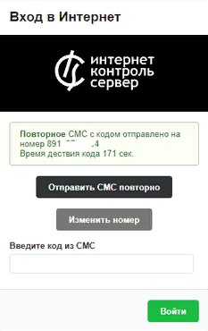

# Настройка SMS-авторизации

SMS-авторизация имеет ряд преимуществ: отправка SMS по протоколу SMPP, произвольный интервал действия кода в SMS, произвольный текст в SMS с кодом, возможность вставить свой логотип.

---

SMS-авторизация имеет ряд преимуществ:

- отправка SMS по протоколу [SMPP](https://doc.a-real.ru/index.php?article=24#smpp);
- возможность указать произвольный интервал времени действия кода в SMS;
- возможность указать произвольный текст в SMS с кодом;
- возможность вставить свой логотип.

### Принцип работы

Данный тип авторизации работает по следующему принципу:

1. Пользователь подключается к точке Wi-Fi.
2. Пользователь заходит в браузер, вводит свой номер телефона и нажимает кнопку **«Получить СМС c кодом»**. Номер телефона должен состоять из 11—13 циф (+79101234567 либо 89101234567).

3. Через некоторое время на указанный номер телефона приходит SMS с кодом.

4. Полученный код пользователь вводит в форму авторизации. При введении правильного кода пользователю будет выдан динамический IP-адрес, а сам пользователь авторизуется на ИКС и получает доступ к сети Интернет.

> ⚠ **Внимание!** Выданный пользователю IP-адрес удаляется через 3 часа отсутствия активности.

Если пользователь не смог ввести код за отведённое время, он может запросить код повторно по кнопке **«Отправить СМС повторно»** или изменить абонентский номер по кнопке **«Изменить номер»**.

---

**Источник:** [Документация ИКС — Настройка SMS-авторизации](https://doc.a-real.ru/index.php?article=191)
