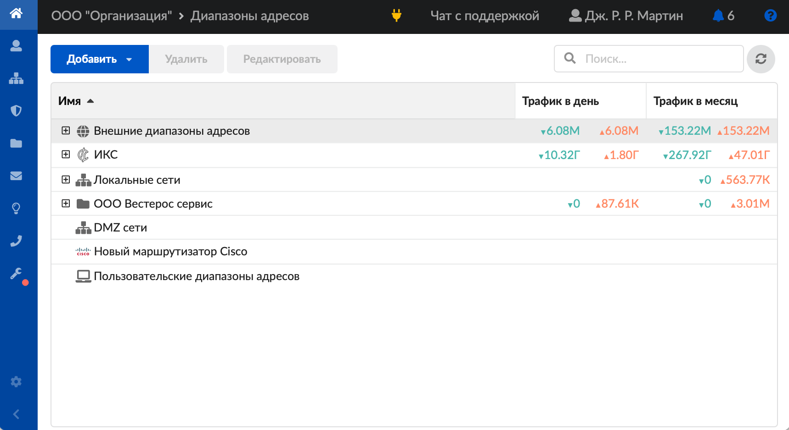
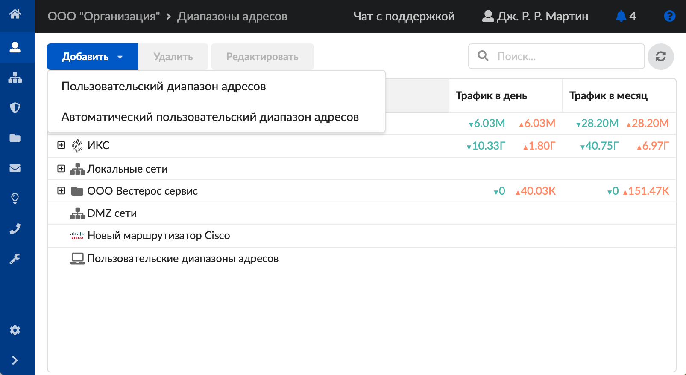
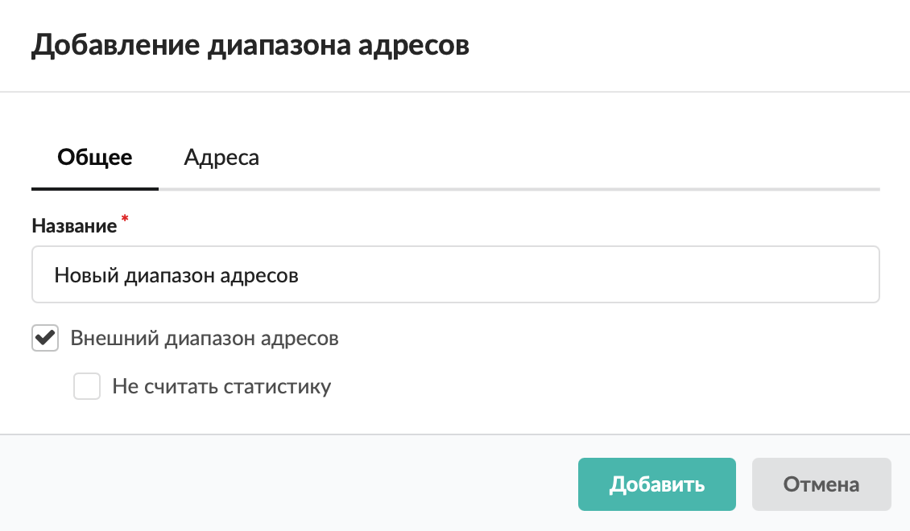
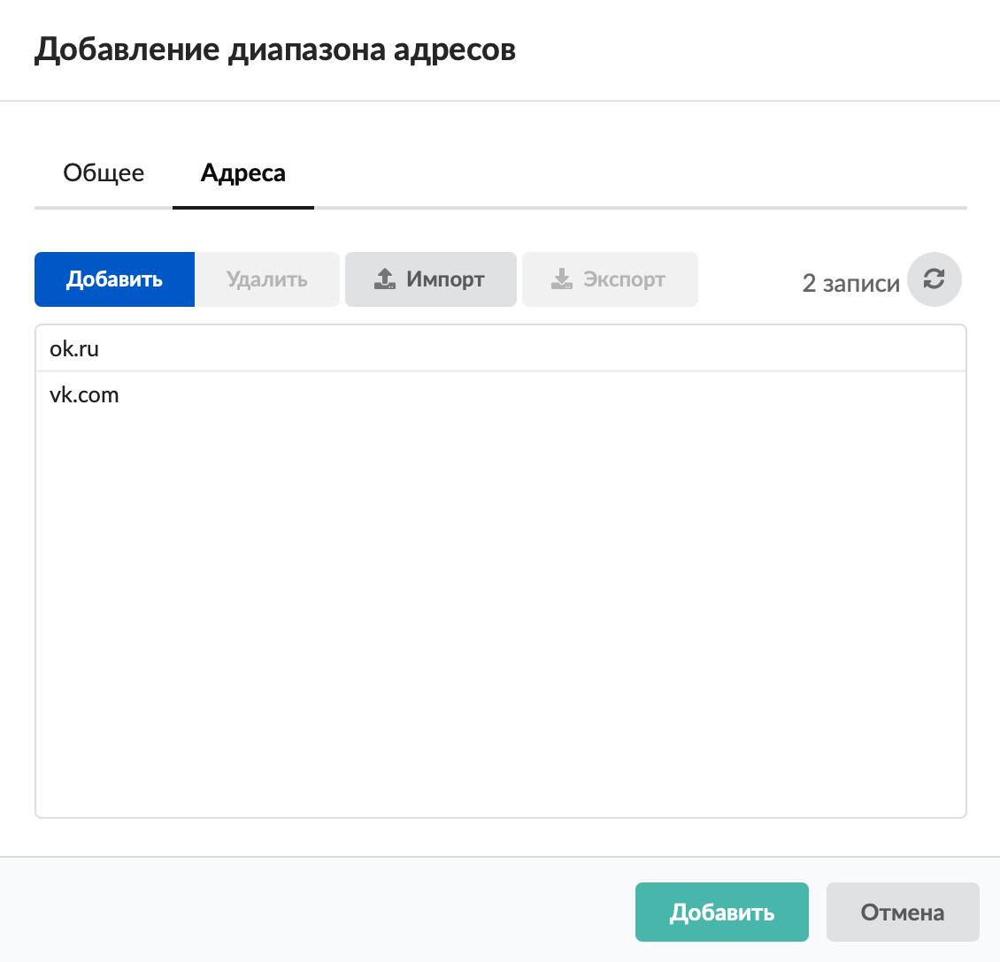
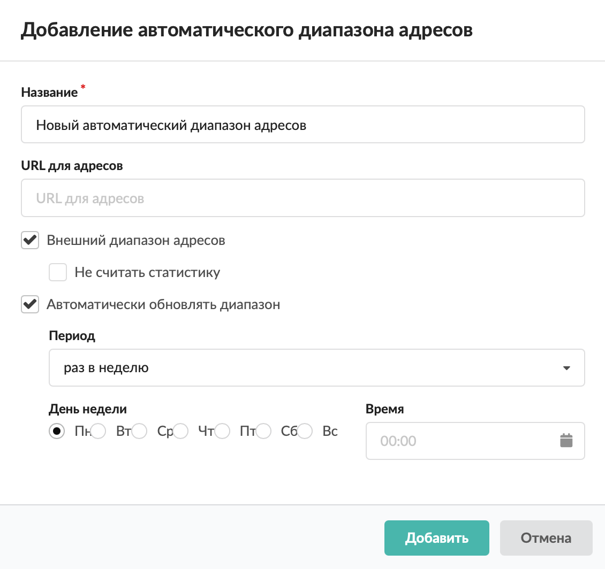

Модуль «Диапазоны адресов» содержит список всех объектов тарификации, по которым ИКС ведет учет. Данный модуль расположен в меню **Пользователи и статистика > Диапазоны адресов**.

По умолчанию заведены следующие **категории объектов**:

- внешние диапазоны адресов (провайдеры);
- ИКС;
- корневая группа (содержит всех заведенных пользователей ИКС и группы, в которых они состоят);
- локальные сети;
- DMZ-сети;
- пользовательские диапазоны адресов.

Все категории объектов, кроме категории «Пользовательские диапазоны адресов», заполняются автоматически из соответствующих модулей и не могут быть изменены в данном модуле.

Категория **«Пользовательские диапазоны адресов»** предназначена для создания объектов тарификации ИКС, к которым можно применять различные правила и использовать для оптимизации действий в других модулях.

Для **поиска** диапазона адресов воспользуйтесь специальной строкой. Здесь же расположена кнопка **обновления окна модуля** — .

## Добавить пользовательский диапазон адресов

1. Нажмите кнопку **«Добавить»** и выберите **«Пользовательский диапазон адресов»** — откроется окно добавления диапазона.

2. На вкладке **«Общее»** введите **название** диапазона адресов.

3. Если диапазон является **внешним**, установите соответствующий флаг.

> ⚠ **Внимание!** Данная опция влияет на подсчет трафика и отображение его в статистике.

По умолчанию любой создаваемый диапазон адресов является **внутренним**.

Если создать внутренний пользовательский диапазон адресов и указать в нем, например, `yandex.ru` и `google.ru`, то обращение к этим доменам будет отображаться в статистике как обращение к внутреннему диапазону адресов. В этом случае запросы на эти ресурсы перестанут отображаться на странице пользователя и в отчетах статистики, так как там в качестве назначения по умолчанию используется внешний диапазон адресов. Чтобы эти ресурсы продолжали определяться как внешние, установите флаг **«Внешний диапазон адресов»**. Если требуется отключить учет запросов для данного источника трафика, установите флаг **«Не считать статистику»**.

4. На вкладке **«Адреса»** укажите нужные **адреса**. Допускаются следующие варианты:

- произвольные IP-адреса (например, `192.168.1.123`);
- подсети (например, `192.168.1.1/24` либо `192.168.1.1/255.255.255.0`);
- доменные имена (например, `ya.ru`);
- диапазоны (например, `192.168.1.53-192.168.1.87`).

Диапазон адресов также можно загрузить из текстового файла формата `*.txt` по кнопке **«Импорт»**. В нем должны быть перечислены с каждой новой строки: IP-адреса, подсети, доменные имена или диапазоны.

Для выгрузки диапазона адресов воспользуйтесь кнопкой **«Экспорт»**.

5. Нажмите **«Добавить»** — новый диапазон отобразится в списке.

## Добавить автоматический пользовательский диапазон адресов

Автоматический пользовательский диапазон адресов работает аналогично пользовательскому диапазону адресов, но вместо ручного ввода списка адресов берет их из специального файла.

1. Нажмите кнопку **«Добавить»** и выберите **«Автоматический пользовательский диапазон адресов»** — откроется окно добавления диапазона.

2. Введите **название** диапазона адресов.

3. Укажите файл **URL для адресов**. Формат файла — список IP-адресов или доменных имен, указанных каждый с новой строки.

4. Если диапазон является **внешним**, установите соответствующий флаг.

> ⚠ **Внимание!** Данная опция влияет на подсчет трафика и отображение его в статистике.

По умолчанию любой создаваемый диапазон адресов является **внутренним**.

Если создать внутренний пользовательский диапазон адресов и указать в нем, например, `yandex.ru` и `google.ru`, то обращение к этим доменам будет отображаться в статистике как обращение к внутреннему диапазону адресов. В этом случае запросы на эти ресурсы перестанут отображаться на странице пользователя и в отчетах статистики, так как там в качестве назначения по умолчанию используется внешний диапазон адресов. Чтобы эти ресурсы продолжали определяться как внешние, установите флаг **«Внешний диапазон адресов»**. Если требуется отключить учет запросов для данного источника трафика, установите флаг **«Не считать статистику»**.

5. Для **автоматического обновления диапазона** установите соответствующий флаг и укажите **период обновления**.

6. Нажмите **«Добавить»** — новый диапазон отобразится в списке.

Созданные диапазоны адресов можно **редактировать** и **удалять** при помощи соответствующих кнопок.
