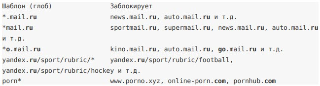

# Адреса в категориях трафика

Основные принципы указания адресов в категориях трафика межсетевого экрана ИКС: состав адресов, работа с кириллическими доменами, поддоменами, регулярными выражениями и глобами.

---

Рассмотрим основные принципы того, как правильно указывать адреса в [категориях трафика](https://doc.a-real.ru/index.php?article=173).

## Состав адресов

Адреса, указываемые в категориях трафика, должны состоять из доменного имени или IP-адреса. Протокол (http:// или https://) в начале адреса указывать не надо.

Пример

```
news.mail.ru
google.com
sample.gtw-02.office4.example.com
87.250.250.242
77.88.55.70/images
yandex.ru/images
```

Если требуется ловить трафик по части доменного имени, пути или параметрам, используйте [глобы](#glob) или [регулярные выражения](#regul).

## Кириллические адреса

ИКС поддерживает работу с кириллическими адресами в категориях трафика. Если добавить адрес в формате [Punycode](https://ru.wikipedia.org/wiki/Punycode), он будет преобразован в кириллическое написание. Например, адрес xn-- 80aesfpebagmfblc0a.xn--p1ai преобразуется в стопкоронавирус.рф.

> ⚠ Внимание! Внутри ИКС кириллические адреса хранятся и используются в формате Punycode.

## Поддомены

Уровни доменов отделяются в URL точками. Обычно [поддоменами](https://ru.wikipedia.org/wiki/Поддомен) считают домены начиная с третьего уровня. Это можно использовать в записях категории трафика.

Пример 1

Требуется заблокировать ВСЕ страницы ресурса mail.ru. Создадим [запрещающее правило прокси](https://doc.a-real.ru/index.php?article=150) на пользователя. Укажем в настройках правила категорию трафика с записью в списке адресов:

```
mail.ru
```

Мы указали запись — домен второго уровня. ИКС заблокирует трафик к страницам вида:

```
mail.ru
news.mail.ru
deti.mail.ru
go.mail.ru/search_images?<...>
account.mail.ru/login?<...>
...
```

Заблокированы будут все страницы поддоменов (news, deti, go, account) включая родительский домен mail.ru.

Пример 2

Требуется заблокировать только страницы поддоменов ресурса mail.ru. Создадим [запрещающее правило прокси](https://doc.a-real.ru/index.php?article=150) на пользователя. Укажем в настройках правила категорию трафика с записью в списке адресов:

```
.mail.ru
```

ИКС заблокирует трафик к страницам вида:

```
news.mail.ru
deti.mail.ru
go.mail.ru/search_images?<...>
account.mail.ru/login?<...>
...
```

Заблокированы будут только страницы поддоменов: news, deti, go, account. Главная страница mail.ru открываться будет.

## Шаблоны регулярных выражений

В списке адресов категории трафика ИКС можно использовать [регулярные выражения, совместимые с Golang](https://ru.wikipedia.org/wiki/Регулярные_выражения). Для этого регулярное выражение нужно заключить между слешами, например `/\d+ [.]ru/`. Шаблоны без слешей ИКС добавить в список адресов не разрешит.

Пример 1

Необходимо заблокировать видео в социальной сети ВКонтакте. Создадим [запрещающее правило прокси](https://doc.a-real.ru/index.php?article=150) на пользователя. Укажем в настройках правила категорию трафика с регулярным выражением в списке адресов:

```
/vk.com[/].*video.*/
```

Здесь мы явно указали домен ВКонтакте, а конструкция `.*video.*` означает, что путь в URL должен содержать слово video. URL vk.com/video также будет заблокирован.

Пример 2

Требуется заблокировать сайты, содержащие слово казино в домене. Создадим [запрещающее правило прокси](https://doc.a-real.ru/index.php?article=150) на пользователя. Укажем в настройках правила категорию трафика с регулярным выражением в списке адресов:

```
/.*a[sz]ino.*[.][a-z]+/
```

Сайты могут начинаться с azino или asino, конструкция `[.][a-z]+` отвечает за проверку доменов (.ru, .com и т.д.). ИКС заблокирует трафик к сайтам вида:

```
777-casino123.com
azino-online.media
best-asino777.ru
```

Пример 3

Необходимо заблокировать сайты с именем из цифр в домене. Создадим [запрещающее правило прокси](https://doc.a-real.ru/index.php?article=150) на пользователя. Укажем в настройках правила категорию трафика с регулярным выражением в списке адресов:

```
/[/]{2}[0-9]{6}[.][a-z]+/
```

В данном случае мы ищем сайты шестизначным числом в имени — `[0-9]{6}`, конструкция `[.][a-z]+` отвечает за проверку доменов (.ru, .com и т.д.). `[/]{2}` — гарантирует, что слева от искомого домена только протокол. ИКС заблокирует трафик к сайтам вида:

```
777777.ru
666666.xyz
123456.media
```

## Шаблон поиска (глоб)

ИКС частично поддерживает шаблоны поиска (глоб). Можно использовать символ `*` для замены любой строки символов (даже нулевой длины).

Примеры

Для определенности будем считать, что записи категории трафика применяются для запрещающего правила прокси.



> ⚠ Внимание! Внутри ИКС глобы со звездочкой будут заменены на регулярные выражения, где `*` будет заменена на `.*`. Например, `*mail.ru` будет работать как `/.*mail[.]ru/`. То есть глобы поддерживаются для удобства отображения.

---

**Источник:** [Документация ИКС — Адреса в категориях трафика](https://doc.a-real.ru/index.php?article=401)
