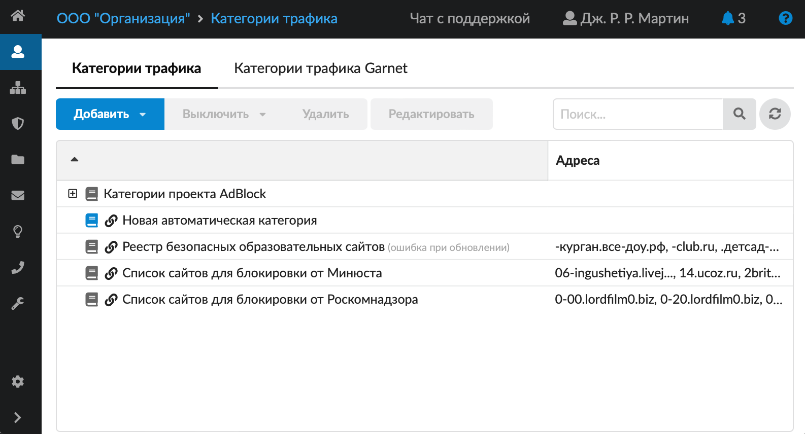
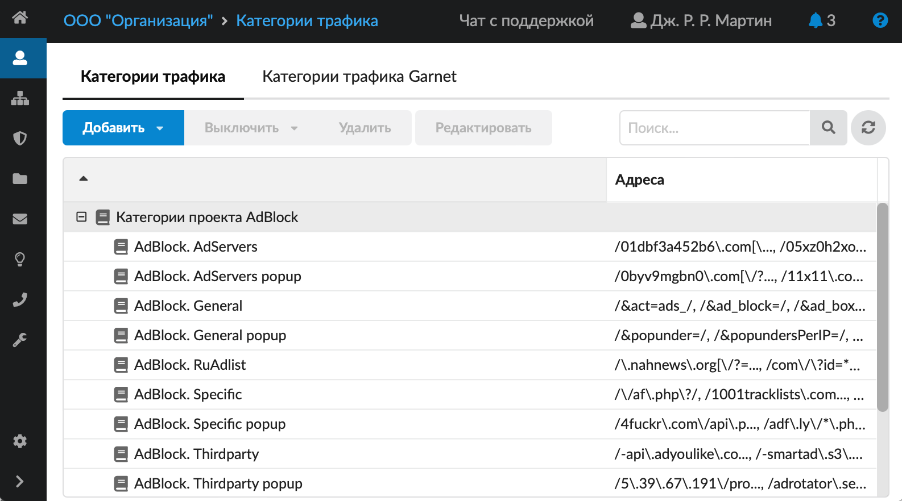
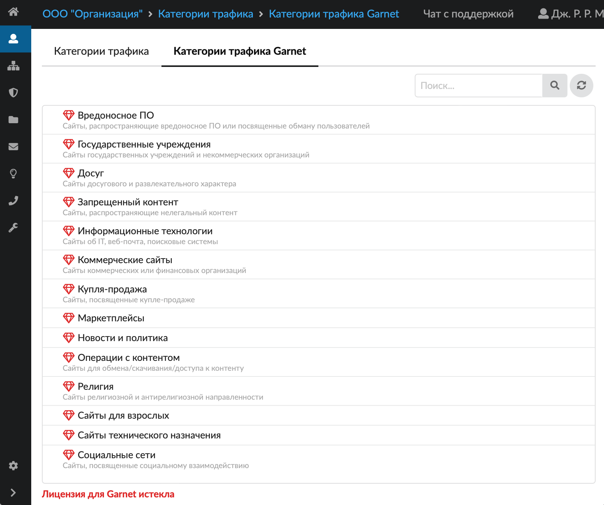

# Категории трафика

Категория трафика — это набор параметров веб-трафика, по которым трафик определяется как соответствующий тематике (имени) категории.

---

**Категория трафика** — это набор параметров веб-трафика, по которым трафик определяется как соответствующий тематике (имени) категории. Категории трафика используются при создании правил и исключений прокси для пользователей и групп.

В ИКС предусмотрена возможность объединения множества [IP-адресов](https://doc.a-real.ru/index.php?article=24/#ip-address), [URL](https://doc.a-real.ru/index.php?article=24/#url) и содержащихся в URL расширений, поисковых запросов, [MIME-типов](https://doc.a-real.ru/index.php?article=24/#mime-type) в единую категорию. Данные категории [трафика](https://doc.a-real.ru/index.php?article=24/#traffic) применяются при создании [запрещающих](https://doc.a-real.ru/index.php?article=150), [разрешающих](https://doc.a-real.ru/index.php?article=153) правил прокси или [исключений прокси](https://doc.a-real.ru/index.php?article=160) для пользователей и групп пользователей (поле **«URL назначения»**).

Модуль **«Категории трафика»** расположен в меню **Пользователи и статистика > Категории трафика**. В модуле отображаются следующие вкладки:

- [Категории трафика](#tab1)
- [Категории трафика Garnet](#tab2)

Для того чтобы узнать все различия между категориями трафика, в статье приведены [таблицы сравнения](#table).

## Категории трафика

На вкладке отображаются все заведенные группы категорий трафика, они обозначены иконкой . Встроенные группы нельзя редактировать и удалить, но возможно экспортировать содержимое категории.

На данной вкладке также расположены категории **проекта AdBlock**. Это бесплатный блокировщик рекламы и отслеживания.

Любые категории трафика, в том числе автоматические (встроенные) и группы категорий, можно включать и выключать. При этом созданные категории можно редактировать и удалять.

> ⚠ Важная информация! Категории «Список сайтов для блокировки от Минюста», «Список сайтов для блокировки от Роскомнадзора» и «Реестр безопасных образовательных сайтов» первоначально не содержат URL. Для доступа к спискам URL и фильтрации по перечисленным категориям необходим модуль **«Техподдержка»** для ИКС (первый год активен по умолчанию у всех клиентов, далее требуется его ежегодное приобретение).

> ⚠ Важная информация! Из категории «Реестр безопасных образовательных сайтов» исключен адрес `yandex.ru`, чтобы избежать конфликта с перенаправлением на безопасный поиск Яндекс (`https://yandex.ru/?family=yes`) в наборах правил для школ.

## Категории трафика Garnet

Группы категорий трафика [веб-фильтра Garnet](https://doc.a-real.ru/index.php?article=354) обозначены логотипом .

---

**Источник:** [Документация ИКС — Категории трафика](https://doc.a-real.ru/index.php?article=46)
