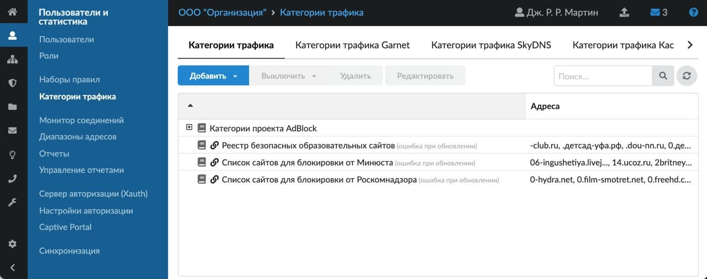
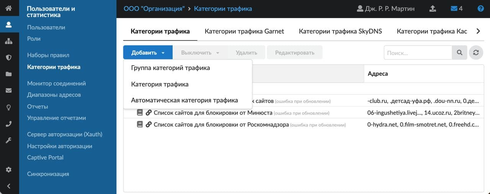
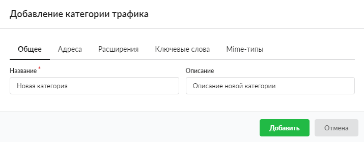
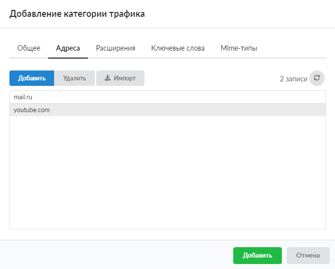
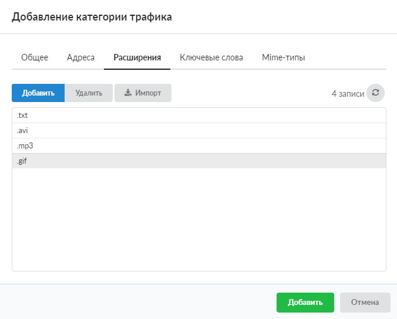
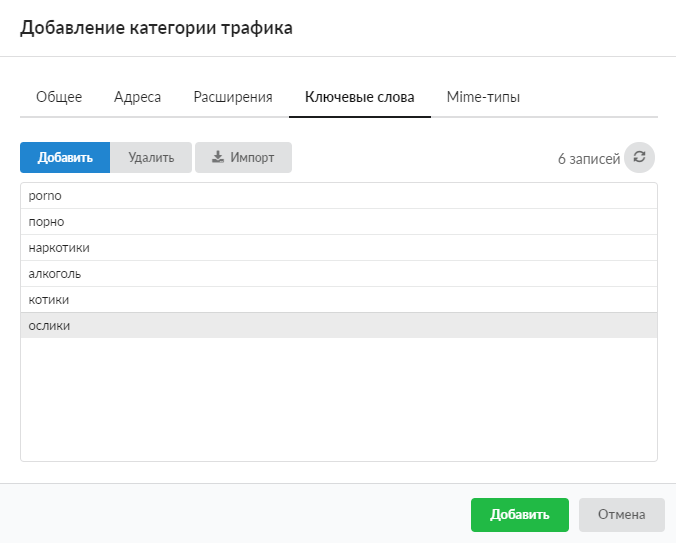
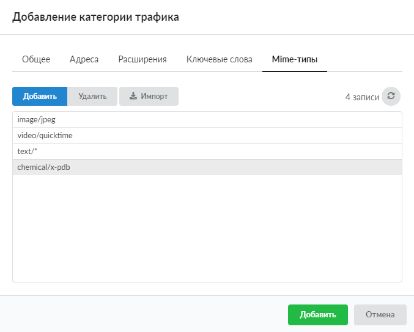
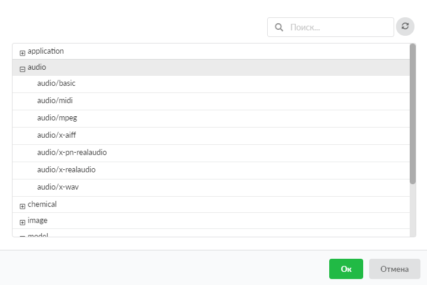
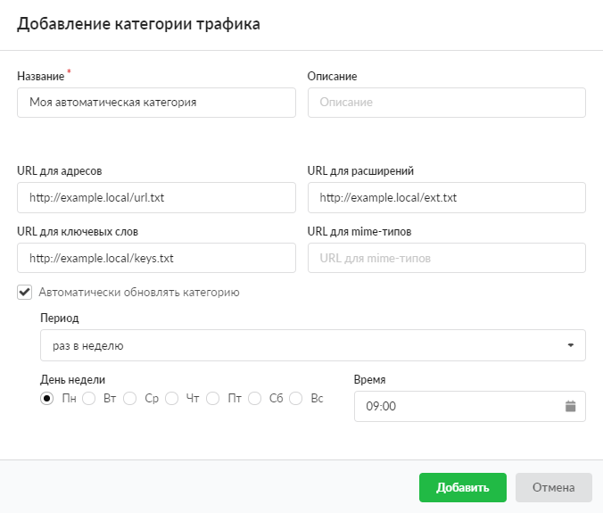
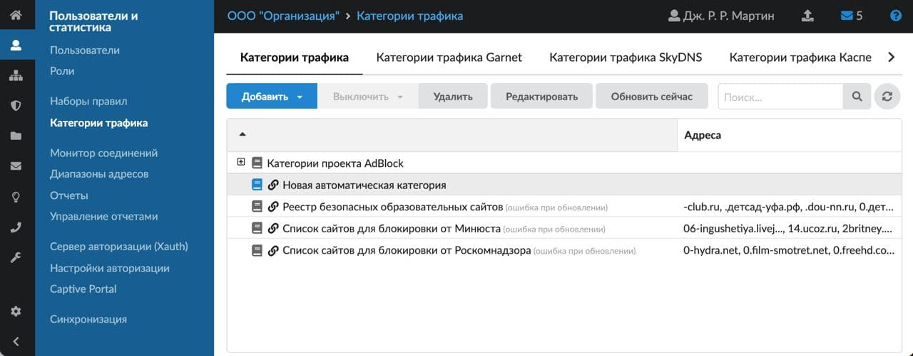

Создание собственной категории трафика, группы категорий или автоматической категории на вкладке «Категории трафика».

---

Создать собственную [категорию трафика](#category), [группы категорий](#group) или [автоматическую категорию](#auto_category) можно на вкладке **«Категории трафика»**, которая расположена в меню **Пользователи и статистика > Категории трафика**. Все созданные категории трафика и группы отмечены иконкой

## Добавить категорию трафика

1. Нажмите кнопку **«Добавить»** и выберите **«Категория трафика»** — откроется окно добавления категории трафика.

2. На вкладке **«Общее»** введите **название** и **описание** новой категории трафика.

3. На вкладке **«Адреса»** укажите [URL](../../o-dokumentacii/slovar-terminov-3.md) и [IP-адреса](../../o-dokumentacii/slovar-terminov-3.md). Здесь также предусмотрена возможность удалить добавленный адрес или импортировать список адресов из файла формата `*.txt`. На данной вкладке можно добавить регулярное выражение (как при ручном вводе, так и при импорте). Подробнее об указании адресов в категориях трафика можно узнать [здесь](adresa-v-kategoriyah-trafika-2.md).

4. На вкладке **«Расширения»** добавьте расширения (например, `*.txt`, `*.mp3`, `*.gif`). Тогда, если при обработке URL прокси-сервер обнаружит в URL данные расширения, он произведет соответствующее действие (разрешить, запретить либо исключить). Здесь также предусмотрена возможность удалить добавленное расширение или импортировать список расширений из файла формата `*.txt`.

> ⚠ Внимание! Блокировать трафик по расширениям можно также с помощью [MIME-типов](../../o-dokumentacii/slovar-terminov-3.md).

5. На вкладке **«Ключевые слова»** укажите ключевые слова (кириллицей либо латиницей). Здесь также предусмотрена возможность удалить добавленное слово или импортировать список слов из файла формата `*.txt`.

6. На вкладке **«MIME-типы»** задайте MIME–заголовки и MIME-расширения файлов, определенные по [стандартам](https://ru.wikipedia.org/wiki/%D0%A1%D0%BF%D0%B8%D1%81%D0%BE%D0%BA_MIME-%D1%82%D0%B8%D0%BF%D0%BE%D0%B2).

7. Для перехода к библиотеке MIME-типов нажмите

в строке. Выберите нужный тип либо целую категорию типов и нажмите **«Ок»**.

8. При обнаружении соответствующего MIME-типа в URL прокси-сервер произведет соответствующее действие (разрешить, запретить или исключить). Здесь также предусмотрена возможность удалить добавленный MIME-тип или импортировать список MIME-типов из файла формата `*.txt`.

> ⚠ Внимание! При импорте адресов, расширений или MIME-типов невалидные (неверные, неподходящие) значения будут пропущены, а на экране появится соответствующее сообщение.

9. Нажмите **«Добавить»** — созданная категория трафика отобразится на вкладке.

## Добавить группу категорий трафика

Чтобы объединить несколько категорий трафика под одним именем, создайте группу.

1. Нажмите кнопку **«Добавить»** и выберите **«Группа категорий трафика»** — откроется окно добавления.

2. Введите **название** группы.

3. Нажмите **«Добавить»** — созданная группа категорий трафика отобразится на вкладке.

В ИКС реализована функция drag-and-drop: зажав категорию левой кнопкой мыши, можно легко перетащить ее в группу.

## Добавить автоматическую категорию трафика

Чтобы оптимизировать процесс составления, изменения и актуализации в группах значений на вкладках «Адреса», «Расширение», «Ключевые слова» или «MIME-типы», создайте автоматическую категорию трафика.

1. Нажмите кнопку **«Добавить»** и выберите **«Автоматическая категория трафика»** — откроется окно добавления.

2. Введите **название** и **описание** автоматической категории.

3. Укажите **URL**, где расположены соответствующие текстовые файлы.

4. При необходимости установите флаг **«Автоматически обновлять категорию»** и укажите частоту обновления данных текстовых файлов:

- **период** — выберите из раскрывающегося списка;
- **день недели** — установите переключатель;
- **время** — выберите по кнопке

5. Нажмите **«Добавить»** — созданная категория трафика отобразится на вкладке. Автоматические категории отмечены в списке иконкой

.

Чтобы обновить автоматическую категорию, выделите ее в списке и нажмите кнопку **«Обновить сейчас»**.

