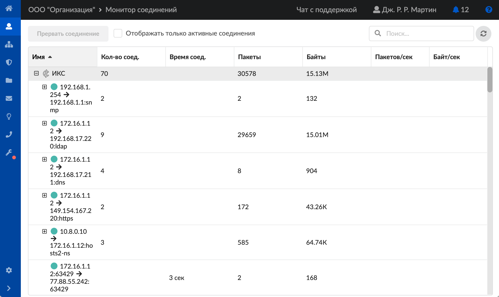
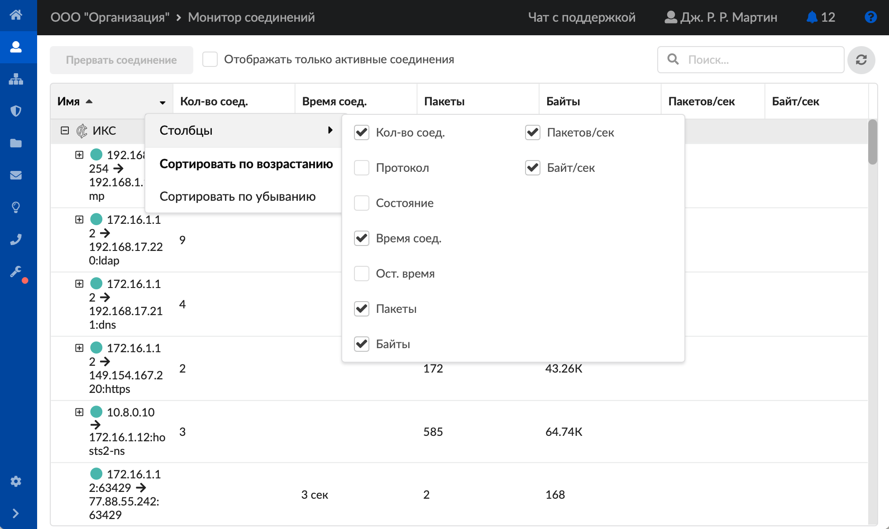
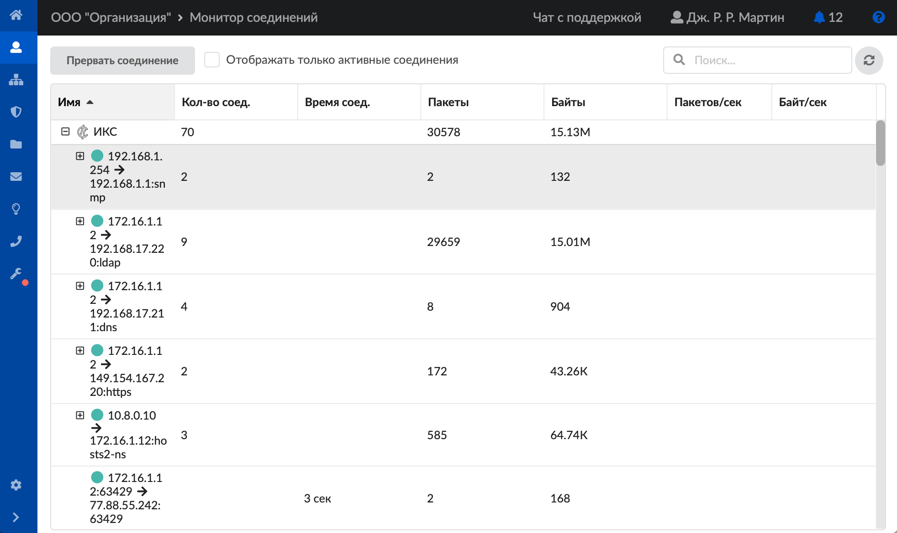

# Монитор соединений

Модуль «Монитор соединений» предназначен для контроля потоков трафика и расположен в меню **Пользователи и статистика > Монитор соединений**.

На странице модуля отображаются все соединения ИКС и пользователей (групп пользователей).

Если установить флаг **«Отображать только активные соединения»**, будут видны только те пользователи, которые имеют соединения в реальном времени.

В таблице соединений могут отображаться следующие **столбцы**:

- имя пользователя;
- количество соединений;
- протокол;
- состояние;
- время соединения;
- оставшееся время соединения;
- число прошедших пакетов;
- объем скаченной информации по соединению (в байтах);
- скорость соединения (в пакетах/сек);
- скорость соединения (в байтах/сек).

Чтобы настроить вид столбцов таблицы, нажмите  в любом заголовке, выберите **«Столбцы»** и установите флаги рядом с нужными названиями.

Для **поиска** соединения воспользуйтесь специальной строкой. Здесь же расположена кнопка **обновления окна модуля** — .

Чтобы прервать соединение (или несколько соединений), выберите его (их) в таблице и нажмите кнопку **«Прервать соединение»**.

<https://vk.com/video_ext.php?oid=-18503994&id=456239331&hd=2>

---

**Источник:** [Документация ИКС — Монитор соединений](https://doc.a-real.ru/index.php?article=47)
