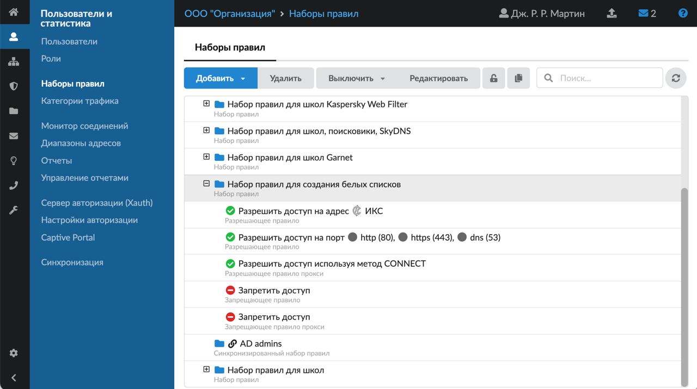
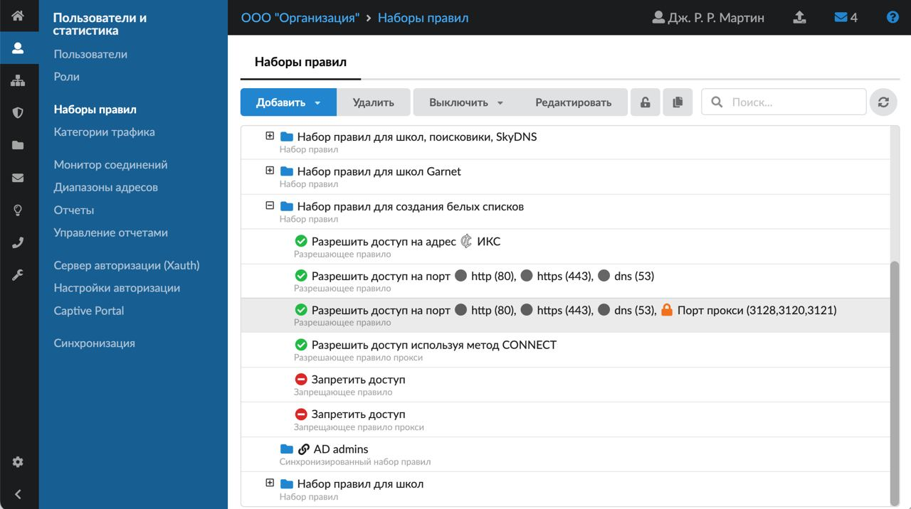

Для удобства пользователей ИКС в модуле «Наборы правил» есть встроенный набор правил для создания белых списков. Его можно редактировать и дополнять новыми правилами.

---

Для удобства пользователей ИКС в модуле **«Наборы правил»** есть встроенный набор правил для создания белых списков. Его можно редактировать и дополнять новыми правилами.

Настроить белые списки (разрешить доступ только к конкретным сайтам) можно согласно следующему порядку действий:

1. Создайте пустое [запрещающее правило](../polzovatelskie-pravila-dostupa/zapreschayuschee-pravilo-2.md) — доступ в сеть Интернет будет полностью закрыт.

2. Создайте [разрешающее правило](../polzovatelskie-pravila-dostupa/razreshayuschee-pravilo-2.md). Укажите в поле **«Адрес назначения»** IP-адрес ИКС — откроется доступ к ресурсам ИКС, а также к прокси-серверу. Если в браузере прописан прокси-сервер ИКС, все сайты будут открываться по протоколу HTTP и HTTPS (для этого должна быть настроена [HTTPS-фильтрация](../../set/proksi/nastroyka-httpsfiltracii-2.md)).

3. Создайте [разрешающее правило](../polzovatelskie-pravila-dostupa/razreshayuschee-pravilo-2.md). Укажите в поле **«Порт»** порты 80, 443, 3128, 3120 и 3121 (порт 443 указывайте, только если настроена [HTTPS-фильтрация](../../set/proksi/nastroyka-httpsfiltracii-2.md)) — будет разрешена работа прозрачного прокси.

4. Создайте пустое [запрещающее правило прокси](../polzovatelskie-pravila-dostupa/zapreschayuschee-pravilo-proksi-2.md) — для пользователя будет закрыт доступ ко всем сайтам.

5. Создайте [разрешающее правило прокси](../polzovatelskie-pravila-dostupa/razreshayuschee-pravilo-proksi.md). Укажите в нем нужные URL назначения — пользователь сможет открывать только указанные сайты.

6. Если используется прозрачный прокси, создайте пустое [разрешающее правило прокси](../polzovatelskie-pravila-dostupa/razreshayuschee-pravilo-proksi.md). Выберите в поле **«Метод»** значение **«CONNECT»** — пользователям будет разрешено устанавливать HTTPS-соединения. Если прокси прописан в браузере у всех пользователей, добавлять данное правило не требуется.
