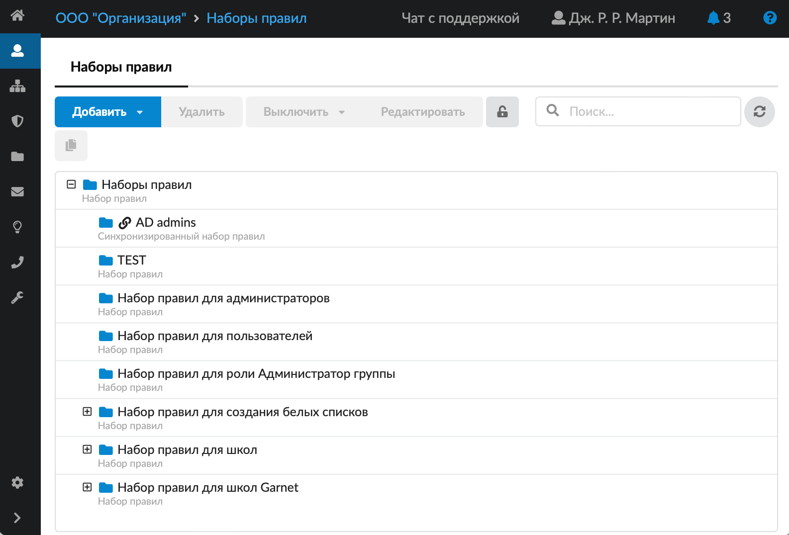
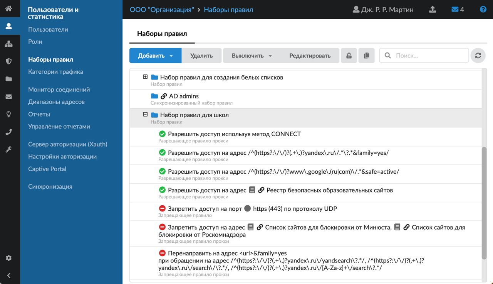

Набор правил позволяет сохранить любое количество пользовательских правил под указанным именем и применить без повторной настройки сразу к нескольким пользователям или группам пользователей.

---

Набор правил позволяет сохранить любое количество пользовательских правил под указанным именем и применить без повторной настройки сразу к нескольким пользователям или группам пользователей.

В ИКС можно создавать следующие пользовательские правила:

- [Запрещающее правило](/index.php?article=147)
- [Запрещающее правило Application Firewall](/index.php?article=148)
- [Разрешающее правило](/index.php?article=158)
- [Исключение](/index.php?article=364)
- [Запрещающее правило прокси](/index.php?article=150)
- [Разрешающее правило прокси](/index.php?article=153)
- [Исключение прокси](/index.php?article=160)
- [Ограничение количества соединений](/index.php?article=161)
- [Ограничение скорости](/index.php?article=162)
- [Выделение полосы пропускания](/index.php?article=163)
- [Маршрут](/index.php?article=164)
- [Квота](/index.php?article=159)
- [Правило контентной фильтрации](/index.php?article=166)

Модуль **«Наборы правил»** расположен в меню **Пользователи и статистика > Наборы правил**.

По умолчанию в модуле созданы пустые наборы правил для каждой [роли](/index.php?article=44), заведенной в ИКС, а также заранее настроенные наборы:

- **набор правил для школ Garnet** — аналогичен набору правил для школ, при этом также содержит категории Garnet;
- **набор правил для школ** — предоставляет доступ к поисковым системам в безопасном режиме; разрешает доступ на адреса из Реестра безопасных образовательных сайтов (РБОС); блокирует доступ к интернет-ресурсам из набора [категорий](/index.php?article=46) (списки сайтов для блокировки от Минюста и Роскомнадзора, мошенничество, порно, вирусы); сканирует трафик с помощью [контент-фильтра](/index.php?article=76) (если контент-фильтр включен).

При добавлении новой роли будет автоматически создан пустой набор правил. Такие наборы правил нельзя удалить, но можно удалить роль (кроме, «Администратор» и «Пользователь»). При этом удалится набор правил, связанный с данной ролью.

В модуле можно [создать](/index.php?article=171) новый набор правил и [настроить](/index.php?article=172) его.

Для того чтобы **скопировать** набор правил, нажмите на него в списке, а затем — на кнопку .

<iframe allowfullscreen frameborder="0" height="480" src="https://vk.com/video_ext.php?oid=-18503994&id=456239327&hd=2" width="853"></iframe>

<iframe allowfullscreen frameborder="0" height="480" src="https://vk.com/video_ext.php?oid=-18503994&id=456239328&hd=2" width="853"></iframe>
