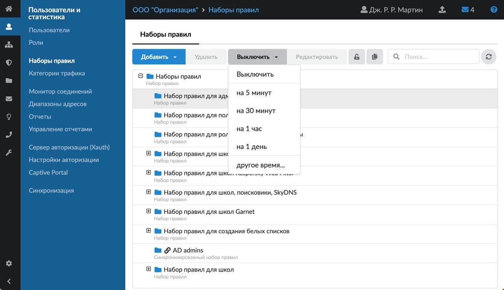
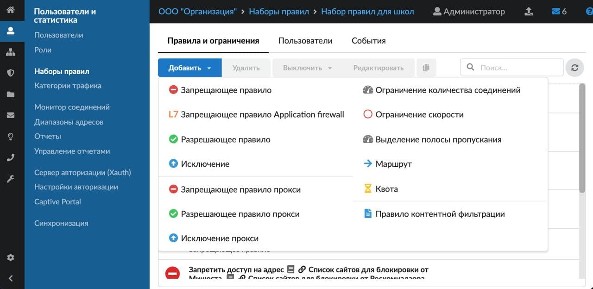
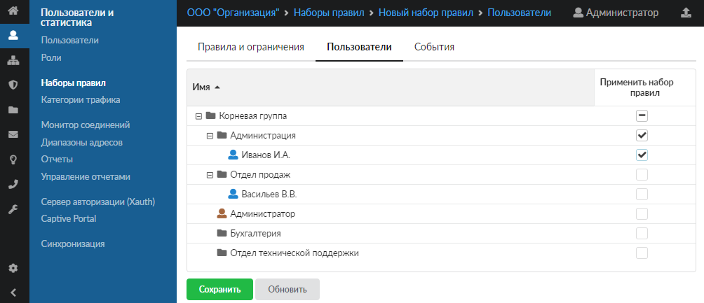
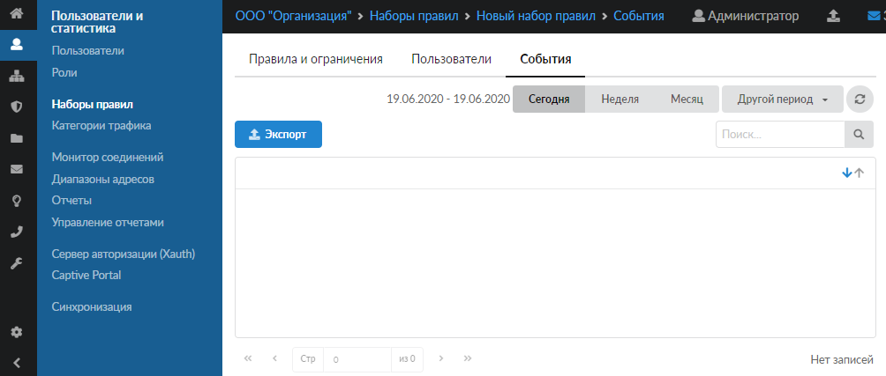

Модуль «Наборы правил» позволяет управлять пользовательскими правилами, назначать их пользователям и группам, а также просматривать события.

---

Модуль «Наборы правил» расположен в меню **Пользователи и статистика > Наборы правил**.

В [набор правил](https://doc.a-real.ru/index.php?article=171) можно добавлять любое количество [пользовательских правил](../polzovatelskie-pravila-dostupa/polzovatelskie-pravila-dostupa-obzor-2.md). Выделите набор, нажмите **«Добавить»** и выберите нужное правило.

В ИКС предусмотрена возможность **выключить** действие набора правил на определённое время. Выделите набор, нажмите **«Выключить»** и выберите нужное время.

Набор правил также можно отредактировать или удалить при помощи соответствующих кнопок. Для того чтобы восстановить предустановленный набор правил, который был изменён, выберите его и нажмите кнопку .

Чтобы перейти в **модуль набора правил** для дополнительных настроек, нажмите на его название в списке наборов. В модуле расположены следующие вкладки:

- **«Правила и ограничения»** — для добавления пользовательских правил. Просто нажмите **«Добавить»** и выберите нужное правило.

  

- **«Пользователи»** (только у неавтоматических наборов правил) — позволяет применить набор правил к пользователям (группам). Просто установите флаги рядом с пользователями (группами), к которым нужно применить данный набор правил.

  

  При выборе пользователя набор правил будет назначен на конкретного пользователя. При выборе группы набор правил будет назначен на все дочерние группы, а также на всех пользователей в данной группе и дочерних группах.

  Правила, установленные на группу, обладают меньшим приоритетом, чем правила, установленные на пользователя (в соответствии с [порядком обработки правил](../polzovatelskie-pravila-dostupa/polzovatelskie-pravila-dostupa-obzor-2.md)).

- **«События»** — показывает события за день, неделю, месяц, заданный период.

  
