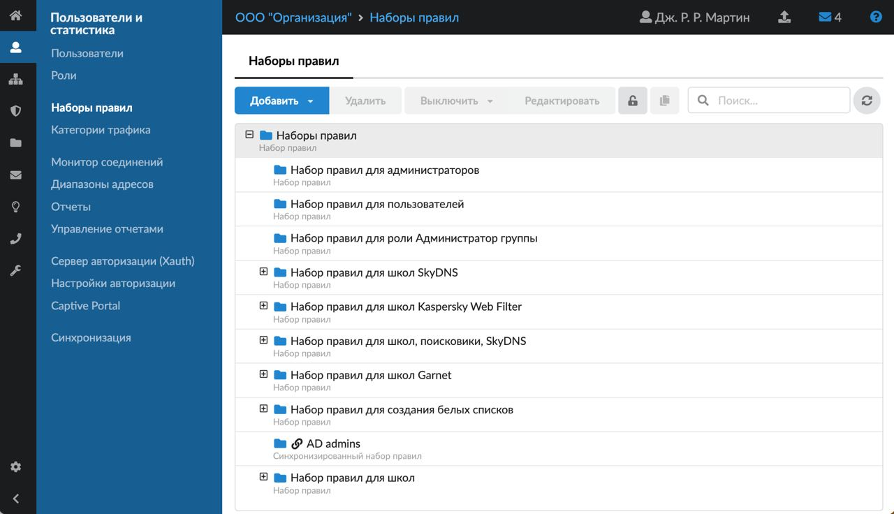
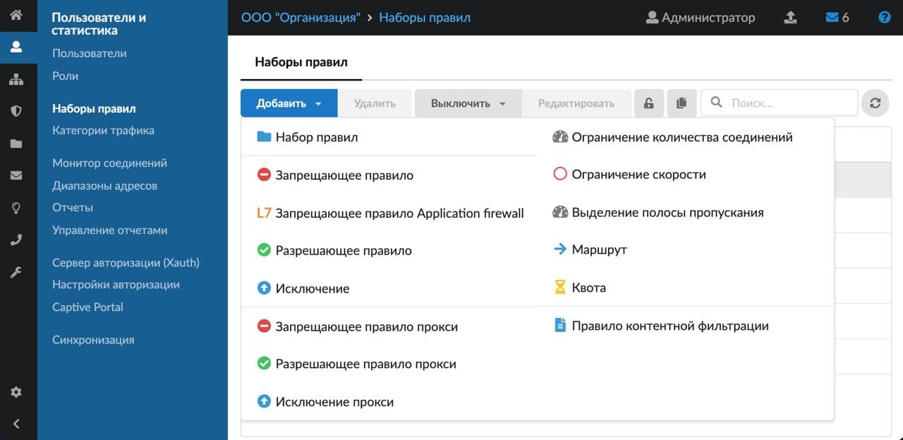
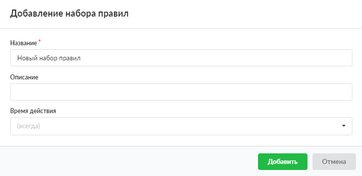

Создать новый набор правил можно в модуле «Наборы правил», который расположен в меню **Пользователи и статистика > Наборы правил**.

1. Нажмите кнопку **«Добавить»** и выберите **«Набор правил»** — откроется окно добавления набора правил.

   

2. Введите **название** и **описание** набора правил.

   

3. Выберите [время действия](../../vebinterfeys-iks/standartnye-elementy-vebinterfeysa.md) в отдельном окне. По умолчанию установлено значение «всегда».

4. Нажмите **«Добавить»** — созданный набор правил отобразится на вкладке.
