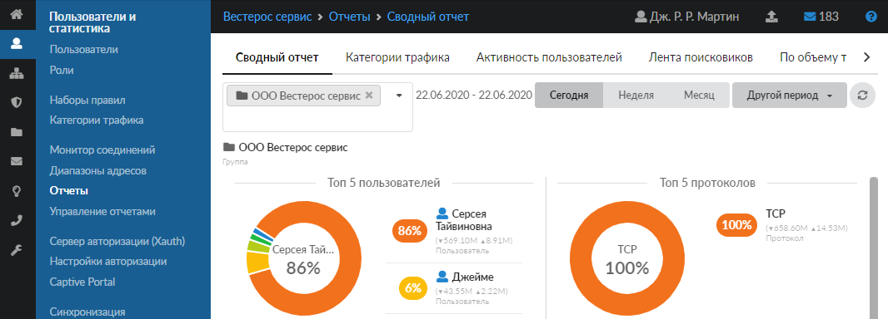
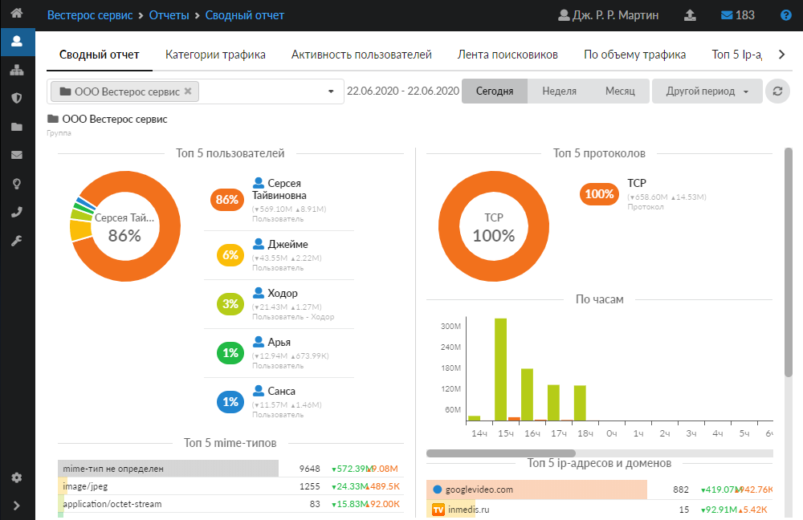
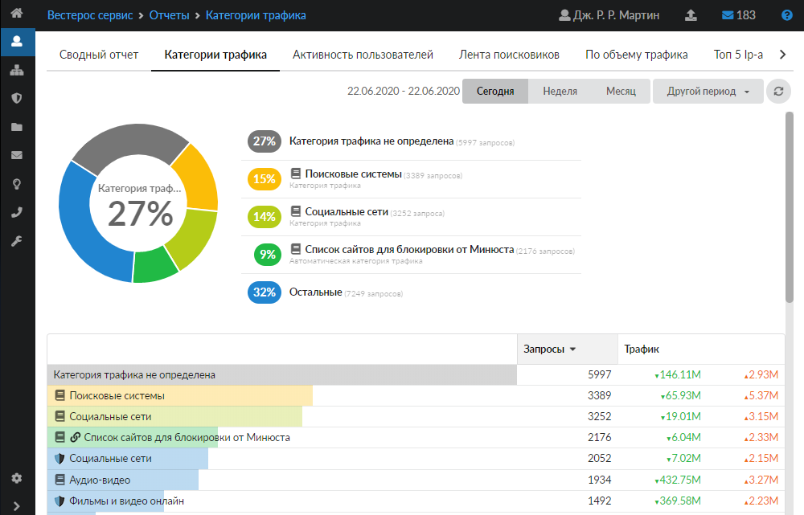
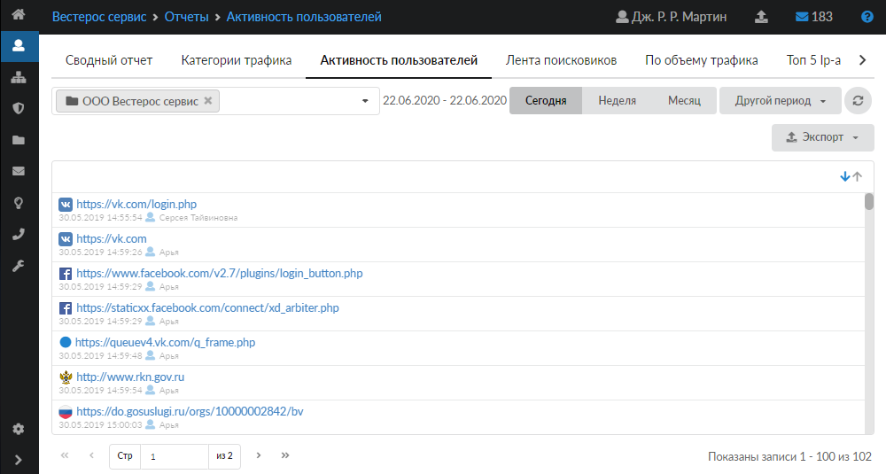
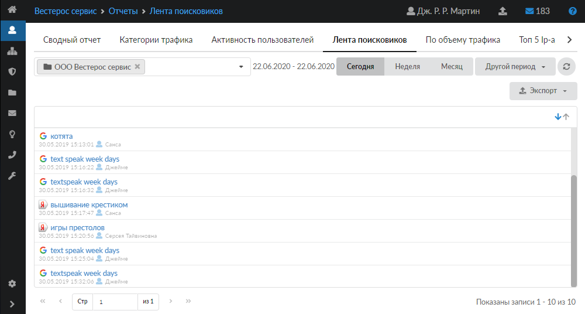
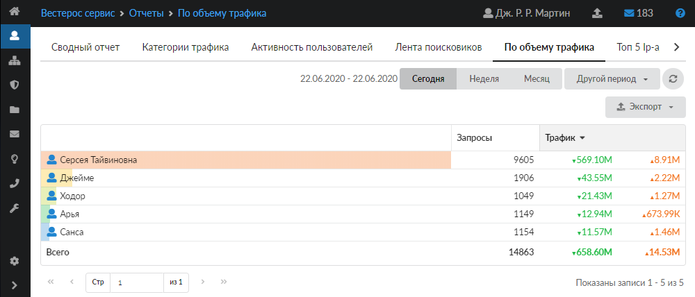
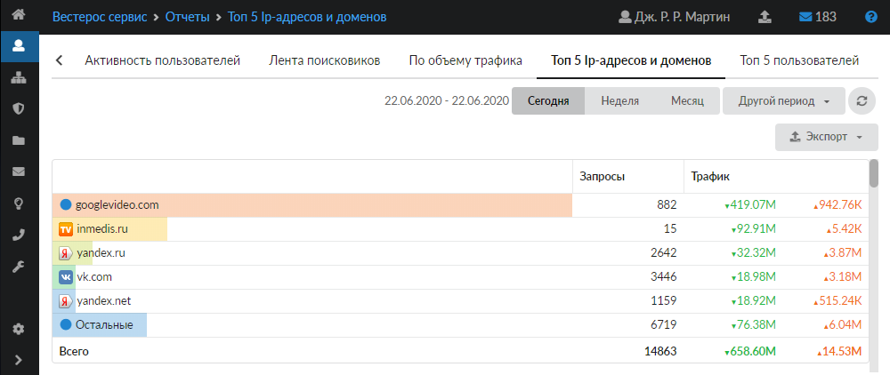
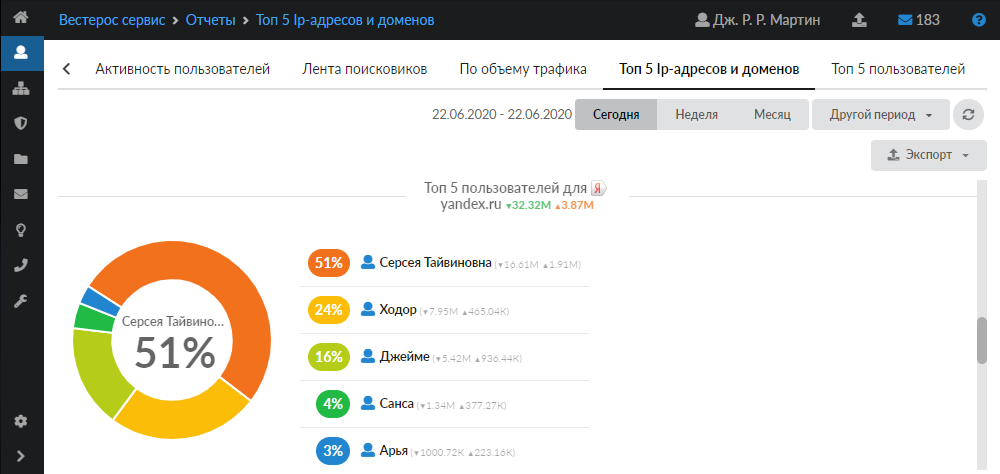
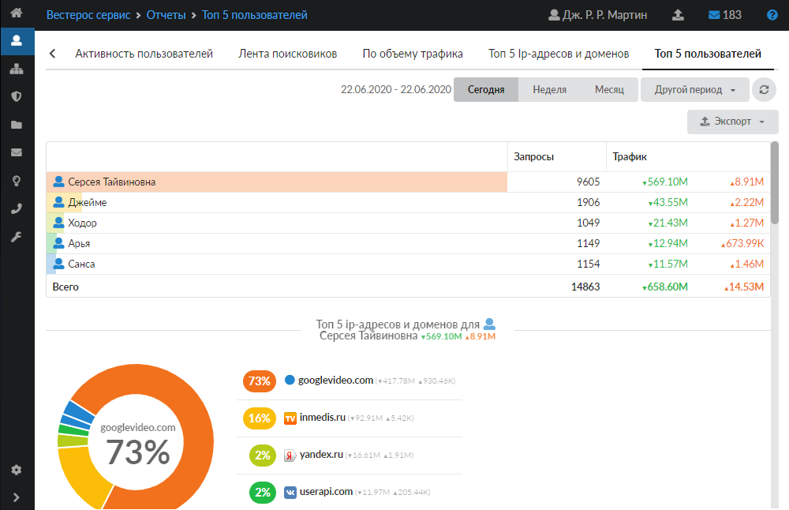
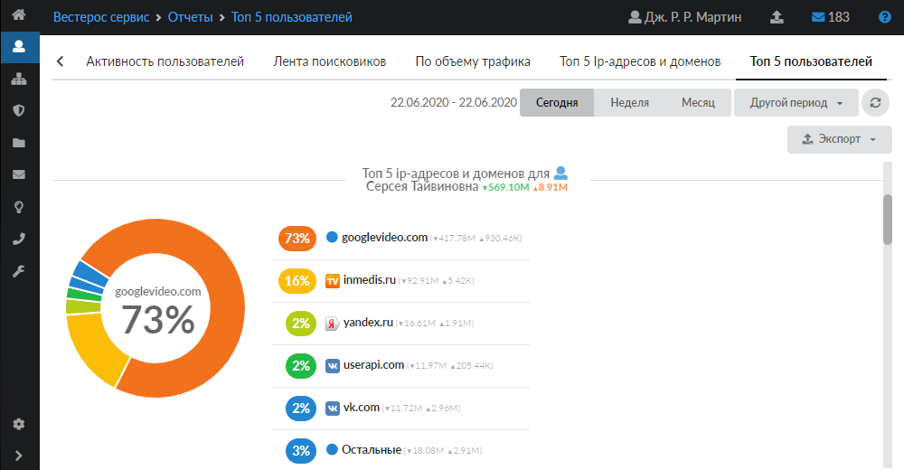

Систему статистики пользователей в ИКС можно настроить вручную либо вывести с помощью нескольких стандартизированных отчетов. Каждый отчет выводится на соответствующей вкладке:

- Сводный отчет
- Категории трафика
- Активность пользователей
- Лента поисковиков
- По объему трафика
- Топ 5 IP-адресов и доменов
- Топ 5 пользователей

Данные отчеты представлены в модуле **«Отчеты»**, который расположен в меню Пользователи и статистика > Отчеты.

Каждый отчет — это система графиков и цифровых значений, которые могут быть выведены за любой отрезок времени. Временной период (день, неделя, месяц, другой период) можно выбрать в правом верхнем углу отчета. По умолчанию выводятся данные за текущий день.

При необходимости можно сохранить данные отчета в файл (кроме отчета «Категории трафика»). Для этого нажмите кнопку **«Экспорт»** и выберите нужный формат файла (.csv, .txt или .xls).

Чтобы обновить данные на вкладке, нажмите кнопку .

## Сводный отчет

На данной вкладке отображаются основные данные по трафику пользователей:

- Топ 5 пользователей — пользователи с самым большим общим трафиком за период, с процентным отношением к общему трафику всех пользователей;
- Топ 5 IP-адресов и доменов — самые часто запрашиваемые сайты;
- Топ 5 MIME-типов — самые распространенные типы запрашиваемых данных;
- Топ 5 назначений — самые распространенные назначения запросов — диапазоны адресов;
- Топ 5 протоколов — самые распространенные протоколы, по которым идут соединения;
- По часам — почасовая статистика за период.

В отчете можно указать группу пользователей, по которым будет построен отчет. Для этого нажмите  в левом верхнем углу вкладки. По умолчанию установлена корневая группа пользователей.

## Категории трафика

На данной вкладке отображается сводка трафика, сгруппированная по категориям трафика. Под диаграммой с пятью самыми распространенными категориями можно посмотреть развернутый отчет по всем запрошенным категориям.

## Активность пользователей

На данной вкладке отображаются страницы, загруженные пользователями.

В отчете можно указать группу пользователей, по которым будет построен отчет. Для этого нажмите  в левом верхнем углу вкладки. По умолчанию установлена корневая группа пользователей.

## Лента поисковиков

На данной вкладке отображаются поисковые запросы пользователей.

В отчете можно указать группу пользователей, по которым будет построен отчет. Для этого нажмите  в левом верхнем углу вкладки. По умолчанию установлена корневая группа пользователей.

При нажатии на ссылку откроется соответствующая страница в браузере.

> ⚠ **Внимание!** Вместо привычной страницы выдачи поисковой системы страница может открыться в текстовом формате `json`. Это происходит потому, что в статистику записывается полный URL, по которому обращался пользователь, без изменений. В некоторых из них содержится уникальный идентификатор пользователя и его конкретной сессии. Поисковая система не может повторно обработать этот URL, так как сессия уже закрыта, поэтому система открывает тело запроса в формате json.

## По объему трафика

На данной вкладке отображается объем входящего и исходящего трафика пользователей.

## Топ 5 IP-адресов и доменов

На данной вкладке отображается трафик пользователей, сгруппированный по IP-адресам и доменам.

Под сводкой адресов можно посмотреть краткую сводку по пользователям, запрашивающим каждый адрес.

## Топ 5 пользователей

На данной вкладке отображается краткая сводка входящего и исходящего трафика пользователей.

Под сводкой можно посмотреть краткую сводку по IP-адресам и доменам, запрошенным каждым пользователем.

