---

В ИКС предусмотрено несколько вариантов авторизации пользователей:

- по IP-адресу
- по MAC-адресу
- пользователей AD
- по логину и паролю ИКС
- по SMS
- по телефонному звонку
- с использованием утилиты Xauth

Настройки авторизации производятся в модуле **«Пользователи»**, расположенном в меню **Пользователи и статистика &gt; Пользователи**.

## Авторизация по IP-адресу

Это самый распространённый способ авторизации.

Применяется в том случае, когда пользователи локальной сети имеют статические IP-адреса либо динамические IP-адреса, регистрируемые с привязкой к MAC-адресу. Пользователь получает доступ во внешнюю сеть по всем протоколам в соответствии с глобальными и индивидуальными правилами доступа.

1. Нажмите на **имя пользователя** в списке — откроется [индивидуальный модуль пользователя](individualnyy-modul-polzovatelya-gruppy-2.md).

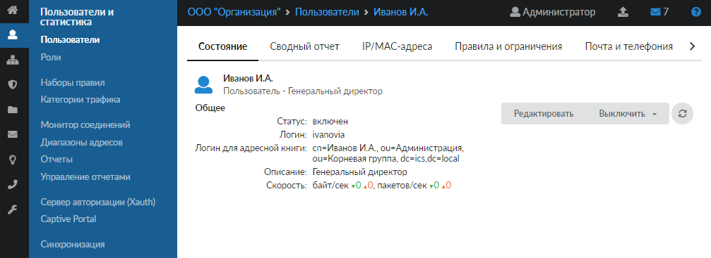

2. Откройте вкладку **«IP/MAC-адреса»**.

3. Нажмите кнопку **«Добавить»** и выберите **«IP-адрес»**.

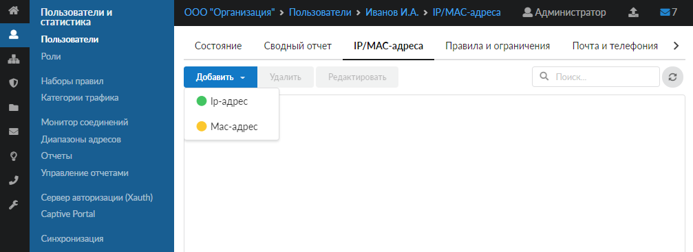

4. В открывшемся окне введите **IP-адрес** и **комментарий** (например, к какому устройству пользователя привязан данный IP-адрес).

5. Нажмите **«Добавить»**.

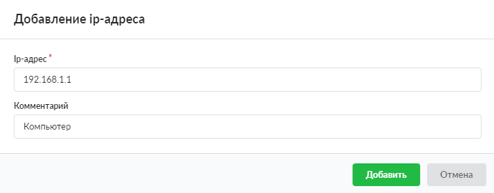

Новый IP-адрес появится в списке адресов пользователя. При необходимости его можно отредактировать, удалить, а также определить MAC-адрес.

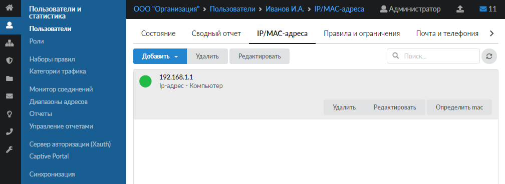

Одному пользователю можно назначить любое количество IP-адресов.

Чтобы назначить пользователю диапазон адресов, укажите адрес в одном из двух вариантов:

- IP-адрес/префикс (например, 192.168.1.1/24);
- через дефис (например, 192.168.1.1-192.168.1.254).

> ⚠ Внимание! IP-адрес довольно легко подделать. Злонамеренный пользователь может выдать себя за другого, просто поменяв сетевые настройки на своем компьютере. Чтобы это предотвратить, воспользуйтесь функцией [привязки к MAC-адресу](../../set/arptablica-2.md).

## Авторизация по MAC-адресу

Данный вид авторизации удобен, когда в сети используются динамические адреса.

1. Нажмите на **имя пользователя** в списке — откроется [индивидуальный модуль пользователя](individualnyy-modul-polzovatelya-gruppy-2.md).

2. Откройте вкладку **«IP/MAC-адреса»**.

3. Нажмите кнопку **«Добавить»** и выберите **«MAC-адрес»**.

4. В открывшемся окне введите **MAC-адрес** и **комментарий** (например, к какому устройству пользователя привязан данный IP-адрес).

5. Нажмите **«Добавить»**.

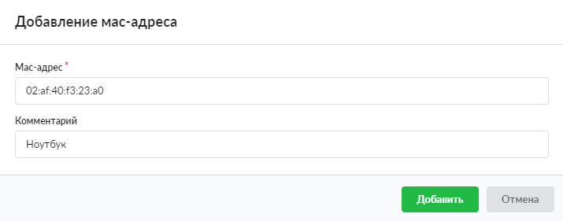

Новый MAC-адрес появится в списке адресов пользователя. При необходимости его можно отредактировать или удалить. Если пользователь активен в сети, ИКС автоматически выделит ему IP-адрес.

## Авторизация пользователей AD

Такая авторизация возможна в двух вариантах в зависимости от протокола сетевой аутентификации, который используется:

- [NTLM](#ntlm)
- [Kerberos](#kerberos)
- [LDAP](#ldap)

Данные типы авторизации используются, когда необходимо авторизовать пользователей AD. Авторизация будет выполнена прозрачно, без запроса логина и пароля. Использование данных типов предполагает прямое указание прокси в браузере или других программах, которые их поддерживают.

> ⚠ Внимание! При данных типах авторизации необходимо добавить перенаправление DNS-зоны домена на IP-адрес одного или нескольких контроллеров домена либо ИКС должен использовать контроллер домена как единственный DNS-сервер (настройки [провайдера](../../set/provaydery-i-seti/provayder-2.md)).

### Авторизация по протоколу NTLM

Для того чтобы пользователи домена авторизовывались по протоколу сетевой аутентификации [NTLM](../../o-dokumentacii/slovar-terminov-3.md), выполните следующие действия:

1. В меню **Пользователи и статистика &gt; Пользователи** [импортируйте](import-polzovateley-2.md) пользователей из [LDAP](../../o-dokumentacii/slovar-terminov-3.md).

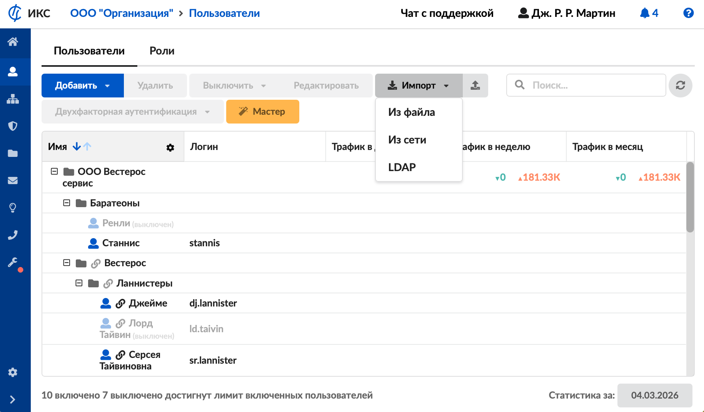

2. В меню **Сеть &gt; Прокси &gt; Настройки** выберите [тип авторизации](../../set/proksi/proksi-obzor.md) «Внешняя - NTLM».

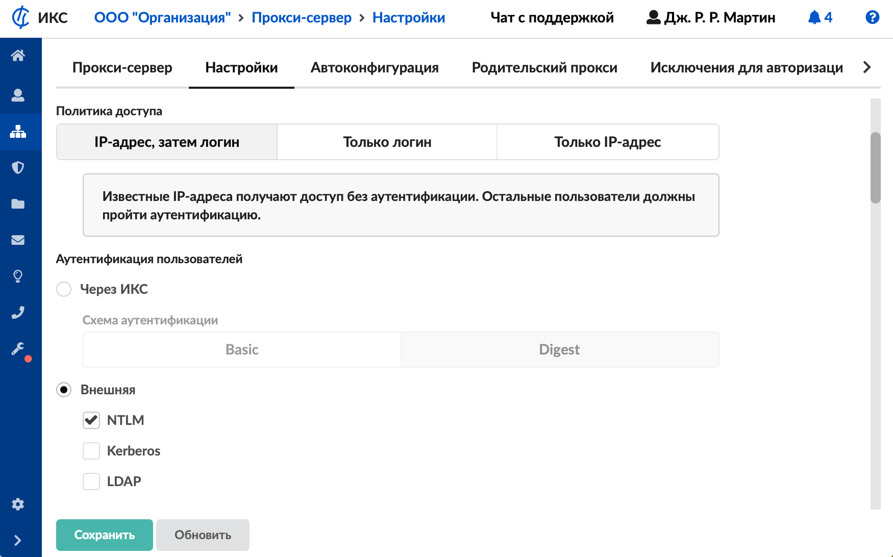

3. В меню **Сеть &gt; Сетевое окружение &gt; Идентификация** установите [переключатель](../../set/setevoe-okruzhenie-2.md) для роли ИКС «Домен».

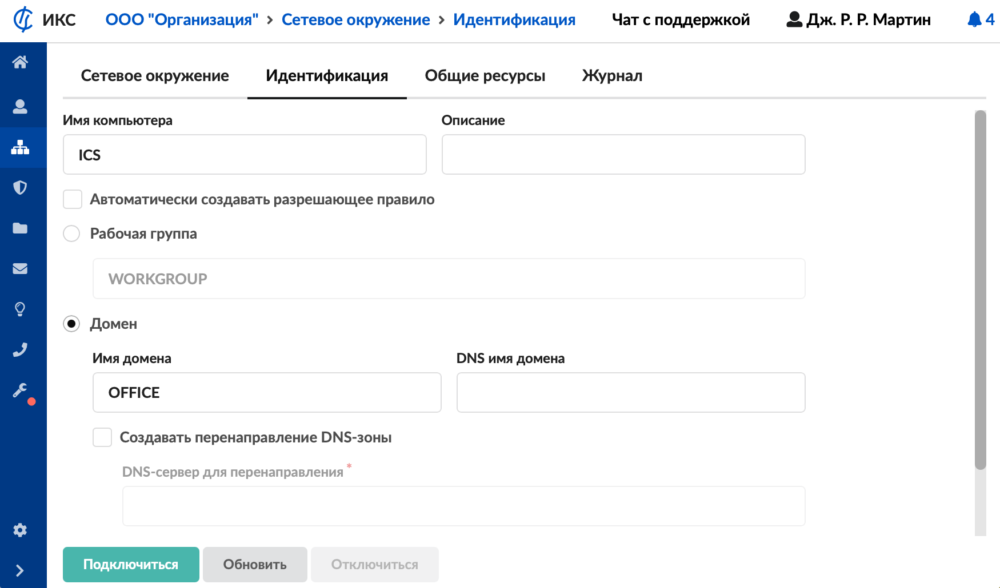

### Авторизация по протоколу Kerberos

Для того чтобы пользователи домена авторизовывались по протоколу сетевой аутентификации [Kerberos](../../o-dokumentacii/slovar-terminov-3.md), выполните следующие действия.

1. В меню **Пользователи и статистика &gt; Пользователи** [импортируйте](import-polzovateley-2.md) пользователей из [LDAP](../../o-dokumentacii/slovar-terminov-3.md).

2. В меню **Сеть &gt; Прокси &gt; Настройки** выберите [тип авторизации](../../set/proksi/proksi-obzor.md) «Kerberos».

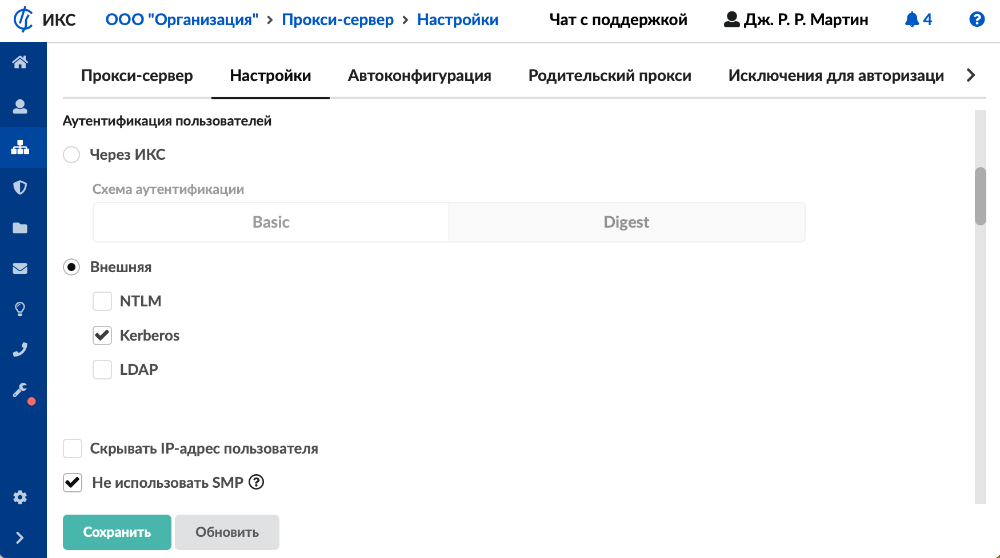

3. В меню **Пользователи и статистика &gt; Настройки авторизации &gt; Kerberos** настройте [соединение с доменом](../nastroyki-avtorizacii-2.md) в сети.

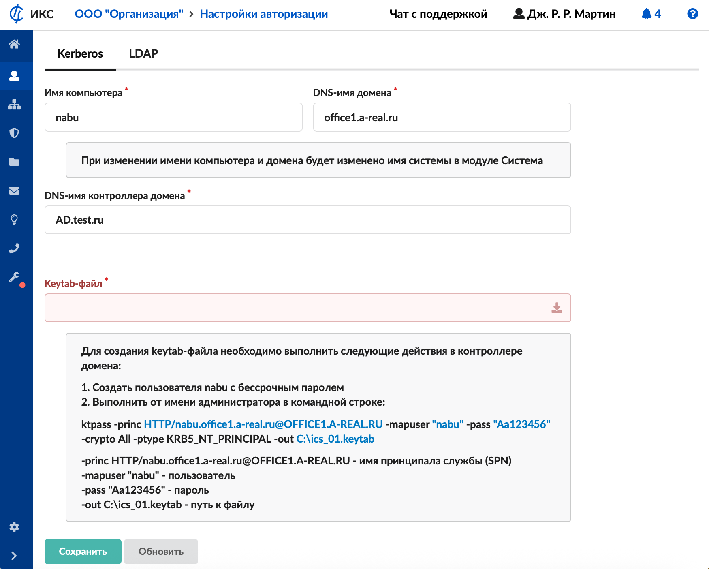

### Авторизация по протоколу LDAP

Для того чтобы пользователи домена авторизовывались по протоколу сетевой аутентификации LDAP, выполните следующие действия.

1. В меню **Пользователи и статистика &gt; Пользователи** [импортируйте](import-polzovateley-2.md) пользователей из [LDAP](../../o-dokumentacii/slovar-terminov-3.md).

2. В меню **Сеть &gt; Прокси &gt; Настройки** выберите [тип авторизации](../../set/proksi/proksi-obzor.md) «LDAP».

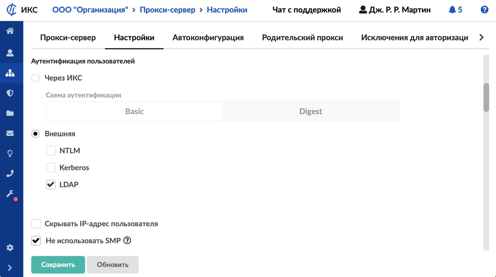

3. В меню **Пользователи и статистика &gt; Настройки авторизации &gt; LDAP** настройте [соединение с доменом](../nastroyki-avtorizacii-2.md) в сети.

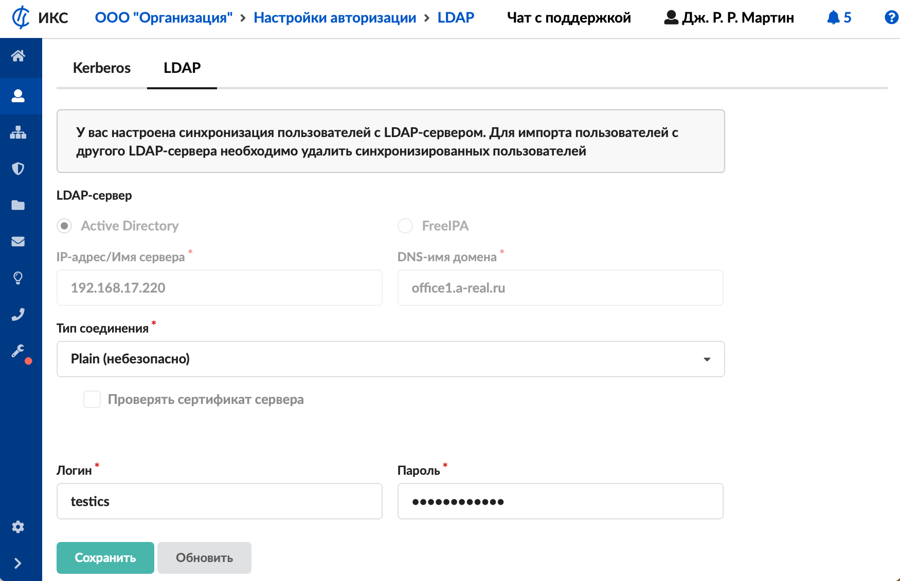
