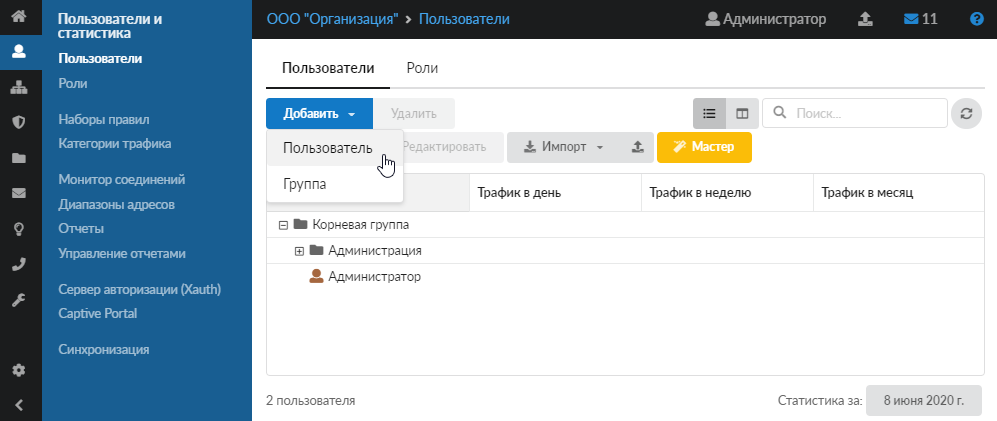
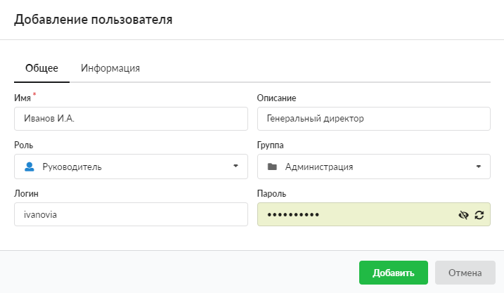
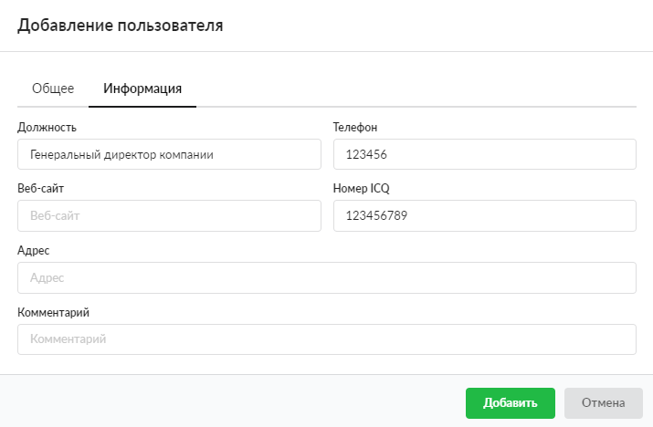
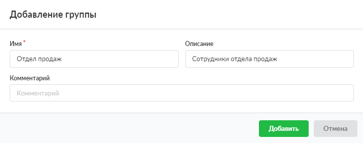

В модуле «Пользователи», расположенном в меню **Пользователи и статистика > Пользователи**, можно создать нового пользователя или группу.

---

## Добавить пользователя

1. Нажмите кнопку **«Добавить»** и выберите **«Пользователь»**.

   

2. В открывшемся окне заполните вкладки:

   - **«Общее»**: уникальное имя пользователя, описание, роль, группа, логин и пароль;

     Поле «Описание» позволяет задать описание пользователя, которое отображается в [индивидуальном модуле](individualnyy-modul-polzovatelya-gruppy-2.md) соответствующего пользователя. Также предусмотрена возможность настроить отображение столбца с описанием в [общем списке пользователей](polzovateli-obzor-2.md). Ограничения, накладываемые на данное поле, следующие: кириллица (макс 127 символов) и латиница (макс 255 символов), цифры, спецсимволы (`-`, `_`, `.`, `,`), не может начинаться с пробела.

     

   - **«Информация»**: должность пользователя, номер телефона, веб-сайт, номер [ICQ](../../o-dokumentacii/slovar-terminov-3.md), адрес, комментарий.

     

3. Нажмите **«Добавить»** — новый пользователь появится в списке.

## Добавить группу

1. Нажмите кнопку **«Добавить»** и выберите **«Группа»**.

2. Заполните поля в открывшемся окне: уникальное **имя** группы, **описание**, **комментарий**.

   

3. Нажмите **«Добавить»** — новая группа появится в списке.

После формирования списка пользователей и групп рекомендуется настроить их [авторизацию](avtorizaciya-polzovateley-2.md).
